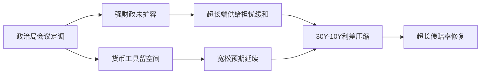
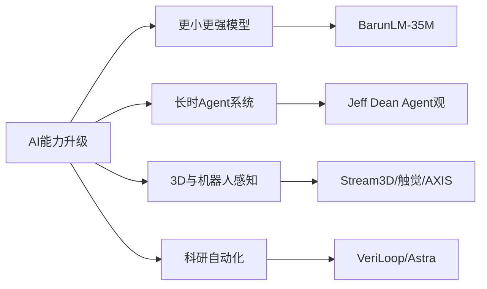

# 📰 公众号热点提炼

> 🕐 2026-08-03（周一）· 覆盖 08-02 ~ 08-03 · 6 个公众号 · 15 篇文章

---

## ⚡关键情报 KEY DELTA

本时段最集中的主线，仍然是**债市在政治局会议后继续围绕“宽货币预期仍在、强财政尾部风险下降、超长端赔率修复”展开交易**：多篇固收文章同时指向**30Y-10Y 利差压缩**、**10 年国债收益率逼近 1.70%**、以及**8-9 月供给与降息预期**将成为下一阶段胜负手。 与此同时，微观情绪指标显示债市总体拥挤度虽仍高，但已从高位**小幅回落至 70%**，短端换手率和机构杠杆降温，而债基止盈压力、股债比价和超长端交易热度仍偏强，说明行情从“全面做多”转向“高赔率结构性博弈”。

权益侧的两篇文章则形成鲜明对照：一边是对**7 月科技股剧烈回撤**、高拥挤资产出清和全球科技从 FOMO 向理性化切换的反思；另一边则认为，若 AI 主产业趋势未被证伪，当前更可能是**多重顶而非单顶**，后续仍有修复与再交易空间。 科技资讯方面，主题集中在**小模型效率、Agent 系统化、流式 3D 生成、触觉具身、代码智能体与科研自动化**，显示 AI 竞争焦点正从“更大模型”向“更强系统、更多场景、更低成本”扩散。[来源:social_media_RAR000007781569][来源:social_media_RAR000007781568][来源:social_media_RAR000007781311][来源:social_media_RAR100001614464][来源:social_media_RAR000007781210][来源:social_media_RAR000007781209][来源:social_media_RAR100001613830]

图1：本轮债市主线的政策—预期—利差传导链条

---

## 财经投研类文章

### 1. 超长利差的博弈空间
**来源**：郁言债市 · `08-02 23:55`

#### 1. 这篇文章在说什么？
- 文章围绕**30Y-10Y 国债利差**展开，认为当前市场争议焦点在于：近期**30 年国债大涨**之后，利差压缩行情是否已经正式启动。
- 文中提出“**旧范式**”与“**新范式**”切换：**2022 年中以前**，30 年国债偏配置、活跃度低，利差主要由**10 年国债收益率**主导；**2022 年中以后**，30 年国债交易属性显著增强，利差更多由**30 年国债自身走势**决定。
- 在“新范式”下，作者判断**30Y-10Y 利差波动区间**可能已从过往的**30bp 至 80bp**下移至**10bp 至 60bp**，其中**30-40bp**属于相对中性水平。
- 文章复盘了**2023 年以来五轮利差压缩与扩张**，总结出影响超长利差最核心的两个前提是**宽松预期**与**广义资产荒**。
- 当前作者认为环境仍偏有利于利差压缩：**2026 年 3 月下旬以来，30Y-10Y 利差已由 56bp 压缩至 7 月末的 46bp**，若 **8-9 月**降准降息预期延续，利差有望进一步压至**40bp 左右**；若要系统性压缩至**30bp**，则需资产荒逻辑进一步强化。

#### 2. 为什么这件事重要？
- **30Y-10Y 利差**已经成为当前债市最关键的结构性交易变量之一。若利差继续压缩，意味着**超长债相对长端继续跑赢**，交易盘和高久期组合将获得更大资本利得弹性。
- 作者将利差变化与**货币宽松预期、政府债供给、股债跷跷板、资金跨资产流动**直接挂钩，意味着它不仅是期限利差问题，也是对下半年**宏观政策组合与资产配置格局**的综合定价。
- 对机构配置而言，若“新范式”成立，则历史上以**50-60bp**视为常态高位的经验需要重估，超长端估值框架可能发生系统性下移。

#### 3. 作者的核心观点是什么？
- 作者的核心判断是：**全年 30Y-10Y 利差进一步压缩的可能性不低**，但不会一蹴而就，而会伴随政策和供给线索逐步演绎。
- 利差压缩是否延续，关键看两点：一是**7-8 月基本面成色**能否维持市场对宽货币加力的一致预期；二是**8-9 月政府债是否提速发行**、是否追加超长政府债，进而对冲“资产荒”。
- 因此，作者并非简单线性看多超长债，而是强调**宽松预期 + 资产荒强化**是压缩至更低利差区间的必要条件。

#### 4. 关键数据与信号
- **2026 年 3 月下旬以来，30Y-10Y 利差由 56bp 压缩至 7 月末 46bp**。
- “旧范式”下历史利差区间多为**30bp-80bp**，区间均值约**54bp**；“新范式”下作者估计新波动区间为**10bp-60bp**，中性区间为**30-40bp**。
- **2016-2022 年**，10 年、30 年国债与 30Y-10Y 利差相关系数分别为**-0.35、-0.08**；**2023-2026 年**分别为**0.02、0.26**，显示利差主导权从 10 年端转向 30 年端。
- **2020 年初至 2022 年 6 月末**，超长国债滚动 10 日换手率日均值仅**9.0%**；**2025 下半年起**，30 年国债换手率已反超 10 年国债。
- 若 **8-9 月**宽松预期持续，作者预计利差可能压至**40bp 左右**；若要进一步压至**30bp**，需叠加更强资产荒逻辑。

#### 5. 对投资决策意味着什么？
- 组合上，超长端仍是下半年债市**最具赔率**的结构性方向之一，但应重点跟踪**政府债供给节奏**与**宽松预期兑现情况**两大触发器。
- 若后续出现**额外超长债供给**或宽松预期证伪，30 年国债也可能重新面临高波动和超跌风险，需动态管理久期暴露。

---

### 2. 8月债市投资策略展望
**来源**：固收亮话 · `08-02 23:50`

#### 1. 这篇文章在说什么？
- 文章给出**8 月债市策略框架**：短端的核心变量是**资金利率中枢**是否还能继续下行，长端的核心变量是**10 年国债低位空间有限**、而**30 年超长债仍具赔率**。
- 作者认为当前**1Y 存单**和**3Y 国开**隐含的 **7 天资金利率**分别约为**1.40%**和**1.36%**，在 **7 月隔夜资金利率 1.35%-1.40%**、**7 天资金约 1.4%**的背景下，短端债券定价已不便宜，趋势性下行机会有限。
- 对长端而言，文章判断**10 年国债收益率接近 1.7%**后继续下行斜率加快的可能性不强，低点或仅小幅下移至**1.65% 左右**；相较之下，若资金平稳宽松、供给影响减弱，**30-10Y 利差 8 月有望压缩至 40bp 左右**，对应**30 年国债收益率有望下行至 2.1% 左右**。
- 组合策略上，作者建议维持**短+长哑铃型结构**，久期至少保持平均以上，短期限关注**2Y 左右信用**，长端关注**30 年国债活跃券**和**20-30Y 地方债**。
- 择券上给出细化建议：10 年国债优先关注**260010**，30 年国债在**26T4、26T2、25T6、25T2、230023**等活跃券中择机配置，且**26T4**因 **8 月 5 日**续发、流动性或仍有改善空间，略偏优先。

#### 2. 为什么这件事重要？
- 文章实际上提供了当前债市的**收益/风险拆解**：短端受制于资金难更松，长端受制于绝对收益率偏低，真正还能提供弹性的，主要剩下**超长端利差压缩**这一结构性机会。
- 作者把**8-9 月政府债供给节奏**与**资金利率维稳能力**并列为关键变量，说明债市是否还能延续强势，不仅看政策表述，更看实际流动性与供给兑现。
- 对交易盘与配置盘而言，这篇文章的价值在于把“是否做多”进一步细化为“**做哪里**”：10Y 是无效久期，30Y 才是赔率所在。

#### 3. 作者的核心观点是什么？
- 作者总体立场偏**谨慎乐观**：短端难有趋势性行情，10 年端向下空间有限，但**超长债仍有压缩利差与获取资本利得的机会**。
- 若后续确认**资金持续宽松**且**地方债供给影响减弱**，则**30-10Y 利差压缩**是最值得跟踪的主线；三季度目标看**40bp 左右**，四季度进一步看**30-35bp**。
- 在券种和个券层面，作者更强调**赔率优先**与**活跃券选择**，而非简单追逐绝对低收益率券种。

#### 4. 关键数据与信号
- **1Y 存单**、**3Y 国开**隐含 **7 天资金利率**分别约为**1.40%**、**1.36%**。
- **7 月**隔夜资金利率多数位于**1.35%-1.40%**，**7 天资金**约在**1.4%**附近波动。
- **10 年国债收益率**接近**1.7%**，作者判断低点可能仅小幅下移至**1.65% 左右**。
- 当前**30-10Y 利差**约为**48-49bp**，若供给平缓、资金宽松，**8 月**有望压至**40bp 左右**；对应**30 年国债收益率**有望下行至**2.1% 左右**。
- 当前**50Y-30Y 国债老券利差**约**5bp**，处于中枢水平，意味着 50Y 相对 30Y 的赔率已较前期下降。

#### 5. 对投资决策意味着什么？
- 配置上可继续沿**“短信用 + 超长利率”哑铃结构**布局，重点跟踪 **8-9 月供给**是否平缓以及**资金利率中枢**是否继续维稳。
- 若超长活跃券出现阶段性超买或逻辑反转，再考虑降低关注度；在此之前，30Y 仍是比 10Y 更优的方向。

---

### 3. 交易情绪在过热区间回落
**来源**：睿哲固收研究 · `08-03 07:30`

#### 1. 这篇文章在说什么？
- 最新一期“债市微观交易温度计”较上期**下降 2 个百分点至 70%**，整体仍在**偏热区间**，但边际上出现降温。
- **20 个微观指标**中，位于**过热区间**的仍有**11 个**，占比**55%**；位于**中性区间**的降至**5 个**，占比**25%**；位于**偏冷区间**的升至**4 个**，占比**20%**。
- 本期降温最明显的指标包括**1/10Y 国债换手率、上市公司理财买入量、配置盘力度、机构杠杆**，对应分位值分别下降**27、28、25、21 个百分点**；而**债基止盈压力、股债比价**分位值分别上升**36、12 个百分点**。
- 短端交易活跃度下降而超长端热度上升：**30/10Y 国债换手率**上升**0.5**至**4.82**，分位值升至**79%**；**1/10Y 国债换手率**下降**0.7**至**0.31**，分位值降至**55%**。
- 机构行为方面，**基金久期中位值**升至**3.19**、分位值**100%**，**基金配置超长债力度**升至**10.95%**、分位值**100%**；同时，**债基止盈压力**由 **45.6%**快速升至**89.04%**，分位值升至**91%**。

#### 2. 为什么这件事重要？
- 这组指标揭示了债市当前并非简单退潮，而是从全面拥挤转向**结构性拥挤**：短端、杠杆和理财买入力度降温，但**超长债、基金久期、止盈压力**仍处于极高水平。
- 对交易盘而言，这意味着行情还未结束，但**波动脆弱性**在抬升。尤其当基金久期和超长债配置已处于**100% 分位**时，任何利空都可能通过止盈行为放大。
- 对配置盘而言，若短端换手率和杠杆已经率先回落，市场的下一步驱动将更依赖**政策预期、资金环境与超长端相对价值**，而非纯粹交易热度扩散。

#### 3. 作者的核心观点是什么？
- 作者的核心判断是：**整体情绪仍热，但边际回落**，交易热度与机构行为热度均在下降，只是比价与部分超长端指标仍在升温。
- 当前拥挤度较高的集中在**长期国债成交占比、基金久期、基金超长债买入量、债基止盈压力、基金-中小行买入量、政策利差、不动产比价、消费品比价**等指标。
- 文章隐含的判断是，行情尚未完全反转，但市场已经进入**“高热度 + 高分化 + 高止盈压力”**阶段，需要更警惕脆弱性上升。

#### 4. 关键数据与信号
- 债市微观交易温度计读数为**70%**，较上期下降**2 个百分点**。
- 过热/中性/偏冷指标数量分别为**11/5/4 个**，占比分别为**55%/25%/20%**。
- **30/10Y 国债换手率**升至**4.82**，分位值**79%**；**1/10Y 国债换手率**降至**0.31**，分位值**55%**。
- **机构杠杆**降至**87.08%**，分位值降至**34%**；**全市场换手率**降至**18.32%**，分位值**39%**。
- **基金久期中位值**升至**3.19**、分位值**100%**；**基金配置超长债力度**升至**10.95%**、分位值**100%**；**债基止盈压力**升至**89.04%**、分位值**91%**。
- **政策利差**为**-12bp**，分位值**97%**；**信用利差**为**46bp**；**农发-国开利差**为**3bp**；**IRS-3M Shibor 利差**为**3bp**，市场利差均值**17bp**、分位值**48%**。

#### 5. 对投资决策意味着什么？
- 当前更适合做**结构选择**而非全面追多，尤其需紧盯**债基止盈压力、基金久期、超长端换手率**这些脆弱性指标的进一步变化。
- 若后续政策和供给线索没有超预期利空，超长端仍可能维持强势；但一旦拥挤交易遭遇反身性回撤，回撤幅度也可能更快更大。

---

### 4. 市场沿赔率交易
**来源**：睿哲固收研究 · `08-02 22:30`

#### 1. 这篇文章在说什么？
- 文章认为本周债市主线是围绕**7 月政治局会议**进行博弈。会议后，债市迅速走强，**10 年国债收益率再次逼近 1.70%**，**30 年与 10 年国债活跃券利差压缩至 48.5bp 附近**。
- 作者将会议解读为“**财政提速但未扩容 + 货币宽松留有余地**”：经济分化被确认，但未选择强力总量刺激；财政重点在于加快支出和债券资金使用，而非新增财政规模；货币政策提出“**综合运用并适时调整货币政策工具**”，给后续政策变化留下空间。
- 在此背景下，市场进行了“**尾部风险重估**”：强财政加码风险下降、宽货币想象空间未关闭，使得曲线上高赔率资产，尤其是**30 年国债**，重新获得做多共识。
- 作者将后续行情分为两个阶段：第一阶段是当前的**尾部风险重估期**；第二阶段是等待新的赔率空间打开，需观察降准降息是否兑现，或财政支出是否率先提速而货币仅配合。
- 除政策分析外，文章还复盘了资金和供给：本周央行连续**三天开展 6000 亿隔夜逆回购**，周内整体投放资金**4215 亿**；**DR001/DR007/DR014**中枢分别上行至**1.42%/1.46%/1.45%**；下周政府债预计合计发行**4948 亿**、净融资**2371 亿**、净缴款**-373 亿**。

#### 2. 为什么这件事重要？
- 文章直接解释了当前债市为何在收益率低位仍能继续走强：不是因为新的基本面利多全面打开，而是因为市场在先前已经定价较多利空后，随着会议落地开始**回补超长端赔率**。
- 这意味着，当前交易并非无条件牛市外推，而是一种“**利空被排除后的赔率修复**”。若后续没有新增政策确认，行情可能从趋势转为震荡；若降准降息兑现，才可能向中短端扩散。
- 对投资者而言，理解“赔率交易”比简单判断“看多/看空”更关键，因为它决定了应该配置在**超长端凸点**，还是等待中短端更明确的资金利率下移。

#### 3. 作者的核心观点是什么？
- 作者明确认为：本轮会议后，债市正在交易**尾部风险下降**，而不是全面进入新一轮无差别牛市。
- 当前曲线中最值得进攻的，仍是此前“该涨不涨”、已经提前定价不少潜在利空的**超长债利差**。
- 后续走势分歧的关键，在于：若**降准降息等总量工具**落地，行情可向中短端扩散；若只是财政支出提速而货币政策未明显加码，则现有利差赔率空间被消耗后，市场可能重新转入震荡。

#### 4. 关键数据与信号
- **10 年国债收益率**再次逼近**1.70%**，**30 年与 10 年国债活跃券利差**压缩至**48.5bp**附近。
- 本周央行在 **7 月 29 日、30 日、31 日**连续三天各开展**6000 亿隔夜逆回购**；周内 7 天逆回购净投放**2215 亿**，再叠加 MLF 到期，整体投放资金**4215 亿**。
- 本周 **DR001/DR007/DR014**运行中枢分别为**1.42%/1.46%/1.45%**，较上周分别上行**4bp/5bp/3bp**。
- 本周 **1 年国债收益率**上行**1bp**至**1.15%**，**10 年国债收益率**下行**1bp**至**1.71%**，**10-1 期限利差**收窄至**57bp**。
- 下周政府债预计合计发行**4948 亿**、净融资**2371 亿**、净缴款**-373 亿**。

#### 5. 对投资决策意味着什么？
- 当前可继续把握**超长端赔率修复**，但应明确这更偏交易性而非完全趋势性配置，重点观察**供给实际放量后配置盘是否对交易盘形成冲击**。
- 若后续总量宽松兑现，则可考虑行情向中短端扩散；若未兑现，应防范利差修复阶段性结束后的震荡回摆。

---

### 5. 【广发策略】牛市中，什么时候才会出现“单顶”
**来源**：晨明的策略深度思考 · `08-02 17:58`

#### 1. 这篇文章在说什么？
- 文章讨论的核心问题是：近期全球科技资产出现陡峭回撤，形态上接近“**尖顶**”或“**单顶**”，但从历史经验看，牛市见顶多数并非单顶，而是**双顶、圆弧顶、多重顶**等复杂结构。
- 作者给出单顶/多顶判别标准：顶峰前后 **1 年**内寻找次高点，若两峰间隔至少 **30 个交易日**，且次高/峰值回归比低于**90%**，则判定为“单顶”。
- 历史统计显示，A 股宽基指数中，**单顶主要只在 2015 年出现过**；海外宽基中，**道指和标普 500 未出现过单顶**，**纳指仅在 2000 年**出现过典型单顶。
- 作者总结，形成单顶通常需要两类条件之一：一是**资金面的不可逆转冲击**，如**2015 年去杠杆**；二是**盈利周期快速逆转**，如 **2000 年科网泡沫**背后的“千年虫”一次性资本开支被证伪。
- 结合当前 AI 行情，作者认为这轮中美日韩台 AI 上涨的核心推动因素仍是**主产业趋势加强**，而非一次性因素，因此大概率不是单顶，至少是**反复多重顶部结构**，若未来再有新的垂类模型等产业催化，甚至仍可能创新高。

#### 2. 为什么这件事重要？
- 这篇文章试图回答当前市场最关键的一个仓位问题：科技股大跌之后，是应该**反弹减仓**，还是应把它视为**大级别产业周期中的阶段性波折**。
- 若判断为单顶，则每次反弹都应视为撤退机会；若判断为多重顶甚至后续仍有新高可能，则当前下跌可能反而提供中期修复的交易窗口。
- 对基金配置层面，文章进一步指出，产业周期顶部时，机构持仓通常也不是尖顶，而是在高位**反复震荡、逐步消化**，这意味着拥挤资产并非一定“一次性出清”。

#### 3. 作者的核心观点是什么？
- 作者的核心立场是：**“单顶”是市场特例，不是常态**；当前 AI 资产更可能对应**多重顶结构**而非单顶。
- 之所以如此，是因为当前 AI 主线缺少类似 **2015 年去杠杆**或 **2000 年千年虫证伪**那样的主产业趋势外一次性致命冲击。
- 因此，作者认为当前回撤之后，后续仍有较可观修复空间，重点不在恐慌性定义顶部，而在继续跟踪**产业催化与商业进展**。

#### 4. 关键数据与信号
- 单顶判定中使用的关键阈值包括：回撤幅度宽基指数达到**20%**、赛道和行业达到**30%**；见顶前 **2 年**最大涨幅宽基不低于**30%**、赛道和行业不低于**50%**；两峰间隔至少**30 个交易日**；回归比低于**90%**。
- 历次筑顶平均来看，上证指数次高点回归比约**94%**、两峰间隔**72 个交易日**；沪深 300 回归比约**95%**、间隔**80 个交易日**；万得全 A 回归比约**94%**、间隔**87 个交易日**；创业板指回归比约**88%**、间隔**77 个交易日**。
- 海外市场中，**道指、标普 500 未出现过单顶**，**纳指仅在 2000 年**出现典型单顶。
- 基金持仓历史上少数“尖顶”案例包括**2012 年白酒**与**2014 年 Q4 非银**，其共同特征都是基本面逻辑在短期内快速恶化、且难逆转。

#### 5. 对投资决策意味着什么？
- 若认可作者框架，则当前 AI 板块更适合按**产业周期波折**而非**总趋势终结**来应对，仓位管理上应重视结构优化与催化跟踪，而非单纯把每次反弹视为卖点。
- 需要持续验证的核心，不是短期价格形态，而是**产业逻辑是否被证伪**、基金配置是否从高位进入系统性瓦解阶段。

---

### 6. 史上亏钱最多的一个月终于过去了
**来源**：表舅是养基大户 · `08-02 21:34`

#### 1. 这篇文章在说什么？
- 文章回顾了**7 月全球科技和 A 股成长风格的剧烈回撤**，认为这可能是许多投资者“**有史以来亏钱最多的一个月**”。
- 文中列举多项指数跌幅：某科技相关指数**单月跌 -27%**，创**史上最大单月跌幅**；**科创创业 50 跌 -26%**、同样为史上最大单月跌幅；**科创 50 跌 -23%**，为史上第二大单月跌幅；**中证 500 跌 -17%**、**中证 1000 跌 -20%**、**中证 2000 跌 -20%**，均处于近年极端区间。
- 作者认为本轮下跌首先源于**全球科技资产共振式下跌**，本质上是**高拥挤资产的再次爆破**；并将半导体板块与此前贵金属白银的拥挤出清过程进行类比。
- 对后续几个月，作者给出四个方向判断：一是全球科技投资从**FOMO**转向**理性化**；二是**均衡配置**性价比提升；三是国内**低利率**仍是投资安全边际，而海外高利率仍是权益估值风险；四是 A 股当前最大的问题仍是**结构性过热**。
- 文章最终落脚于资产配置，而非单一赛道择时，强调应远离高估值、高拥挤、依赖故事叙事的资产。

#### 2. 为什么这件事重要？
- 文章虽偏策略随笔，但对当前市场的核心解释很明确：本轮亏钱效应不是孤立的 A 股问题，而是**全球科技拥挤交易同步出清**。
- 其对后续的启示并非简单看空科技，而是提示投资者要从“单边押注高景气”切换到**估值、利率与均衡配置**视角，这对组合再平衡有现实指导意义。
- 国内外利率环境的对比也构成重要框架：海外长端利率上行持续压制科技估值，而国内低利率环境为权益和多资产配置提供缓冲。

#### 3. 作者的核心观点是什么？
- 作者的核心观点是：**拥挤资产暴跌的核心，不在资产属性，而在交易行为与人性一致性**；高拥挤资产最终都会通过暴力下跌出清。
- 对下半年判断上，作者并不主张继续高度集中押注科技，而是更偏向**均衡配置、重视低利率带来的安全边际、警惕结构性过热**。
- 在个股层面，文章偏好那些真正愿意做股东回报、估值不过分昂贵的公司，而反感高位讲故事、回购流于形式的标的。

#### 4. 关键数据与信号
- 某科技相关指数**7 月跌 -27%**，为史上最大单月跌幅；**科创创业 50 跌 -26%**；**科创 50 跌 -23%**；**中证 500 跌 -17%**；**中证 1000 跌 -20%**；**中证 2000 跌 -20%**。
- 以 **2025 年 1 月 21 日**为起点，美债区间变化为：**2 年期 4.29% → 4.28%**，**10 年期 4.57% → 4.75%**，**30 年期 4.8% → 5.27%**，体现出明显**熊陡**。
- 作者提到，当前高利率环境意味着市场对**中长期通胀**与**美国财政可持续性**并不乐观。

#### 5. 对投资决策意味着什么？
- 组合层面更应强调**均衡配置与再平衡**，而不是继续高度集中在已经历长期拥挤交易的科技资产。
- 需要持续跟踪的变量包括：**美债长端利率**是否继续上行、全球科技资本开支预期是否进一步下修，以及 A 股结构性高估值板块是否完成充分出清。

---

### 7. 国金证券固收｜利率择时模型：总信号看利率下行
**来源**：睿哲固收研究 · `08-02 22:30`

#### 1. 这篇文章在说什么？
- 文章披露利率择时模型的最新信号：**波动信号**自**2026 年 7 月 10 日**起看利率下行，**趋势信号**自**2026 年 1 月 19 日**起看利率下行，因此模型当前**总体看利率下行**。
- 文中回顾了 **2026 年**以来模型信号的多次切换，显示今年以来波动项频繁翻转，但截至目前，趋势与波动方向重新一致，均指向看多债市。
- 文中也系统回顾了 **2025 年、2024 年、2023 年、2022 年、2021 年、2020 年**的模型信号变化轨迹，意在说明当前信号所处的历史位置和适用场景。
- 作者强调，**趋势项**属于长周期、适用于配置策略；**波动项**属于短周期、适用于交易策略，当前两者同时看多是相对更强的信号组合。

#### 2. 为什么这件事重要？
- 对债券投资者来说，模型从“震荡/分化”转向“总信号看利率下行”，意味着无论从配置还是交易视角，当前债市仍偏向顺风状态。
- 在市场已经处于较低收益率水平时，单一短期交易信号往往不够稳健；而趋势项与波动项同时同向，通常代表**中短周期共振**，对仓位决策更有参考意义。

#### 3. 作者的核心观点是什么？
- 文章本身以模型结果呈现为主，核心观点就是：**当前利率择时模型总体继续看利率下行**。
- 同时作者提醒，趋势判断有一定**后验性**，波动判断更具**前瞻性**，两者应分别服务于配置与交易，不宜混用。

#### 4. 关键数据与信号
- **波动信号**由**2026 年 7 月 10 日**开始看利率下行。
- **趋势信号**由**2026 年 1 月 19 日**开始看利率下行。
- 当前模型总信号为：**看利率下行**。

#### 5. 对投资决策意味着什么？
- 若将模型作为辅助框架，当前可维持对债券市场的**偏多配置与偏多交易思路**。
- 但需注意模型存在**适用性风险**和**估算误差**，尤其在低利率区间应结合基本面、政策和供给信息交叉验证。

---

### 8. 国金证券固收｜债市温度计
**来源**：睿哲固收研究 · `08-03 07:30`

#### 1. 这篇文章在说什么？
- 本周（**7 月 26 日至 8 月 1 日**）基本面监测体系中共有**46 个高频指标**更新，其中“**利好**”与“**利空**”指标个数分别为**30 个**与**16 个**，整体对债市偏正面。
- 主要利好体现在**耗煤、多数行业开工率、土地成交量价、消费、出行、市内活动、多数农产品价格、旅游消费价格、工业品价格**等方面；利空主要集中于**粗钢产量、商品房挂牌量价、快递量、长途出行、出口**等。
- 利率十大同步指标中，本周释放“利好”信号的占比为**7/10**，较上周新增转“利好”的包括**失业金搜索指数、PMI 供需平衡度趋势值、铜金比**，新增“利空”的是**美元指数**。
- 具体指标方面，**企业中长贷余额增速 6.1%**、**建材综合指数 112.3**、**BCI 企业招工前瞻指数 51.5%**、**票据融资 17.2 万亿**、**铜金比 15.6**等被归为利好；**PMI 新出口订单趋势值 -20.0%**、**耐用消费品价格 0.93**、**美元指数 100.7**被归为利空。

#### 2. 为什么这件事重要？
- 这篇文章相当于从高频数据层面验证：在政治局会议后债市偏强的同时，基本面并未出现对利率显著不利的改善，反而仍偏向**弱现实/利率友好**。
- **7/10** 的同步指标看多债市，也说明当前收益率下行并非完全由情绪推动，背后仍有高频基本面和融资需求偏弱的支撑。

#### 3. 作者的核心观点是什么？
- 核心判断是：当前高频基本面信号**对债市偏利好**，利率同步指标也以利好为主。
- 文章没有展开强烈主观预测，但隐含结论是，在经济分化和融资需求偏弱的背景下，债市暂时缺乏显著反转的高频基本面证据。

#### 4. 关键数据与信号
- 本周更新高频指标**46 个**，“利好”与“利空”指标数分别为**30 个**与**16 个**。
- 利率十大同步指标中，利好占比为**7/10**。
- **企业中长贷余额增速 6.1%**，低于前值**6.5%**；**建材综合指数 112.3**，低于前值**115.1**；**BCI 企业招工前瞻指数 51.5%**，低于前值**52.2%**。
- **PMI 新出口订单趋势值 -20.0%**，高于前值**-22.0%**；**PMI 供需平衡度趋势值 16.1%**，低于前值**17.8%**。
- **票据融资 17.2 万亿**，高于前值**17.1 万亿**；**美元指数 100.7**，低于前值**101.2**；**铜金比 15.6**，低于前值**15.8**。

#### 5. 对投资决策意味着什么？
- 高频数据层面，当前债市仍有**基本面缓冲垫**，利率若出现扰动，更可能来自政策和供给，而不是短期经济显著走强。
- 后续重点仍是跟踪高频指标是否从“弱现实”转向“稳增长兑现”，尤其关注融资、出口和地产相关变量。

---

## 科技类文章

### 9. 只用一张卡，做出了声称是100M参数以内最好的小模型？
**来源**：机器之心 · `08-02 13:00`
独立开发者发布仅**3500 万参数**的基础语言模型 **BarunLM-35M**，声称其在九项零样本基准上的平均准确率达到**41.01%**，超过参数量约为其 **6.55 倍**的 **LFM2.5-230M-Base**，且主要训练在**单张 H200 GPU**上完成。[来源:social_media_RAR000007781569] 文章重点展示了小模型通过**局部/全局注意力交替、可学习残差选择器、分组查询注意力**等结构优化，在**57 亿 token**预训练预算下实现高参数效率。[来源:social_media_RAR000007781569]

### 10. 从TPU到自我进化的Agent，Jeff Dean如何判断AI的下一步
**来源**：机器之心 · `08-02 13:00`
文章围绕 **Jeff Dean** 的公开访谈展开，核心观点是 AI 下一阶段竞争重心正从“更大模型”转向“**更好组织智能**”，包括**低延迟推理硬件、上下文工程、长时运行 Agent、自动实验系统**等系统级能力。[来源:social_media_RAR000007781568] 文中多次强调，未来关键不只是模型更聪明，而是让模型进入一个能**长期工作、持续试错、自动验证、不断积累能力**的闭环系统。[来源:social_media_RAR000007781568]

### 11. 从「看见」到「补全」：哈佛、MIT与港科大Stream3D打通流式3D重建与生成
**来源**：机器之心 · `08-02 13:00`
文章介绍 **Stream3D**：在冻结的视图条件 3D 生成器上加入训练免费的流式机制，通过“**证据记忆**”持续吸收视频流中的多视角证据，并生成跨时间、跨视角一致的完整 3D 结果。[来源:social_media_RAR000007781311] 其核心价值在于把传统 3D 重建的“看见什么”与 3D 生成的“补全什么”连接起来，在固定容量记忆下支持开放式视频流处理。[来源:social_media_RAR000007781311]

### 12. 「触觉」会是具身智能感知世界的最后一块拼图吗？
**来源**：机器之心 · `08-02 11:06`
文章讨论具身智能中**触觉感知**的价值，指出仅依赖视觉-语言-动作模型难以胜任需要精细物理接触的任务，近期研究正从硬件传感器优化转向把触觉融入**VLA、大模型与世界模型**框架。[来源:social_media_RAR100001614464] 文中提及 **VTLA、FTP-1、T-Rex、TouchWorld、Being-H0.8** 等方向，强调触觉可能成为提升机器人精细交互能力的关键模态。[来源:social_media_RAR100001614464]

### 13. 清华团队VeriLoop Coder-E1正式开源：以循证螺旋驱动可验证的递归式自我改进
**来源**：机器之心 · `08-02 11:06`
文章介绍基于 **Qwen3.6-27B** 构建的开源代码模型 **VeriLoop Coder-E1**，其在 **SWE-bench Verified 85.20**、**SWE-bench Pro 62.38**、**Terminal-Bench 2.0 76.40**、**DeepSWE 33.63** 上取得较强表现。[来源:social_media_RAR000007781210] 其方法论核心是“**循证螺旋**”，即让系统通过“证—伪—探—修—验—化”的多轮闭环，把代码生成升级为**可反证、可回滚、可验证**的软件工程智能体。[来源:social_media_RAR000007781210]

### 14. 5万条网页众源轨迹，真能把机器人模型练强吗？AXIS基准给出答案
**来源**：机器之心 · `08-02 09:37`
文章介绍可持续生长的机器人数据引擎 **AXIS**：固定快照包含**207 个操作任务**、**50,129 条人类演示轨迹**和超过**6 万种任务或场景变体**，而项目主页实时统计已达**1,816 个任务**、**1,530,275 条轨迹**、**13,645 小时 7 分钟**。[来源:social_media_RAR000007781209] 研究显示，在 **LIBERO-Plus** 基准上，使用完整 **AXIS-100%** 预训练的 π0.5 总体成功率达到**88.8%**，较未经持续预训练的**83.9%**提升**4.9 个百分点**。[来源:social_media_RAR000007781209]

### 15. OpenAI刚曝光的下一代Astra，拿下10项开放问题新突破，成本仅2000美元
**来源**：机器之心 · `08-02 09:37`
文章称 **OpenAI** 的下一代主要模型 **Astra** 内部版本在高维几何、群论、编码理论、量子复杂性、格密码学、极值组合等方向上给出**10 项新的研究结果**，并把全部解法的 token 成本估算为约**2000 美元**。[来源:social_media_RAR100001613830] 更值得关注的是，这些论证不仅由模型生成，还被进一步整理成论文并形式化为 **Lean** 证明证书，显示大模型正在尝试从“科研辅助”走向“直接提出可验证的新结论”。[来源:social_media_RAR100001613830]

图2：本时段科技文章的主线聚焦——从模型规模竞争转向系统能力扩展

---

## ☕其他更新

| 文章 | 来源 | 时间 | 概要 |
|---|---|---:|---|
| 无 | - | - | 本时段文章主要集中在**财经投研**与**科技**两大类，未见需要单列的其他类别更新。 |

---

## 🔭关注清单 THINGS TO WATCH

1. **8-9 月政府债发行与超长债供给节奏**：这是决定**30Y-10Y 利差**能否从当前 **46-49bp** 一带继续压向 **40bp**、甚至更低区间的关键外生变量。
2. **宽货币预期能否兑现为实际总量工具**：政治局会议后市场已先交易“尾部风险下降”，下一步若**降准降息**兑现，行情可能从超长端扩散到中短端；若未兑现，则更可能回到震荡博弈。
3. **科技成长风格修复还是继续出清**：权益侧需要持续验证两件事——一是**AI 主产业趋势**是否被真正证伪，二是**高拥挤资产**是否已经完成充分出清，这将决定当前回撤更像“多重顶中的回踩”还是长期风格重估。

_本日报基于用户订阅的公众号文章生成。财经投研类文章做结构化深度拆解，科技类文章做概要。_