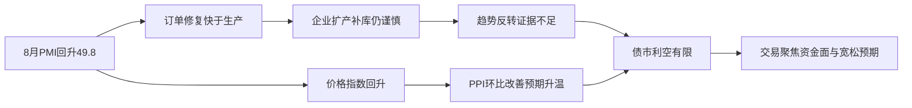
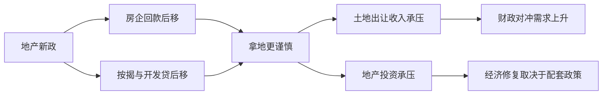

# 📰 公众号热点提炼

> 🕐 2026-09-01（周二）· 覆盖 08-31 至 09-01 · 8 个公众号 · 21 篇文章

---

## ⚡ 关键情报 KEY DELTA

**8月PMI回升至49.8** 成为本时段最集中的宏观变量，但多篇固收研究的共识并非“趋势性反转”，而是**7月天气扰动消退后的阶段性修复**：新订单回升更快、生产与库存修复偏弱、就业仍弱、价格反弹快于需求改善，意味着基本面对债市的冲击偏短而非趋势反转。[来源:social_media_RAR000007900508][来源:social_media_RAR000007900249]

债市层面，日内表现反而体现出“**利空出尽**”特征：PMI高于上月后，**10年国债收益率收于1.688%至1.69%附近，30年收于2.1805%至2.18%附近**，多家观点都认为市场仍在交易宽松预期、资金面与政策观察窗口，而非重新定价强复苏。[来源:social_media_RAR100001980416][来源:social_media_RAR100001975798][来源:social_media_RAR000007898016]

结构上，配置分歧正从“要不要做多”转向“**做什么、怎么做**”：转债强调**中性仓位+中高价结构机会**，REITs关注**租赁住房政策优化**，地产新政的讨论则集中在**财政、房企现金流、银行存贷节奏和地产投资**等中长期传导，而非短期刺激总量反转。[来源:social_media_RAR000007900511][来源:social_media_RAR000007900267][来源:social_media_RAR100001976713][来源:social_media_RAR000007898016][来源:social_media_RAR000007898018]

图1：PMI修复向债市影响的主逻辑

---

## 财经投研类文章

### 1. 张瑜：六个方面可能的影响思考——地产新政学习

**来源**：一瑜中的 · `08-31 13:04`

#### 1. 这篇文章在说什么？
- 文章围绕 **8月28日地产发展新模式相关多部委文件**，系统讨论其对**财政、居民、房企、银行、经济与房价**六个方面的影响，并明确指出当前仍有大量制度细节待明确，例如**现房销售是否强制、土地分期付款如何变化、定金比例如何确定**。[来源:social_media_RAR100001976713]
- 在作者设定的简化测算中，旧模式下若项目总卖房款为 **1**、土地成本 **0.6**、开发成本 **0.3**，预售后房企资金可基本覆盖土地与开发；新模式下若**定金为0.05、项目周期三年、土地与开发贷分三年支付**，则首年房企获得资金仅 **0.15**，需支付土地成本 **0.2**，形成约 **0.05** 资金缺口，意味着房企需要更多资本金参与建设。[来源:social_media_RAR100001976713]
- 财政端，文章判断**土地出让收入或承压**，并给出 **2025年地方土地出让收入为4.15万亿** 的背景量级；居民端则因现房销售或预售贷款发放时点后移而获得更低交付风险，但支付时点同步后延。[来源:social_media_RAR100001976713]
- 银行端，作者测算若 **2025年期房销售额为5.3万亿**、原首付比 **80%**、现房销售定金比 **5%**，则居民存款活化速度将放缓，对应 **新增居民存款/新增M2** 的比值可能由 **54.7%** 升至 **69.6%**。[来源:social_media_RAR100001976713]
- 房价端并未给出单边结论：一方面供给趋谨慎有利于消化库存，另一方面拿地、财政和投资若走弱又可能拖累居民收入和房价承接；截至 **7月现房库销比为7.21个月**，仍处偏高水平。[来源:social_media_RAR100001976713]

#### 2. 为什么这件事重要？
- **地产新政的影响链条很长**，不仅关乎销售制度，还会通过**土地出让收入、开发商现金流、银行按揭与开发贷节奏、地方财政支出能力**传导至广义信用环境与总需求，对债券和地产链资产都有中期影响。[来源:social_media_RAR100001976713]
- 对市场而言，最关键的不是“政策力度大不大”，而是**预售制向现房制切换后现金流如何再分配**。如果房企高周转难以为继，地产投资和拿地可能更谨慎，财政对冲压力就会上升。[来源:social_media_RAR100001976713]
- 对利率资产而言，文章本质上传达的是**制度重塑大于短期刺激**。这意味着市场若期待地产新政直接推动总量复苏，可能需要更多高频和融资数据验证。[来源:social_media_RAR100001976713]

#### 3. 作者的核心观点是什么？
- 作者核心判断是：**地产新政将推动房企从“三高模式”转向更稳健经营**，现金流与经营风险约束都会显著增强。[来源:social_media_RAR100001976713]
- 对财政与经济的判断偏审慎中性：**土地出让收入短期承压概率较高**，后续需看地方税、政府债等其他资金来源是否对冲。[来源:social_media_RAR100001976713]
- 对房价判断为**中性偏复杂**，即供给收缩可能利多库存消化，但若财政和投资承压、收入预期受损，则需求端未必同步改善。[来源:social_media_RAR100001976713]

#### 4. 关键数据与信号
- **2025年地方土地出让收入：4.15万亿**。[来源:social_media_RAR100001976713]
- 假设期房销售额 **5.3万亿**、首付比 **80%**、定金比 **5%**，居民存款活化放缓测算值为 **14.9%**。[来源:social_media_RAR100001976713]
- **新增居民存款/新增M2**：旧口径 **54.7%**，现房销售情景下测算升至 **69.6%**。[来源:social_media_RAR100001976713]
- 新模式示例下房企首年资金获得 **0.15**、土地支付 **0.2**，缺口约 **0.05**。[来源:social_media_RAR100001976713]
- **现房库销比：7.21个月**（截至7月）。[来源:social_media_RAR100001976713]

#### 5. 对投资决策意味着什么？（如适用）
- 需要重点跟踪**土地出让节奏、地方政府债发行、地产拿地面积、居民按揭发放时点变化**，这些变量决定地产新政是“制度重塑”还是“总量托底”。[来源:social_media_RAR100001976713]
- 对债市而言，若地产新政更多体现为**短期财政与地产投资承压**，则其未必构成利率上行驱动；但若后续配套财政金融工具显著加码，则需重新评估稳增长强度。[来源:social_media_RAR100001976713][来源:social_media_RAR000007898016]

图2：地产新政的核心传导链条

---

### 2. 张瑜：企业收入与岗位的非对称观察——投石问“K”系列五

**来源**：一瑜中的 · `09-01 00:00`

#### 1. 这篇文章在说什么？
- 文章以美国、德国、日本、韩国、中国台湾地区及中国大陆上市公司样本为基础，研究头部企业收入份额与就业份额的不对称，即“**赢者少雇**”现象，并比较制造业、建筑业和金融业差异。
- 样本平均看，**2024年制造业收入集中度与就业集中度差额约12.4%**，金融业约 **10.6%**，建筑业约 **6.4%**，说明制造业与金融业更容易出现“头部企业用更少人力占据更大销售”的结构。
- 中国大陆最新横向比较中，**制造业该差值为15.9%**，高于美国 **15.4%** 与韩国 **15.4%**；金融业仅 **1.3%**，显著低于美国 **35.2%**、韩国 **17.0%**、日本 **6.0%**；建筑业为 **4.9%**，低于韩国 **16.6%**、美国 **6.4%**、日本 **5.9%**。
- 动态上，多数经济体制造业收入与就业分化程度持续扩大，例如德国由 **2019年低点2.9%** 升至 **2024年7.4%**，日本由 **2021年6.1%** 升至 **2024年11.1%**，美国由 **2020年11.0%** 升至 **2024年15.4%**。
- 文章进一步提出，制造业“赢者少雇”与**发展阶段**和**制造业规模**相关：中国大陆处于产业升级与超大规模制造并存阶段，因此该现象可能仍处上升阶段。

#### 2. 为什么这件事重要？
- 这篇研究的重要性在于，它把“K型分化”从宏观叙事落到了**企业收入与就业的结构失衡**上，有助于解释为什么总量增长并不自动带来就业同步改善。
- 对投资而言，如果收入与岗位继续非对称扩张，意味着**头部制造企业的盈利、份额和资本回报可能继续集中**，而居民收入与就业扩散效应偏弱，宏观消费修复斜率可能受限。
- 对政策而言，这提示“产业升级”与“就业扩张”并非天然同向，需要更多关注中游制造稳定、产业结构平衡及就业承接能力。

#### 3. 作者的核心观点是什么？
- 作者核心判断是：**主要工业国普遍存在头部企业收入增长快于就业增长的现象**，这并非中国独有，而是产业升级过程中的一般规律。
- 中国大陆制造业的“赢者少雇”程度**略偏高但不极端**，符合国际经验，但在超大规模制造与升级并行背景下，未来阶段性上行压力仍在。
- 作者对未来判断偏**中性偏审慎**：随着升级完成、中游占比趋稳，发展阶段因素压力可能缓和，但由于中国制造业规模大、人口结构变化更晚，长期水平可能仍高于部分成熟经济体。

#### 4. 关键数据与信号
- 样本经济体平均：制造业 **12.4%**、金融业 **10.6%**、建筑业 **6.4%**。
- 中国大陆制造业：**15.9%**；美国 **15.4%**；韩国 **15.4%**。
- 中国大陆金融业：**1.3%**；美国 **35.2%**；韩国 **17.0%**；日本 **6.0%**。
- 中国大陆建筑业：**4.9%**；韩国 **16.6%**；美国 **6.4%**；日本 **5.9%**。
- 德国制造业分化由 **2.9%** 升至 **7.4%**；日本由 **6.1%** 升至 **11.1%**；美国由 **11.0%** 升至 **15.4%**。

#### 5. 对投资决策意味着什么？（如适用）
- 继续关注**制造业头部企业、尤其是高附加值中游制造**的份额集中逻辑，但不能简单外推为全面就业与消费改善。
- 需要把“盈利集中”与“需求扩散不足”同时纳入宏观配置框架，这对权益风格、消费链修复预期和政策博弈都有直接影响。

---

### 3. 【开源固收】宇树开花浮盈满枝，产投信用终看兑现

**来源**：陈曦固收研究 · `08-31 08:31`

#### 1. 这篇文章在说什么？
- 文章聚焦地方国资产业投资在长鑫科技、宇树科技等项目上市后形成的账面浮盈，但强调**账面浮盈不等于信用支撑**，关键在于能否形成优质资产、能否兑现、现金能否回流至偿债主体。[来源:social_media_RAR000007898018]
- 按发行价测算，合肥国资相关平台、安徽省投、北京机器人产业基金及深创投相关主体投资资本倍数分别约 **6.4倍、8.3倍、11.3倍和15.3倍**，账面回报很高。[来源:social_media_RAR000007898018]
- 但兑现过程存在“三层折损”：**锁定期与股价波动、减持折价与税费、资金归集损耗**。以长鑫科技案例测算，中性情景下可动用现金上限仅约为账面市值的 **57%**。[来源:social_media_RAR000007898018]
- 宇树科技上市后，股价由首日收盘 **845元** 回落至 **591.53元**，总市值由 **3417.72亿元** 降至 **2392.53亿元**，相关国资主体持股对应市值由 **196.25亿元** 降至 **137.38亿元**，均回撤约 **30%**。[来源:social_media_RAR000007898018]
- 作者据产业投资重要度与近三年广义投资净现金占用率，将 **68家主体** 分层为低敏感型、回流验证型、基本平衡型和持续投入型，指出持续投入型风险补偿开始显现但仍有限。[来源:social_media_RAR000007898018]

#### 2. 为什么这件事重要？
- 对信用债投资而言，地方国资“投中了明星项目”并不自动提升信用，真正重要的是**账面价值能否转化为偿债现金**，这是对近年来产业投资城投逻辑的一次纠偏。[来源:social_media_RAR000007898018]
- 文章把信用分析从“持股故事”推进到“**退出能力、现金归集、债务覆盖率**”的可验证框架，这对筛选产业投资平台债有直接意义。[来源:social_media_RAR000007898018]
- 若市场只交易账面浮盈而忽视兑现难度，就可能高估部分主体信用资质，尤其在股价高波动阶段更容易出现定价偏差。[来源:social_media_RAR000007898018]

#### 3. 作者的核心观点是什么？
- 作者核心判断是：**产业投资的信用价值最终取决于兑现能力与主体债务负担的匹配度**，而不是投中项目本身。[来源:social_media_RAR000007898018]
- 对持续投入型主体偏审慎：虽然市场已开始给予一定风险溢价，但在资产荒环境下，**风险补偿仍相对有限**。[来源:social_media_RAR000007898018]
- 作者建议信用分析沿“**投前选择—投中资金承接—投后现金兑现**”全过程穿透，而不是停留在合并报表投资收益或账面浮盈层面。[来源:social_media_RAR000007898018]

#### 4. 关键数据与信号
- 投资资本倍数：**6.4倍、8.3倍、11.3倍、15.3倍**。[来源:social_media_RAR000007898018]
- 长鑫科技案例：中性情景下可动用现金上限仅约账面市值 **57%**。[来源:social_media_RAR000007898018]
- 宇树科技股价：**845元** 降至 **591.53元**。[来源:social_media_RAR000007898018]
- 宇树总市值：**3417.72亿元** 降至 **2392.53亿元**。[来源:social_media_RAR000007898018]
- 相关地方国资持股市值：**196.25亿元** 降至 **137.38亿元**。[来源:social_media_RAR000007898018]
- 分层样本：**68家主体**，其中 **33家低敏感型、6家回流验证型、9家基本平衡型、20家持续投入型**。[来源:social_media_RAR000007898018]

#### 5. 对投资决策意味着什么？（如适用）
- 产业投资平台债筛选应重点看**母公司口径回款、现金短债比、项目退出节奏、再融资稳定性**，而不是只看明星股权项目名称。[来源:social_media_RAR000007898018]
- 若持续投入型主体的**信用利差与期限调整后超额利差持续走阔**，应转向更审慎配置。[来源:social_media_RAR000007898018]

---

### 4. 9月债市投资策略展望

**来源**：固收亮话 · `08-31 08:39`

#### 1. 这篇文章在说什么？
- 文章判断 **9月资金利率大概率保持稳定**，预计隔夜资金在 **1.35%** 左右、7天资金在 **1.4%** 左右波动；在此背景下，**1Y存单和3Y国开隐含7天资金利率分别约1.41%和1.36%**，短端机会不大。[来源:social_media_RAR000007898016]
- 长债方面，作者认为 **10年国债** 虽在突破 **1.7%** 后一度下行至 **1.66%** 左右，但当前位置并不算贵，若9月无超预期利空，预计主要波动区间在 **1.65%至1.7%**。[来源:social_media_RAR000007898016]
- 超长债方面，作者预计 **30年国债** 主要波动区间在 **2.1%至2.15%**，并指出当前 **9月地方债计划发行量约6000亿元**，节奏仍偏平稳，供给冲击有限。[来源:social_media_RAR000007898016]
- 组合建议上，维持**短+长的哑铃型结构**，久期偏中性，长期限交易敞口可关注 **30年国债活跃券**，底仓可关注 **30Y地方债**。[来源:social_media_RAR000007898016]
- 个券方面，交易上可关注 **260010、260205、26T4、26T2、25T2** 等，浮息债则点名 **26农发清发09** 相对便宜。[来源:social_media_RAR000007898016]

#### 2. 为什么这件事重要？
- 这是较典型的**月度债市配置框架**：核心不再是方向性大举做多，而是围绕**资金稳定、曲线不陡、供给温和**的环境做结构优化。[来源:social_media_RAR000007898016]
- 对机构投资者而言，文章给出的**区间、券种和组合形态**都具有较强交易指引意义，尤其适用于当前低波动环境中的仓位管理。[来源:social_media_RAR000007898016]
- 同时，文章把市场风险点明确收敛为**政府债发行节奏、增量政策、资金面变化**，便于后续动态验证。[来源:social_media_RAR000007898016]

#### 3. 作者的核心观点是什么？
- 作者总体立场为**中性偏多**：短端震荡、长端有缓步下行可能、超长端赔率更高但分歧更大。[来源:social_media_RAR000007898016]
- 对10年国债看法偏积极，认为即便收益率低于 **1.7%**，也不意味着下行过快。[来源:social_media_RAR000007898016]
- 对30年国债保持谨慎乐观，即赔率较高，但要等待地方债、政策工具和经济数据进一步验证。[来源:social_media_RAR000007898016]

#### 4. 关键数据与信号
- 隔夜资金：**1.35%** 左右；7天资金：**1.4%** 左右。[来源:social_media_RAR000007898016]
- 1Y存单与3Y国开隐含7天资金利率：**1.41%**、**1.36%**。[来源:social_media_RAR000007898016]
- 10年国债波动区间：**1.65%至1.7%**。[来源:social_media_RAR000007898016]
- 30年国债波动区间：**2.1%至2.15%**。[来源:social_media_RAR000007898016]
- 9月地方债计划发行量：约 **6000亿元**。[来源:social_media_RAR000007898016]
- TL期货空头力量增强空间有限，短期存在反弹可能。[来源:social_media_RAR000007898016]

#### 5. 对投资决策意味着什么？（如适用）
- 当前更适合做**区间内交易和结构择券**，而非简单追多；若利率来到区间上沿，可关注交易性机会。[来源:social_media_RAR000007898016]
- 重点观察 **地方债发行实际节奏、政策性金融工具落地、地产新政对信贷和数据的拉动**。[来源:social_media_RAR000007898016]

---

### 5. REITs I 关注租赁住房板块政策指引

**来源**：郁言债市 · `08-31 23:32`

#### 1. 这篇文章在说什么？
- 文章回顾 **2026年8月24日至8月28日** REITs市场表现：**中证REITs全收益指数收于955.3点，周涨1.39%**，连续两周涨幅超过 **1%**，日均换手率升至 **0.48%**。
- 截至 **8月28日**，**产权REITs利差收窄10bp至290bp**，但仍处于历史 **96%分位数**，说明赔率仍高；作者判断在参与机构更多元、指数基金上线背景下，利差大幅走阔概率较低。
- 二级市场中，**产业园区板块周涨4.98%**、仓储物流涨 **2.58%**，其中**建信中关村REIT单周上涨18.4%**，并在 **8月26日** 尾盘涨停，成为老券首个涨停板。
- 文章重点讨论 **8月28日发布的《关于资本市场支持构建房地产发展新模式的意见》** 对租赁住房REITs的影响，关注**原始权益人监管、战略配售比例、锁定期、份额质押、净现金流分派率要求**等后续优化空间。
- 目前交易所对租赁收入型不动产项目要求未来两年年净现金流分派率原则上不低于**10年国债收益率+150bp**，当前约 **3.2%**；而中指研究院披露 **50城平均租金回报率约2.28%**，板块存量项目平均分派率约 **3.24%**，相对更有优势。

#### 2. 为什么这件事重要？
- REITs当前的关键不是指数反弹本身，而是**政策开始指向租赁住房和商业不动产的制度优化**，这可能改变一级供给与二级估值框架。
- 若监管要求放松，例如降低战略配售比例、放宽锁定期、优化分派率要求，将提升租赁住房REITs的可发行性，并改善板块估值锚。
- 对存量持仓而言，**高出租率、高分派率的已上市项目**可能率先受益于政策预期和相对稀缺性。

#### 3. 作者的核心观点是什么？
- 作者观点偏**中性偏多**：整体利差仍在高位，赔率已较高，而流动性压力较2024年利差高点时更小。
- 配置方向上更看好**租赁住房、数据中心、消费设施、市政环保**等基本面较好板块；交易上可博弈**园区、仓储**等前期跌幅大的高分派率个券。
- 对租赁住房板块的判断偏积极，关键催化在于**监管约束可能边际放松**。

#### 4. 关键数据与信号
- 中证REITs全收益指数：**955.3点**，周涨 **1.39%**。
- 日均换手率：**0.48%**。
- 产权REITs利差：**290bp**，历史 **96%分位数**。
- 产业园区涨幅：**4.98%**；仓储物流：**2.58%**。
- 建信中关村REIT单周涨幅：**18.4%**。
- 分派率门槛：约 **3.2%**；50城平均租金回报率：**2.28%**；租赁住房板块平均分派率：**3.24%**。
- 推荐关注：**华润有巢3.57%**、**招商基金蛇口3.40%**、**城投宽庭3.38%**。

#### 5. 对投资决策意味着什么？（如适用）
- REITs配置上可优先跟踪**租赁住房政策优化细则**，尤其是分派率和原始权益人约束是否放松。
- 存量项目中，优先筛选**高出租率、高分派率、区位优质**的租赁住房REITs。

---

### 6. 转债｜保持仓位，把握结构机会

**来源**：睿哲固收研究 · `09-01 07:30`

#### 1. 这篇文章在说什么？
- 文章回顾了7月至8月的转债行情：7月科技调整后，转债高低价“K型分化”收敛，**低价转债大幅反弹而高价券回调**；进入8月科技反弹后，转债前期跟涨、后期出现明显“**上涨杀估值**”。
- 估值层面，作者指出当前转债市场虽然经历8月下旬调整，但若忽略7月底畸形高点，**估值仍处历史高位**；上周 **平价90–110** 转债转股溢价率约 **44.14%**，处于历史 **95%分位数以上**，价格中位数约 **134.2元**。
- 供给与需求方面，**1至8月转债发行规模635亿元、数量53只**，明显超过前两年；但同期**强赎退出接近100只、规模超700亿元**，且未来一个季度到期规模接近 **400亿元**，供给收缩仍对估值形成支撑。
- 策略上，作者认为低价券下修预期已被透支，高价券次新定价也偏高，整体应**保持中性仓位**，重点关注**中高价中与行业景气契合的结构性机会**。
- 文章给出细分方向：关注**油价上行受益链、科技链反弹、出口链绩优标的**以及均衡底仓配置。

#### 2. 为什么这件事重要？
- 当前转债市场的核心矛盾不再是“有没有估值”，而是**高位估值+供给收缩+风格轮动**下如何做结构选择。
- 对投资者而言，这意味着简单做beta的性价比下降，策略重点转向**板块景气度、个券期限结构和强赎博弈风险**。
- 文中对资金结构的观察也很重要：**公募基金、尤其ETF占比提升**，说明转债市场交易性增强，波动和风格切换可能更快。

#### 3. 作者的核心观点是什么？
- 作者立场是**中性**：当前位置有支撑，但进一步拉升空间有限。
- 低价券观点偏谨慎：**下修透支明显、性价比偏低**；高价券观点也偏谨慎：**次新定价高、博弈难度大**。
- 最明确的建议是：**保持仓位，积极挖掘中高价结构性机会**。

#### 4. 关键数据与信号
- **1至8月发行规模635亿元、53只**。
- **强赎退出接近100只、规模超700亿元**。
- 未来一个季度到期规模接近 **400亿元**。
- 平价 **90–110** 转股溢价率：**44.14%**。
- 可转债价格中位数：**134.2元**。
- 上周中证转债指数：**495.87**，反弹 **0.92%**；日均成交额 **456.32亿元**。

#### 5. 对投资决策意味着什么？（如适用）
- 不宜在当前位置全面加风险暴露，更适合围绕**行业景气度与个券结构**做精选配置。
- 重点跟踪**强赎重新计数、次新定价、ETF资金流向**，这些变量对阶段表现影响更大。

---

### 7. 需求修复，是反转还是脉冲？

**来源**：睿哲固收研究 · `09-01 07:30`

#### 1. 这篇文章在说什么？
- 文章指出 **8月制造业PMI回升0.6个点至49.8**，修复动力主要来自需求侧，**新订单指数、新出口订单指数分别回升2.1个点、0.5个点**，双双回到扩张区间。
- 与之相对，生产修复偏弱，**生产指数仅回升0.5个点**，原材料库存指数连续 **4个月** 在临界值以下回落，企业生产经营预期指数环比回落 **0.3个点**，显示企业扩产意愿有限。
- 价格端出现二次抬头，**原材料购进价格指数和出厂价格指数分别上行3.4个点、2.6个点** 至临界值以上，作者认为近期油价和有色价格上行是重要推手，但下半年高基数会限制PPI同比上行幅度。
- 文章将8月修复定义为更接近**“脉冲式修复”**而非趋势反转：一方面受7月异常天气扰动消退影响，另一方面企业未同步补库存、招工和扩产。
- 建筑业层面，作者提到基建分项已有企稳迹象，**土木工程建筑业商务活动指数回升2个百分点至52以上**，但房建仍弱。

#### 2. 为什么这件事重要？
- PMI是短期宏观预期和债市交易的重要锚。若修复只是脉冲，意味着**基本面对利率上行的持续约束有限**。
- 订单强、生产弱、库存弱的组合说明企业对需求持续性信心不足，这与市场对“经济趋势反转”的判断有明显差别。
- 价格端抬头而非就业、库存同步改善，也意味着**PPI改善更多来自成本推动而非需求全面走强**。

#### 3. 作者的核心观点是什么？
- 核心观点是：**8月需求修复更像脉冲，不足以认定趋势反转**。
- 对价格判断偏中性：**PPI在8至9月可能环比边际修复，甚至阶段性回正，但同比难再破6月前高**。
- 对后续经济判断偏谨慎：在地产链调整与外需波动背景下，仍需政策持续呵护，等待内生动能修复。

#### 4. 关键数据与信号
- 制造业PMI：**49.8**，环比 **+0.6**。
- 新订单指数：**+2.1**；新出口订单：**+0.5**。
- 生产指数：**+0.5**。
- 企业生产经营预期指数：**-0.3**。
- 原材料购进价格指数：**+3.4**；出厂价格指数：**+2.6**。
- 土木工程建筑业商务活动指数：回升 **2个百分点** 至 **52以上**。

#### 5. 对投资决策意味着什么？（如适用）
- 债市交易上，更应把本轮PMI理解为**数据扰动修复而非基本面趋势切换**。
- 需跟踪 **9月订单、库存、就业、生产能否继续修复**，若缺乏接力，则“脉冲论”更成立。[来源:social_media_RAR000007900249]

---

### 8. “旺季”反弹，8月PMI的信号

**来源**：郁言债市 · `08-31 23:32`

#### 1. 这篇文章在说什么？
- 文章认为 **8月制造业PMI回升0.6个百分点至49.8%**，高于历史同期中位升幅 **0.1个百分点**，但结合7月超季节性下滑看，两个月合并后仍弱于季节性。
- 需求与生产关系上，**生产指数和新订单指数分别回升0.5和2.1个百分点至50.4%和50.6%**，新订单修复明显快于生产；但7至8月双月均值仍低于二季度平均值，表明景气度尚未回到二季度水平。
- K型分化方面，**高技术制造业PMI为52.9%、装备制造业51.4%**，而消费品和基础原材料分别仅 **49.0%和47.9%**；高技术制造业已连续 **19个月** 不低于50，基础原材料行业连续 **28个月** 低于50。
- 非制造业并未跟随回补，服务业商务活动指数持平于 **49.3%**，服务业新订单回落至 **44.5%**；建筑业商务活动指数回落至 **46.9%**，但新订单回升 **2.3个百分点至42.4%**。
- 价格端方面，制造业购进价和出厂价指数分别回升至 **56.6%和50.4%**，但从业人员指数仍弱，显示价格改善更多是成本推动而非全面需求改善。

#### 2. 为什么这件事重要？
- 文章与其他PMI解读一起构成当前宏观的主线分歧：**数据边际改善已发生，但对趋势反转的证据仍不充分**。
- 对股市而言，K型分化边际收敛支持再平衡交易；对债市而言，PMI边际偏空但强度有限，因为服务业与非制造业修复偏弱。
- 这意味着资产配置上不能只盯制造业PMI总量，而要看**服务、新订单、就业、库存和价格结构**。

#### 3. 作者的核心观点是什么？
- 作者判断是：**8月经济较7月边际改善，但7至8月景气度仍低于二季度**。
- 对债市观点偏**中性偏空但有限**：制造业订单和价格回升对长端收益率构成短期约束，但市场仍更关注宽松预期与资金面。
- 对后续验证窗口明确指向**9月**，要看生产、新订单、服务业订单、建筑业实物工作量、出厂价格与就业能否形成接力。

#### 4. 关键数据与信号
- 制造业PMI：**49.8%**，环比 **+0.6个百分点**。
- 生产指数：**50.4%**；新订单：**50.6%**。
- 高技术制造业：**52.9%**；装备制造业：**51.4%**；消费品：**49.0%**；基础原材料：**47.9%**。
- 服务业新订单：**44.5%**。
- 建筑业商务活动指数：**46.9%**；新订单：**42.4%**。
- 购进价格：**56.6%**；出厂价格：**50.4%**；制造业从业人员指数：**48.7%**。

#### 5. 对投资决策意味着什么？（如适用）
- 对债市而言，不宜把8月PMI单月回升线性外推为强复苏，应重点验证**9月能否接力**。
- 对权益而言，可继续关注**K型分化收敛、AI以外方向的再平衡交易**。

---

### 9. 不会再降息了

**来源**：表舅是养基大户 · `08-31 21:33`

#### 1. 这篇文章在说什么？
- 文章结合银行半年报，提出中短期内**降息概率依然不大**、本轮利率低点基本确认的判断，并讨论其对债市、股市、地产和汇率的影响。
- 作者认为银行上半年利润增速“含金量一般”，一方面部分大行在 **2025年完成增资**，另一方面通过出售AC账户债券兑现浮盈抬升利润；文中提到**国有大行AC兑现投资收益/归母净利润由6.6%升至10.6%**。
- 真正反映经营绩效的是ROE。文章指出国有行里仅农行ROE勉强在 **10%以上**，但各家ROE同比仍继续下行，只是下行速度放缓。
- 作者将利率底部确认的逻辑建立在**银行净息差企稳**与中小银行吸储能力约束之上，认为若继续降利率、尤其存款利率，会冲击银行体系稳定和政策传导。
- 对资产配置上，文章认为债市将维持**低利率、低波动**，股市长期慢牛趋势不变，但估值高点也大体被利率底部锁定。

#### 2. 为什么这件事重要？
- 这篇文章的意义在于，它不是从总量经济，而是从**银行经营与金融体系稳定**角度论证利率下限，对市场有较强框架参考意义。
- 若利率底部确认，意味着债市下行赔率收窄，传统股债对冲框架效果可能变弱，权益估值上限也更清晰。
- 对地产而言，若政策利率难再下，则后续支持工具可能更多转向**财政贴息、期限延长、公积金政策优化**等非价格工具。

#### 3. 作者的核心观点是什么？
- 核心观点是：**中短期不会再降息，本轮利率底部基本已探明**。
- 对债市观点偏**中性**：向上风险有限，但向下赔率也有限，低波动格局延续。
- 对股市观点偏**中性偏多**：低利率环境仍支持股市相对性价比，但估值高点已较为明确，后续更要看ROE与PB匹配。

#### 4. 关键数据与信号
- 国有大行AC兑现投资收益/归母净利润：由 **6.6%** 升至 **10.6%**。
- 银行ROE衡量线：**10%以上** 被视作较有参考意义的资本回报标准。
- 文章提及 **10年美债达到4.75%**，创特朗普本届政府上任以来新高。

#### 5. 对投资决策意味着什么？（如适用）
- 债市不宜再用“持续降息”做主要押注逻辑，更适合以**低波动、区间交易、期限利差**思路应对。
- 权益更适合寻找**PB合理、ROE稳定**的板块与公司，而非单纯追逐估值扩张。

---

### 10. PMi落地，债市利空出尽！

**来源**：红军债市笔记 · `09-01 05:41`

#### 1. 这篇文章在说什么？
- 文章复盘 **8月31日** 债市走势：早盘在央行净回笼、PMI好于预期背景下，现券收益率震荡上行，上午 **10年国债约1.693%、30年约2.185%**；午后资金面保持均衡，尾盘 **10年收于1.688%、30年收于2.1805%**。
- 资金面上，**DR001上行8bp至1.422%**，**DR007上行3bp至1.418%**，**一年存单1.47%** 持平，央行当日开展 **50亿元7天逆回购** 和 **4470亿元隔夜逆回购**，当日逆回购到期 **6730亿元**，单日净回笼 **2210亿元**。
- PMI方面，文中引用 **中国8月官方制造业PMI为49.8，前值49.2，预期49.9**，指出数据仍在荣枯线以下，但回升力度较大，市场反应却体现为“利空出尽”。
- 作者同时提示政策观察窗口：已喊出努力实现年度经济目标，若三季度数据继续下滑，则**降准降息可期**。

#### 2. 为什么这件事重要？
- 这篇文章提供了**日内交易视角**：在PMI反弹和央行净回笼双重偏空因素下，长端利率并未明显上冲，显示市场情绪仍偏强。
- 对交易盘而言，资金面与政策预期仍然比单次数据更重要，这与多篇策略研究形成互证。[来源:social_media_RAR000007898016]
- 同时，文章给出明确的交易区间和节奏，反映当前债市仍是**搓衣板式低波动交易环境**。

#### 3. 作者的核心观点是什么？
- 作者观点偏**短线偏多**，认为PMI落地后债市呈现“**利空出尽**”表现。
- 同时保留对后续宽松的期待，若三季度数据继续下滑，**降准降息可期**。

#### 4. 关键数据与信号
- 10年国债：上午 **1.693%**，收盘 **1.688%**。
- 30年国债：上午 **2.185%**，收盘 **2.1805%**。
- DR001：**1.422%**；DR007：**1.418%**。
- 一年存单：**1.47%**。
- 逆回购：**50亿元7天**、**4470亿元隔夜**；到期 **6730亿元**；净回笼 **2210亿元**。
- PMI：**49.8**，前值 **49.2**，预期 **49.9**。

#### 5. 对投资决策意味着什么？（如适用）
- 当前更适合按**区间思维**交易，而不是追逐单一数据扰动。
- 需继续观察**三季度数据与政策窗口**是否验证宽松预期。

---

### 11. 沃什放鹰，长端利率下行（20260831）

**来源**：固收彬法每日观察 · `08-31 19:36`

#### 1. 这篇文章在说什么？
- 当日国债现券收益率整体下行，**2年期下行0.15bp至1.25%**、**10年期下行0.50bp至1.69%**、**30年期下行0.70bp至2.18%**。
- 资金面边际收敛，**1年期国股行存单利率1.49%**，与前一日持平。
- 背景事件包括**逆回购净回笼2210亿元、沃什放鹰、股市表现较好、地产新政影响有限**。

#### 2. 为什么这件事重要？
- 这是一篇短频快的日度观察，核心意义在于确认：即便外部鹰派与净回笼同时出现，**长端利率仍以下行为主**，显示债市韧性仍在。
- 与其他复盘相互印证，市场当前对单一利空的敏感度下降，更关注中期资金和政策环境。

#### 3. 作者的核心观点是什么？
- 作者隐含观点偏**中性偏多**：外部偏鹰和净回笼并未改变长端利率下行方向。

#### 4. 关键数据与信号
- 2年国债：**1.25%**，下行 **0.15bp**。
- 10年国债：**1.69%**，下行 **0.50bp**。
- 30年国债：**2.18%**，下行 **0.70bp**。
- 1年期国股行存单：**1.49%**。

---

## 科技类文章

### 12. Lovart这次全新升级，我顺手把自己的skill搬了上去

**来源**：花叔 · `08-31 17:20`

文章围绕 Lovart 国内版升级展开，重点介绍了**灵感采集插件**与 **skill 导入能力**，并通过电商主图、海报、网页原型等案例展示其从“收集参考—生成候选—交付设计资产”的完整工作流。 文中还提到作者将自己开源的设计 skill 迁入平台，认为其价值在于强化“先给多个真实方向再选择”的设计流程。

### 13. ECCV社交副本开启！来AI Talent Night，聊聊新技术、见见新老朋友

**来源**：机器之心 · `08-31 17:00`

文章是一则活动预告，介绍 **ECCV 2026 AI Talent Night** 将于 **9月10日17:30至22:00** 在瑞典马尔默举办，面向ECCV论文作者、青年研究者、技术人才与产业专家开放报名。 活动形式包括学术分享、技术与产业交流、大咖座谈和Networking，强调研究方向、职业发展与产业需求的连接。

### 14. 今天，「人工智能」这个学科诞生70年了

**来源**：机器之心 · `08-31 17:00`

文章回顾人工智能从 **1955年达特茅斯提案** 到 2026 年的发展史，串联了感知机、专家系统、AI寒冬、深度学习、Transformer、ChatGPT与Agent等关键节点，并讨论“AGI是否已实现”的定义争议。[来源:social_media_RAR000007900508] 全文更像一篇AI技术史长文，重点不在单一新闻，而在总结七十年技术路线与产业叙事的反复演进。[来源:social_media_RAR000007900508]

### 15. 刚刚，我们用千问创作做了一部「JoJo的奇幻买瓜」

**来源**：机器之心 · `08-31 14:11`

文章实测了阿里 **千问创作** 平台中的 **Wan 3.0视频模型** 与 **Agent Teams协作模式**，展示从一句创意需求到剧本、角色、分镜、视频生成再到成片的完整流程。[来源:social_media_RAR000007900312] 核心结论是，视频创作的瓶颈正从单镜头质量转向**多工位协作与上下文管理**，多Agent平台的价值在于把分散流程收拢到同一工作台中。[来源:social_media_RAR000007900312]

### 16. 刚刚，OpenClaw 2.0来了，龙虾升级

**来源**：机器之心 · `08-31 14:11`

文章介绍 OpenClaw 2.0 的核心升级，包括**引导式安装、chat-first浏览器控制界面、SQLite会话存储、共享云会话、审计与安全工具**等。[来源:social_media_RAR000007900249] 文中认为该版本标志着项目从早期爆红后的“演示品”逐步转向更强调协作、权限边界与生产可用性的工具化阶段。[来源:social_media_RAR000007900249]

### 17. Mac mini缺货原因找到了！OpenAI、Anthropic都在抢

**来源**：机器之心 · `08-31 10:18`

文章援引外媒信息称，OpenAI过去几个月采购了**数万台Mac mini和Mac Studio**，用于强化学习和计算机操作Agent开发，Anthropic也在AWS租用大量Mac算力。[来源:social_media_RAR100001975798] 文章进一步指出，Mac正在从个人电脑转变为AI基础设施的一部分，尤其适合本地推理、Agent执行和真实操作系统环境训练。[来源:social_media_RAR100001975798]

### 18. HOMIE Gen2全新发布！解锁人类经验的Scaling Law

**来源**：机器之心 · `08-31 10:18`

文章介绍 Physical AI 公司 Ropedia 发布的新一代多模态采集系统 **HOMIE Gen2**，强调“机器人能力将随高质量人类经验规模化增长”的 **Human Experience Scaling Law**。[来源:social_media_RAR100001975840] 设备主打 **4目360°全景、4路空间音频、约380g机身、约13小时连续采集** 与训练级多模态数据交付，意在解决具身智能的数据稀缺问题。[来源:social_media_RAR100001975840]

---

## ☕ 其他更新

| 公众号 | 文章 | 一句话 |
|--------|------|--------|
| 固收亮话 | 固收实务投研框架系列会议（共12期，每周三晚上7点） | 会议预告，宣传固收实务投研框架系列课程，第九期主题为**美债定价逻辑全景解析**，时间为 **9月2日19:00**。[来源:social_media_RAR000007900511] |
| 固收亮话 | 国联民生固收徐亮团队丨电话会议邀请 | 电话会通知，主题为**9月债市投资策略**，围绕利率节奏、债券策略、商金债与地方债提速展开。[来源:social_media_RAR100001980416] |
| 债券今天有蛋吗 | 加仓总在周一... | 短评类更新，主要记录作者作为跟投人的加仓动作，并简述债券与转债市场体感，信息密度较低。[来源:social_media_RAR000007900267] |

---

## 🔭 关注清单 THINGS TO WATCH

1. **9月PMI与高频生产数据能否接力8月修复**：重点看制造业**生产、新订单、库存、就业**是否同步改善，验证“脉冲修复”还是“趋势回升”。
2. **政府债发行与资金面变化**：多篇债市观点均把**地方债供给节奏、央行流动性投放、短端资金利率**视为9月交易主变量。[来源:social_media_RAR000007898016]
3. **地产新政与租赁住房REITs配套细则**：重点观察**现房销售制度细节、土地分期支付安排、租赁住房REITs监管与分派率要求是否优化**。[来源:social_media_RAR100001976713]

---

_本日报基于用户订阅的公众号文章生成。财经投研类文章做结构化深度拆解，科技类文章做概要，其他类文章做轻量概览。_