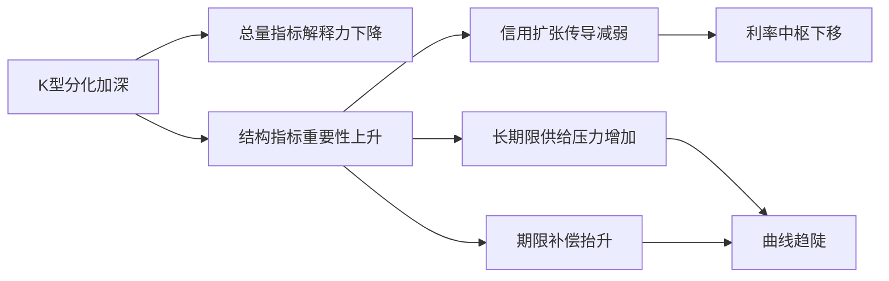
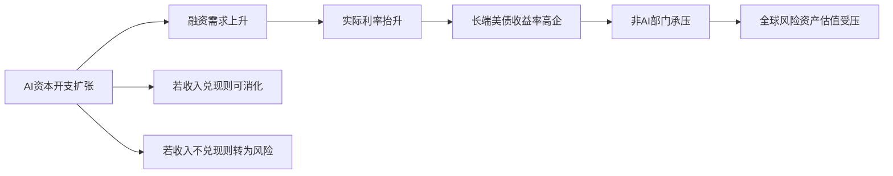

# 📰 公众号热点提炼

> 🕐 2026-09-03（周四）· 覆盖 09-02 至 09-03 · 10 个公众号 · 18 篇文章

## ⚡ 关键情报 KEY DELTA

本时段最值得关注的主线有两条：一是**债市进入9月博弈窗口**，多篇固收文章同时聚焦“9月魔咒”、政府债供给放量、资金面平稳预期与长端利率上行压力，结论整体偏向“**调整幅度或有限，但低位震荡、波段交易价值上升**”。[来源:my_subscription_RAR000007909415][来源:my_subscription_RAR000007909264] 二是**海外利率与油价重新成为全球风险资产定价核心变量**，从美伊冲突推升油价、10年美债上行，到A股科技拥挤交易降温、红利与成长同步承压，市场关注点正从基本面催化切回贴现率冲击。[来源:my_subscription_RAR000007909415][来源:my_subscription_RAR000007909264]

科技侧则呈现出明显的“**Agent化、物理世界化、工程可用性**”升级：从**Gemini 3.8**、**豆包工作**、**UU远程**到机器人精密装配、3D Vibe Coding、世界模型 **Atlas**，行业热点已不再停留在单次生成效果，而是转向**长任务、自主执行、真实部署、结构可编辑与闭环学习**。[来源:my_subscription_RAR000007909412][来源:my_subscription_RAR000007909265][来源:my_subscription_RAR100002009054]

---

## 财经投研类文章

### 1. 9月，每调买机
**来源**：郁言债市 · `09-02 15:16`

#### 1. 这篇文章在说什么？
- 文章回顾**8月债市**表现，指出10年国债在交易力量推动下一度逼近**1.67%**，随后因止盈与利空猜想回升至**1.69%**附近，重新回到**1.70%**附近的“安全水平”。
- 文中总结近十年所谓“**9月魔咒**”：以10年国债收益率为参考，**9月利率上行概率高达70%**，月内自阶段低点最大上行平均**11.6bp**，且高点多落在下旬。
- 作者将9月潜在扰动归纳为四类：**资金收紧、供给冲量、“稳增长”预期、机构行为**，并据此评估今年9月债市风险。
- 对政府债供给给出三种假设：常规与极端假设下，**9月政府债净融资规模约1.44万亿–1.60万亿元**；温和情形约**1.29万亿元**。
- 文章判断在“**财政提速、货币求稳**”组合下，长端利率上行与下行空间都受约束，9月主线更偏向**震荡中的波段机会**，“**每调买机**”仍是有效策略。

#### 2. 为什么这件事重要？
- 9月是债市季节性扰动最集中的月份之一，若供给、资金与风险偏好同时变化，长端波动会放大，对**利率债久期仓位、信用债利差交易和债基净值稳定性**都有直接影响。
- 当前长端收益率已处于历史低位附近，文章特别提示**利率债基久期中枢约4.8年、处于2024年以来96.7%分位**，意味着一旦调整，机构一致止盈可能放大波动。
- 若央行对供给放量给予对冲，则“9月魔咒”可能弱化；若风险偏好因中美关系或政策超预期修复，则长债下行逻辑将进一步受限。

#### 3. 作者的核心观点是什么？
- **事实判断**：9月政府债净融资大概率放量，但仅凭供给很难形成显著债市风险，因为央行大概率会配合投放流动性。
- **逻辑判断**：今年资金利率中枢此前并未明显下移，意味着跨季上行空间可能有限；央行维持资金平稳运行的诉求较强。
- **策略判断**：9月不是单边大跌或单边大涨环境，而更像**低位震荡、月中波段交易窗口开启**的月份，因此“逢调整布局”优于盲目追多或恐慌减仓。

#### 4. 关键数据与信号
- **10年国债活跃券一度逼近 1.67%**，截至8月28日回升至**1.69%**。
- 近十年**9月利率上行概率 70%**，最大上行均值**11.6bp**。
- 9月政府债净融资：常规/极端假设约**1.44万亿–1.60万亿元**；温和情形约**1.29万亿元**。
- 利率债基久期中枢约**4.8年**，处于**2024年以来96.7%分位**。
- 文章明确提出月内节奏：**月初偏低波、月中随着数据与供给明朗而活跃**。

#### 5. 对投资决策意味着什么？
- 对利率债而言，更优策略是**控制过高久期暴露、等待调整后的修复机会**，而不是在极低利率位置继续线性追涨。
- 重点跟踪三项验证变量：**政府债发行节奏、9月下旬央行跨季工具投放、中美关系与风险偏好变化**。

---

### 2. 凉了
**来源**：表舅是养基大户 · `09-02 21:34`

#### 1. 这篇文章在说什么？
- 文章将昨晚美股与今日亚太市场下跌，归因于**美伊冲突加剧**推升油价与通胀预期，进而带来**加息预期抬升、美债收益率上行、股市与黄金下跌**的链式反应。
- 作者强调**海外利率风险**仍是下半年最核心不确定性，尤其提到日本央行官员表态偏鹰，暗示**9月加息**甚至可能从此前半年一次转向更高频率调整。
- A股方面，文章认为市场交易显著降温，**成交额再次回到1.8万亿元**，且此前持续跟踪的拥挤度指标回落至**43%**，反映大盘成长和科技交易冷却。
- 作者进一步指出，这不是A股独有问题，而是**全球科技资产共振向下**，背后是科技板块从“利率脱敏型资产”变成“利率相关性资产”。
- 文章还提到红利板块出现补跌，煤炭、有色等此前涨幅较大细分方向回调，提示高位红利交易也在透支；同时点出**宇树股价“正式腰斩”**，以及黄金短期明显回落。

#### 2. 为什么这件事重要？
- 这篇文章的重要性不在于单一市场点评，而在于把近期风险资产调整统一到了同一条主线：**油价–通胀–海外利率–估值压缩**。
- 若海外利率持续抬升，科技成长板块受压最明显，因为估值本质上对贴现率高度敏感；同时，红利也并非绝对避风港，高位交易拥挤后同样会面临均值回归。
- 对A股投资者而言，这意味着市场风格分化逻辑正在弱化，单纯依赖“成长/红利跷跷板”可能失效，资产间相关性上升是更大的风险。

#### 3. 作者的核心观点是什么？
- **事实陈述**：美伊冲突推升油价，美国柴油价格逼近2022年历史高位，美债收益率上行，全球股市承压。
- **核心判断**：下半年最大的风险仍是**海外利率风险**，这不仅影响美股，也通过估值、资金与风险偏好传导到A股与亚太市场。
- **风格判断**：科技调整并非孤立现象，而是全球科技共振下行；与此同时，高位红利细分板块也存在显著透支。
- **配置判断**：作者最终回到**分散配置、多元资产、降低致命错误概率**的框架，弱化单一风格押注。

#### 4. 关键数据与信号
- A股成交额回落至**1.8万亿元**。
- 拥挤度指标下滑至**43%**。
- 作者举例指出，去年11月初农行股息率一度跌破**3%**，若从彼时计算，至今农行累计**-14.88%**，工行累计**4.54%**，股价收敛约**20个点**。
- 文中明确提到**宇树股价正式腰斩**，作为高估值新股/热门题材回归的案例。

#### 5. 对投资决策意味着什么？
- 需要把未来几周核心监测指标前移到**油价、美债长端、日央行政策信号**，而不仅仅盯国内基本面或行业景气。
- 成长与红利都要警惕高位透支，当前更重要的是**控制拥挤交易暴露**，而非简单切换风格。

---

### 3. 观K型分化，测利率脉动｜债市转型数据库
**来源**：睿哲固收研究 · `09-03 07:30`

#### 1. 这篇文章在说什么？
- 文章讨论在**K型分化**加深背景下，传统总量指标如GDP、工业增加值、制造业PMI对利率的解释力下降，**结构性指标**的重要性上升。
- 文中指出，经济结构分化会通过**资金供需、信用派生、债券供需、机构行为、政策响应**等渠道影响利率定价。
- 作者认为，出口和新兴制造业韧性较强，但由于其**轻资产、低杠杆**特征，对传统银行信贷需求拉动有限；而地产、居民消费和传统行业融资需求偏弱，导致“**货币增加快于信用创造**”，压制整体利率中枢，尤其支撑中短端。
- 在收益率曲线层面，内需偏弱背景下财政仍需维持力度，长期限政府债供给上升，叠加结构不确定性提升期限补偿，可能带来“**利率中枢下移**”与“**期限利差中枢抬升**”并存。
- 为此，文章构建了“**K型分化与利率数据库**”，覆盖**4大维度、23个模块、254条指标序列**，并从中筛选出与**1年、10年、30年国债收益率**及**30–10年期限利差**关联度较高的**20个核心指标**。

#### 2. 为什么这件事重要？
- 对利率研究而言，这篇文章的价值在于明确提出：未来仅靠总量宏观指标可能越来越难解释债市，**结构分化才是中期利率定价的关键变量**。
- 这意味着利率交易需要从“总量跟踪”转向“**结构跟踪**”，尤其是对**中短端利率中枢**与**长端期限利差**的判断方法要随之调整。
- 如果K型分化持续，债市可能长期处于“**信用扩张不强、财政供给偏大、曲线更陡**”的环境，这会改变久期配置与曲线交易策略。

#### 3. 作者的核心观点是什么？
- **事实判断**：总量指标波动幅度下降、预测难度上升，与利率之间映射关系发生变化。
- **机制判断**：结构分化削弱了经济修复向信用扩张的传导，因此更容易形成“货币宽、信用弱”的组合，从而压低利率中枢。
- **曲线判断**：长端和超长端受财政供给与期限补偿影响更大，结构变化不只影响方向，也会影响**曲线形态**。
- **方法判断**：利率研究框架必须引入宏观–中观–上市公司层面的多维结构指标体系。

#### 4. 关键数据与信号
- 数据库覆盖**4大维度、23个模块、254条指标序列**。
- 从254条序列中筛选出与利率和利差高度相关的**20个核心指标**。
- 重点跟踪对象包括**1年、10年、30年国债收益率**及**30–10年期限利差**。

#### 5. 对投资决策意味着什么？
- 投资上可重点关注**结构分化是否继续强化中短端支撑、并推动长端期限补偿上升**，这对应更有价值的可能是**曲线交易**而非纯方向押注。
- 后续应跟踪“新旧动能分化、财政长债供给、信用派生效率”三类指标，以判断债市是否进入更明显的**低中枢、陡曲线**环境。

图1：K型分化对利率与曲线形态的传导路径

---

### 4. 高频跟踪 | 工业品价格二次大面积转涨
**来源**：睿哲固收研究 · `09-03 07:30`

#### 1. 这篇文章在说什么？
- 文章按生产、需求、通胀三条线索跟踪近期高频经济数据，显示生产端总体偏平，需求端局部改善，**工业品价格出现二次大面积转涨**。
- 生产端方面，**6大发电集团平均日耗94.7万吨**，较8月25日的96.1万吨下降**1.4%**；南方八省电厂日耗**239万吨**，较前值下降**0.8%**。
- 地产需求方面，**30大中城市商品房日均销售面积22.6万平方米**，较8月同期上升**75.1%**，较去年9月同期上升**25.1%**。
- 价格端方面，**玻璃活跃期货合约953元/吨**，较8月25日上涨**4.2%**；布伦特、WTI原油现货价分别报**94.3美元/桶**、**90.2美元/桶**，分别上涨**5.9%**、**9.5%**。
- 文中认为，本月工业品中除水泥外，多数工业品价格环比上涨，油价重新升破**90美元**是PPI侧最关键的外生变量之一。

#### 2. 为什么这件事重要？
- 高频数据的意义在于为月度宏观判断提供更早线索，尤其是**PPI、地产修复力度与工业品景气**的边际变化。
- 若油价与工业品价格持续抬升，而国内需求仅温和修复，则宏观组合会更接近“**弱增长、弱信用、局部成本推动通胀**”，这对债市和权益估值都不是完全友好的情形。
- 地产销售、玻璃、钢价等指标若只是短期反弹而非持续改善，则“政策托底”与“基本面趋势”之间仍有较大鸿沟。

#### 3. 作者的核心观点是什么？
- **事实判断**：当前工业品价格出现二次普涨，高频显示玻璃、钢价、油价等方向更强，而水泥仍偏弱。
- **逻辑判断**：油价上升主要来自地缘冲突，美伊关系短期仍将决定原油市场回旋空间。
- **地产判断**：9月初商品房成交样本偏少，政策落地后的改善趋势仍需更多数据确认，当前更偏“托底修复”而非大幅放量。

#### 4. 关键数据与信号
- **6大发电集团日耗 94.7 万吨**，周降**1.4%**。
- **全国高炉开工率 82.3%**，下降**0.5个百分点**；产能利用率**88.8%**，下降**0.4个百分点**。
- **30城商品房日均销售面积 22.6 万平方米**，较8月同期增**75.1%**，较去年9月同期增**25.1%**。
- **玻璃活跃期货 953 元/吨**，周涨**4.2%**。
- **布伦特/WTI 现货 94.3 / 90.2 美元/桶**，周涨**5.9% / 9.5%**。
- **南华工业品指数**较8月25日上涨**3.3%**，**RJ/CRB**上涨**4.4%**。

#### 5. 对投资决策意味着什么？
- 对债市而言，短期应警惕**油价与工业品普涨**带来的通胀预期扰动，尤其是对长端名义利率的压制。
- 对周期板块而言，要区分**成本推动型涨价**与**需求回升型涨价**；当前更值得跟踪的是地产销售能否持续，以及钢、玻璃库存能否同步改善。

---

### 5. 宋雪涛：加息也救不了长端利率
**来源**：雪涛宏观笔记 · `09-02 11:43`

#### 1. 这篇文章在说什么？
- 文章围绕美国长端利率高企的成因展开，核心结论是：当前**10年美债高利率主要来自真实资本需求与实际利率抬升**，而不是传统意义上的通胀预期失锚。[来源:my_subscription_RAR000007909415]
- 作者列出当前关键定价：**10年期美债名义收益率约4.75%**、**10年期实际利率约2.44%**、**10年盈亏平衡通胀率约2.3%**。[来源:my_subscription_RAR000007909415]
- 相比2022年8月鲍威尔“痛苦讲话”时，当前10年名义利率高出约**170个基点**，但实际利率高出约**200个基点**，说明问题核心在实际利率而非通胀补偿。[来源:my_subscription_RAR000007909415]
- 文章进一步指出，**AI产业已成为美国不能轻易停下来的国家投资**，AI科技企业在美国非金融企业中长期发债中的占比已从**2023年的17.9%**升至**2026年至今的37.9%**；2026年前8个月发债规模已达**3000亿美元**。[来源:my_subscription_RAR000007909415]
- 因此，作者认为即便美联储继续加息，也更可能先伤害地产、制造业、消费等**非AI部门**，而难以压低长端利率。[来源:my_subscription_RAR000007909415]

#### 2. 为什么这件事重要？
- 这篇文章的重要性在于，它挑战了“**加息可以通过压低通胀预期来拉低长债收益率**”这一市场常见逻辑。[来源:my_subscription_RAR000007909415]
- 如果长端利率高企来自**资本开支扩张、AI融资需求、实际利率抬升**，那么传统利率工具的有效性会下降，意味着全球资产定价要适应更高的无风险利率中枢。[来源:my_subscription_RAR000007909415]
- 对全球市场而言，这不只是美国利率问题，而是决定**科技估值、美元流动性、非美资产压力**的根变量。[来源:my_subscription_RAR000007909415]

#### 3. 作者的核心观点是什么？
- **事实判断**：当前长端利率高企的主要原因是**实际利率**，不是盈亏平衡通胀率大幅抬升。[来源:my_subscription_RAR000007909415]
- **结构判断**：AI投资与融资需求正在吸走资金，高利率首先压制的是非AI经济，而非AI链科技企业。[来源:my_subscription_RAR000007909415]
- **政策判断**：美联储今天面对的是结构问题，政策工具“治标不治本”，多说无益，甚至会加剧“市场猜联储、联储看市场”的镜中之镜博弈。[来源:my_subscription_RAR000007909415]
- **核心变量判断**：最终决定问题是否恶化的，不是一次议息表述，而是**AI能否尽快实现收入和变现**。[来源:my_subscription_RAR000007909415]

#### 4. 关键数据与信号
- **10年美债名义收益率约 4.75%**。[来源:my_subscription_RAR000007909415]
- **10年实际利率约 2.44%**。[来源:my_subscription_RAR000007909415]
- **10年盈亏平衡通胀率约 2.3%**。[来源:my_subscription_RAR000007909415]
- AI科技企业在美国非金融企业中长期发债占比：**2023年 17.9%**，**2026年至今 37.9%**。[来源:my_subscription_RAR000007909415]
- **2026年前8个月 AI科技企业发债规模 3000亿美元**。[来源:my_subscription_RAR000007909415]
- 银行业仍肩负近**3200亿美元**未实现损失。[来源:my_subscription_RAR000007909415]

#### 5. 对投资决策意味着什么？
- 若这一框架成立，则全球市场需要重新适应“**高实际利率常态化**”，科技股的估值锚会系统性上移贴现率。[来源:my_subscription_RAR000007909415]
- 未来关键跟踪点不是单次美联储措辞，而是**AI资本开支与收入兑现节奏**；若变现不及预期，高利率将从“代价”演化为“风险”。[来源:my_subscription_RAR000007909415]

图2：AI融资需求与美国长端利率高企的关系链条

---

### 6. 美国金融条件收紧不可避免
**来源**：沧海一土狗 · `09-02 10:31`

#### 1. 这篇文章在说什么？
- 文章从**金融条件指数（FCI）**视角解释为何市场如此关注长期美债收益率，并指出在某种流行编制方案中，**长端利率权重达45%**，信用利差权重为**37%**。[来源:my_subscription_RAR000007909264]
- 作者认为，长端利率之所以权重高，是因为它不仅反映融资成本，也反馈**主权债务风险**，并具备信用风险的传染性。[来源:my_subscription_RAR000007909264]
- 文中提出，在当前美债主权信用风险重新进入视野的“边界场景”下，短端利率与金融条件可能形成一种跷跷板关系：若美联储更鹰、短端更高，长端可能反而更低，金融条件反而更松；反之亦然。[来源:my_subscription_RAR000007909264]
- 作者进一步分析沃什的政策框架，认为其核心是**不愿重新让市场参与短端定价**，并试图通过更慢的短端调整来有意收紧金融条件。[来源:my_subscription_RAR000007909264]
- 文章最后结论是，在近期油价再度上行背景下，沃什并未让短端承担更多通胀压力，市场因此“用脚投票”把**10年美债收益率推高至4.81%附近**，金融条件收紧不可避免。[来源:my_subscription_RAR000007909264]

#### 2. 为什么这件事重要？
- 该文的意义在于从**制度与定价权**角度，而非单纯宏观数据角度，解释为何美债长端持续走高。[来源:my_subscription_RAR000007909264]
- 若金融条件收紧不是意外，而是政策有意引导或默许的结果，那么美股、美债、新兴市场与大宗商品都要面对更长期的流动性约束。[来源:my_subscription_RAR000007909264]
- 对投资者而言，这提供了一个不同于传统“通胀–加息”框架的视角：即**金融条件本身就是政策目标之一**。[来源:my_subscription_RAR000007909264]

#### 3. 作者的核心观点是什么？
- **事实判断**：近期10年美债收益率已升至**4.81%附近**，为年内新高。[来源:my_subscription_RAR000007909264]
- **框架判断**：金融条件可近似理解为系统信用风险，长端利率在其中权重极高，因此长端抬升即意味着金融条件趋紧。[来源:my_subscription_RAR000007909264]
- **政策判断**：沃什并非“外行”，而是有意收回市场对短端的定价参与，并通过更缓慢调整短端来实现更紧的金融条件。[来源:my_subscription_RAR000007909264]
- **结论判断**：在地缘冲突推升油价的环境下，美国金融条件继续收紧几乎不可避免。[来源:my_subscription_RAR000007909264]

#### 4. 关键数据与信号
- 高盛金融条件指数某流行编制中：**长端利率 45%**、**信用利差 37%**、汇率**6%**、股票**5%**、短端利率**4%**。[来源:my_subscription_RAR000007909264]
- **10年美债收益率 4.81%附近**，创今年以来新高。[来源:my_subscription_RAR000007909264]
- 文中强调沃什的两个“罪状”：**收拢短债定价权**、**企图收紧金融条件**。[来源:my_subscription_RAR000007909264]

#### 5. 对投资决策意味着什么？
- 需要把“美债长端上行”理解成更综合的**金融条件收紧信号**，而不只是债券市场自身波动。[来源:my_subscription_RAR000007909264]
- 若后续油价与地缘风险未缓解，则美债长端仍可能维持高位，对全球高估值成长资产继续不利。[来源:my_subscription_RAR000007909264]

---

### 7. 逆回购再度挂零，长端利率上行（20260902）
**来源**：固收彬法每日观察 · `09-02 20:22`

#### 1. 这篇文章在说什么？
- 这是一篇债市日评，记录了当日国债现券收益率分化：**2年期国债活跃券收益率下行0.25bp至1.24%**，**10年期上行0.10bp至1.69%**，**30年期上行0.85bp至2.18%**。
- 资金面整体仍偏宽松，**1年期国股行存单利率下行0.15bp至1.48%**。
- 当日流动性操作上，**逆回购再度挂零，净回笼5985亿元**。
- 文章列举市场关注事件包括：**美伊冲突升温、30Y特别国债发行符合预期、央行8月买债500亿元**。

#### 2. 为什么这件事重要？
- 这篇文章虽短，但提供了当日债市定价的直接切面：**短端稳、长端弱、超长端更弱**，说明市场对资金面并不担忧，担忧主要来自长端供给与外部风险扰动。
- 逆回购挂零但资金仍宽，说明当前流动性未显著收紧；因此长端上行更像是**风险偏好、供给与海外因素驱动**。

#### 3. 作者的核心观点是什么？
- **事实陈述**：短端利率下行、长端利率上行，资金面宽松。
- **隐含判断**：在逆回购挂零背景下，市场没有因资金面出现系统性压力，长端走弱更多是外部与供给因素影响。

#### 4. 关键数据与信号
- **2Y 国债 1.24%**，下行**0.25bp**。
- **10Y 国债 1.69%**，上行**0.10bp**。
- **30Y 国债 2.18%**，上行**0.85bp**。
- **1Y 国股行存单 1.48%**，下行**0.15bp**。
- **净回笼 5985亿元**。

#### 5. 对投资决策意味着什么？
- 当日曲线变化说明，短线交易更应关注**长端与超长端供给、海外冲击**，而不是简单把逆回购挂零解读为流动性收紧。

---

### 8. 【广发策略方法论】2026年授人以渔方法论会议重磅开启！
**来源**：晨明的策略深度思考 · `09-02 17:33`

这是一则会议预告，信息密度较低，但时间表较明确：**9月5日–9月17日**共安排**11场会议**，主题覆盖**资产划分与演绎逻辑、中美产业周期、成长与价值轮动、外需研究、红利资产框架、AI投研、黄金、A股资金面、AI投资、港股研究框架**等。  
⚠️ 文章以会议信息罗列为主，缺少进一步正文展开与观点细节，更适合作为未来跟踪日程表而非当下投资结论。

---

## 科技类文章

### 1. 刚刚，谷歌Gemini 3.8登场！姚顺宇：RSI巨大飞跃
**来源**：机器之心 · `09-03 06:33`  
**Google** 发布 **Gemini 3.8 Flash** 与 **Gemini 3.8 Flash Cyber**，前者保持与 3.7 Flash 相同定价——输入每百万Token **0.75美元**、输出每百万Token **3.75美元**，并强化软件工程、Agent 与多步推理；后者聚焦网络安全，在内部基准中漏洞发现成功率超过 **70%**，在 **CWE-Bench** 上 **Pass@1 为47.2%**。

### 2. Facet-0：NTU王子为团队让机器人在精密装配中「看得懂、插得准、出错能恢复」
**来源**：机器之心 · `09-03 06:33`  
**Facet-0** 是面向精密接触式装配的机器人基础模型，在五项真实计算机装配任务中平均成功率达到 **82%**，显著高于 **π0.5 的10%** 和 **GR00T N1.7 的4%**，放置精度达到 **0.5 mm**、指令延迟约 **50 ms**。 文章重点不在“会不会做”，而在模型能否在 **0.10–0.30 mm** 间隙中稳定接触、失败后回撤重试并持续学习。

### 3. 豆包有Agent了：派活、离开，回来报告写完了
**来源**：花叔 · `09-02 18:19`  
文章展示 **豆包工作** 作为独立客户端与云电脑协同的 Agent 工作流：作者将一项“AI对就业市场影响”的研究任务交给系统，依托 **42份PDF**、自定义报告技能与飞书连接器，最终在约 **15分钟** 内交付一份 **28页PDF**、包含 **7张图表** 和 **54个数据点速查表** 的报告。 重点在于 Agent 能跨权限、渲染、报错修复与文件写作完成长任务闭环，而不是单轮对话生成。

### 4. 4秒卖出一只的爆款鸭，中国制造，宇树都来推销电机，复刻比买贵？
**来源**：机器之心 · `09-02 17:30`  
**Hugging Face / Pollen Robotics** 推出的消费级机器人 **Microduck** 售价 **399美元**，预售数小时订单超过 **100万美元**、24小时销售额超过 **260万美元**，约对应 **5000台**；官方累计销售目标为 **2万台**。 文章强调其“树莓派时刻”意义在于**全栈开源**、可在模拟器中训练强化学习策略，并依托中国供应链完成 **RK3566 芯片 + 深圳代工** 的低成本实现。

### 5. 从模型到真实世界：具身智能落地面临哪些关键问题？
**来源**：机器之心 · `09-02 17:30`  
文章不是技术评测，而是围绕 **9月11日** 某具身智能论坛预热，概括当前具身智能落地的核心难点：**跨任务与跨本体泛化不足、真实数据采集与标注成本高、开放动态环境下鲁棒性和可部署性不足**。 ⚠️ 内容以议题介绍为主，缺乏量化实验或明确产业结论。

### 6. 李飞飞发布Atlas，世界模型进入新时代
**来源**：机器之心 · `09-02 13:02`  
**World Labs** 发布世界模型 **Atlas**，其定位为能原生处理**文本、图像、视频和3D**的“全模态模型”，支持相机可控生成、空间重建、时空模拟和图像生成。 在相机可控生成盲测中，Atlas 对 **MiniMax H3 / Gemini Omni Flash / FLUX 3 / Seedance 2.5** 的胜率分别达到 **75% / 81% / 93% / 94%**；3D重建任务中平均误差 **25.3**，优于多项开源重建模型。

### 7. Vibe Coding杀进3D领域！OpenAI总裁都在围观这种新玩法
**来源**：机器之心 · `09-02 13:02`  
文章聚焦 **VAST Tripo P2.0**，其核心升级是直接生成**原生四边面拓扑**，三角面最高支持 **50000面**、四边面最高支持 **25000面**，使 AI 3D 资产从“好看”走向“可编辑、可绑定、可动画”。 公司同时宣布完成 **B轮和B+轮融资合计约30亿元人民币**，不到半年累计融资约 **50亿元**，强化了其在 3D 原生智能赛道的资本与技术领先地位。

### 8. UU远程史诗级升级，这就是如今远程Vibe Coding的第一神器。
**来源**：数字生命卡兹克 · `09-02 11:32`  
文章介绍 **UU远程** 新版在 Agent 时代的远程控制增强，包括**完整TUI渲染、多终端会话管理、跨端接管、免重复输入Mac密码**等，核心瞄准远程 Vibe Coding 场景。[来源:my_subscription_RAR000007909412] 作者重点强调的是工作流体验升级，而非可量化产品指标；⚠️ 文中带有较强主观体验色彩。[来源:my_subscription_RAR000007909412]

### 9. UniSteer用机械臂「拼豆」：让人类指导进入VLA噪声空间强化学习
**来源**：机器之心 · `09-02 10:30`  
**UniSteer** 通过把人类纠正动作反演为噪声监督，让监督学习与强化学习共同更新同一个 noise actor，在真机任务上实现更高效适配；平均 **66分钟** 在线微调后，将四项任务平均成功率从 **20%** 提升至 **90%**，高于仅做噪声强化学习的 **55%** 和 DAgger 的 **60%**。[来源:my_subscription_RAR000007909265] 文章还展示机械臂逐颗摆放 **16颗拼豆** 拼出微软 Logo，以说明其在人机协同、精细接触任务中的潜力。[来源:my_subscription_RAR000007909265]

### 10. 让 AI Scientist 真正“做出材料”， 鼎犀智创完成数亿元 Pre-A 轮融资
**来源**：机器之心 · `09-02 10:30`  
AI新材料公司 **鼎犀智创** 完成**数亿元 Pre-A 轮融资**，并披露其通过 **RhinoAI / RhinoMat / Self-Driving Lab** 打通模型、实验与中试验证的闭环。[来源:my_subscription_RAR100002009054] 在案例中，系统将原本预计约 **2000天** 的复合纤维多目标寻优压缩至 **4天**，拉伸强度做到 **41.2 cN/dtex**；另一电解液案例则将研究周期由 **180天** 缩短至 **30天**，实验量减少 **75%**，库伦效率突破 **99.5%**。[来源:my_subscription_RAR100002009054]

---

## 🔭 关注清单 THINGS TO WATCH

- **9月政府债供给与央行对冲力度**：若净融资规模向**1.44万亿–1.60万亿元**区间靠拢，而央行对冲不足，长端利率波动可能明显放大；反之“每调买机”逻辑更容易兑现。
- **油价与美债长端联动**：当前布伦特、WTI已回到 **94.3 / 90.2 美元/桶**，10年美债也维持高位，若地缘冲突继续升级，全球风险资产仍面临贴现率再冲击。[来源:my_subscription_RAR000007909415][来源:my_subscription_RAR000007909264]
- **9月5日–9月17日方法论会议窗口**：会议覆盖红利、AI投资、黄金、港股与资金面框架，可作为近期市场风格与研究线索的观察窗口。

---

_本日报基于用户订阅的公众号文章生成。财经投研类文章做结构化深度拆解，科技类文章做概要概览。_