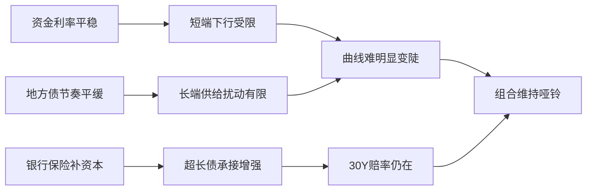
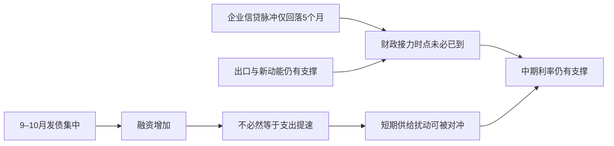

# 📰 公众号热点提炼

> 🕐 2026-09-07（周一）· 覆盖 09-06 至 09-07 · 10 个公众号 · 26 篇文章

## ⚡关键情报 KEY DELTA

债券与宏观线索高度聚焦在同一个判断上：**9月政府债供给虽将抬升，但短期财政支出未必同步大幅提速，叠加资金利率总体平稳，长端利率更接近“震荡偏强、易下难上”而非趋势性上行**。[来源:social_media_RAR100002071035][来源:social_media_RAR000007921990][来源:social_media_RAR000007921989] 与之对应，多篇固收文章把**10年国债运行区间锚定在1.65%–1.70%，30年国债区间锚定在2.10%–2.15%**，并继续推荐偏哑铃型或偏长久期的配置思路。[来源:social_media_RAR000007921989]

科技线则出现明显共振：**GPT-6 Astra、长程 Agent、Computer Use、机器人/VLA** 成为过去24小时最密集的话题，核心变化不是“单点能力更强”，而是**AI开始更深入地接管软件操作、研究流程与物理执行链条**。[来源:social_media_RAR100002067291][来源:social_media_RAR000007921871] 这意味着市场对于 AI 产业链的关注点，正在从模型能力展示进一步向**Agent基础设施、工具调用、具身执行与商业化效率**迁移。[来源:social_media_RAR000007921887][来源:social_media_RAR000007921871]

---

## 财经投研类文章

### 1. 当前债券策略关注什么
**来源**：固收亮话 · `09-07 08:00`

#### 1. 这篇文章在说什么？
- **短端利率下行空间有限**，预计后续隔夜资金在**1.35%左右**、7天资金在**1.4%左右**波动，而当前1Y存单和3Y国开隐含7天资金利率已分别在**1.41%**和**1.36%**附近，短端继续下行的定价空间不大。
- **10年国债利率目前在1.68%左右**，作者判断自6月以来已经在**1.7%左右**震荡约三个月，在收益率曲线并不平坦的背景下，10Y相对短端估值“不贵”，仍有缓步下行并压平曲线的可能。
- 对超长债而言，市场分歧集中在**地方债是否提速**及**是否有增量稳增长政策**；但文中测算显示，当前**9月地方债计划发行量约6000亿元**，节奏仍平缓，供给冲击暂不构成主导矛盾。
- 文章给出明确区间判断：**10年国债主要波动区间为1.65%–1.70%**，**30年国债主要波动区间为2.10%–2.15%**。
- 组合层面建议继续维持**“短+长”哑铃型结构**，久期短期更偏中性，长期限交易仓位优先关注**30年国债活跃券**，底仓则可关注**30Y地方债**。

#### 2. 为什么这件事重要？
- 债市当前的核心不在“方向是否向下”，而在**下行节奏和拥挤度如何匹配**：如果短端被资金利率锚住、长端又受供给与政策预期扰动，那么交易机会更多来自区间波动而非单边趋势。
- 文中强调**部分银行和保险于9月6日公布补充资本方案**，可能提升其对超长政府债的承接力度，这意味着超长端需求侧可能边际改善，从而影响30Y及地方债估值体系。
- 对机构投资者而言，这篇文章的重要性在于它把**资金面、供给面、曲线形态与择券逻辑**放在一个框架中统一讨论，直接对应久期、曲线和券种配置决策。

#### 3. 作者的核心观点是什么？
- 作者核心判断是：**债券利率中短期仍以区间震荡为主，但方向上偏震荡偏多**，不排除投资者在**9月底抢跑**，而更顺畅的下行节奏可能出现在**10–11月**。
- 对短端偏谨慎、对10Y相对积极、对30Y维持“有赔率但需等待验证”的态度，是全文的主线判断。
- 在择券上，文章强调不是简单拉久期，而是要在**活跃券、税后利差、品种利差与地方债-国债利差**之间寻找相对价值。

#### 4. 关键数据与信号
- **隔夜资金预期：1.35%左右**；**7天资金预期：1.4%左右**。
- **1Y存单隐含7天资金利率：1.41%**；**3Y国开隐含7天资金利率：1.36%**。
- **10年国债利率：1.68%左右**；目标波动区间**1.65%–1.70%**。
- **30年国债利率区间：2.10%–2.15%**。
- **9月地方债计划发行量：约6000亿元**。
- **10Y国开-国债利差：约8BP**；**30-10Y利差：约45BP**，作者认为四季度有望压至**40BP以下**。

#### 5. 对投资决策意味着什么？
- 当前更适合采用**中性久期+区间交易**思路，而不是在短端进一步追多。
- 若后续出现利率上行至区间上沿、而政府债供给与政策并未超预期走强，可重新关注**30年活跃券、30Y地方债及部分中长久期政金债**的交易性机会。

图1：债券策略主线——资金、供给与配置行为共同决定“震荡偏多”

---

### 2. 债市｜利率或易下难上
**来源**：郁言债市 · `09-06 23:45`

#### 1. 这篇文章在说什么？
- 文章指出，9月初债市震荡走强，**10年国债收益率下行至1.68%**，接近**8月24日**创下的年内低点，收益率曲线整体下移。
- 资金面方面，8月跨月流动性在央行平滑操作下仍偏宽松，**R001回到1.36%–1.37%**附近，略低于政策利率，作者据此推断**1.35%–1.40%可能是央行合意的隔夜利率区间**。
- 财政供给方面，未来一周政府债净供给约**3154亿元**，其中**国债净发行1800亿元**、**地方债净发行1364亿元**，处于滚动一年中位水平附近，尚未出现显著放量。
- 机构行为上，自**8月27日至9月2日**，券商自营累计**净卖出612亿元**7年及以上国债，而基金同期**净买入超长国债122亿元**，显示交易盘与配置盘分化。
- 文章最终判断，**9月中旬债市更可能处于“震荡发展、易下难上”**的状态，中端**5–7年期**及**30年次新活跃券**值得关注。

#### 2. 为什么这件事重要？
- 这篇文章的重要性在于，它把债市走势拆成三层：**货币条件、财政供给、机构交易行为**。这三个因素决定了近期利率不是简单看基本面，而是看“供给是否超预期+资金是否失衡+谁在接盘”。
- 当**资金面并未显著收紧**、政府债供给又没有超预期放量时，债市大幅调整的触发条件不足，这对久期资产形成底部支撑。
- 同时，文章将**美国非农超预期、国内股市缩量盘整**纳入风险偏好框架，认为低风险偏好可能间接利多长债，这提供了一个跨资产视角。

#### 3. 作者的核心观点是什么？
- 核心结论是：**未来一周震荡仍是基准情景，但方向上利率“易下难上”**。
- 在基准情景下，建议等待调整后的局部高点，优先关注**5–7年品种**；若供给继续低于预期，则**30年活跃次新券**仍有利差压缩机会。
- 若后续8月通胀、金融、消费、投资等数据弱于预期，则长久期仍可能继续占优。

#### 4. 关键数据与信号
- **10年国债：1.68%**。
- **R001：1.36%–1.37%**；**R007周五降至1.40%**。
- 未来一周**国债净发行1800亿元**、**地方债净发行1364亿元**，合计**3154亿元**。
- **券商自营净卖出612亿元**7年及以上国债；**基金净买入122亿元**超长国债。
- **1年国债收益率1.23%**、**3年1.25%**、**5年1.40%**、**7年1.53%**、**30年2.13%**、**50年2.28%**。

#### 5. 对投资决策意味着什么？
- 在没有超预期供给冲击前，长债调整风险可能可控，交易上更适合**逢调整增配中长端**而非追空。
- 若后续验证财政供给低于市场担忧、且基本面数据偏弱，则超长债和次新活跃券的相对表现可能继续占优。

---

### 3. 从供给到支出：财政脉冲何时增强？
**来源**：睿哲固收研究 · `09-06 21:40`

#### 1. 这篇文章在说什么？
- 文章聚焦一个核心问题：**9–10月政府债供给预计较集中，但发行增加不等于财政支出会同步显著加快**，债市真正需要盯的是“供给之后，支出能否迅速跟上”。[来源:social_media_RAR000007921989]
- 总量上，作者预计未来4个月政府债净融资规模约**4.5万亿至5万亿元**，其中国债约**2.90万亿元**，地方债约**1.6万亿至2.1万亿元**。[来源:social_media_RAR000007921989]
- 月度节奏上，**9月政府债净融资约1.84万亿元**、**10月约1.34万亿元**，显著高于**11月7893亿元**和**12月4906亿元**，供给压力主要集中在9–10月。[来源:social_media_RAR000007921989]
- 分期限看，国债超长端供给主要也集中在9–10月，其中**9月约2100亿元**、**10月约1790亿元**；地方债方面，**9–12月10年以上地方债预计发行1.12万亿元**，占同期地方债供给约**45%**。[来源:social_media_RAR000007921989]
- 但作者强调，从历史经验看，财政支出往往**滞后企业信贷脉冲约10–11个月**。本轮企业信贷脉冲自**今年2月**见顶以来，回落时间仅约**5个月**，财政大幅加码的时点可能尚未到来。[来源:social_media_RAR000007921989]

#### 2. 为什么这件事重要？
- 债市面对的并非单一“供给利空”，而是要区分**融资扩张**与**财政支出落地**之间的时滞。如果只是发债而未迅速转化为实物工作量，利率上行压力可能弱于市场直觉。[来源:social_media_RAR000007921989]
- 文章进一步指出，当前**出口与新动能投资仍能提供一定对冲**，削弱了财政立刻显著加码的必要性，这意味着总量刺激的时点或仍偏后移。[来源:social_media_RAR000007921989]
- 这对长债定价非常关键：如果“供给集中”不自动导向“信用/增长脉冲”，那么超长端利率的上行持续性会被削弱。[来源:social_media_RAR000007921989]

#### 3. 作者的核心观点是什么？
- 作者核心判断是：**短期债市会受9月传统不利窗口、集中供给与高拥挤度压制，但中期基本面对利率仍偏有利**。[来源:social_media_RAR000007921989]
- 今年与往年不同之处在于，**资金面收敛已提前发生**，且央行对冲工具更丰富，发行本身对流动性的扰动更容易被熨平。[来源:social_media_RAR000007921989]
- 因此，中期看真正决定方向的不是“债发多少”，而是“支出何时明显提速”；在这一点未被证实时，债市并不具备持续转熊的充分条件。[来源:social_media_RAR000007921989]

#### 4. 关键数据与信号
- 未来4个月政府债净融资规模：**4.5万亿至5万亿元**。[来源:social_media_RAR000007921989]
- 国债净融资剩余：**2.90万亿元左右**；地方债剩余：**1.6万亿至2.1万亿元**。[来源:social_media_RAR000007921989]
- **9月净融资1.84万亿元**，**10月1.34万亿元**，**11月7893亿元**，**12月4906亿元**。[来源:social_media_RAR000007921989]
- 超长国债供给：**9月2100亿元**、**10月1790亿元**。[来源:social_media_RAR000007921989]
- **9–12月10年以上地方债预计发行1.12万亿元**，其中**9月4797亿元**、**10月3142亿元**、**11月2462亿元**、**12月799亿元**。[来源:social_media_RAR000007921989]
- 企业信贷脉冲自**今年2月**见顶，当前仅回落约**5个月**；历史平均财政接力时滞约**10–11个月**。[来源:social_media_RAR000007921989]

#### 5. 对投资决策意味着什么？
- 短期需防范供给与拥挤度带来的波动，但不宜把“9–10月供给集中”线性外推成中期利率趋势性上行。[来源:social_media_RAR000007921989]
- 后续重点应跟踪**政府债发行后财政支出转化率、企业信贷脉冲继续回落的速度、以及新动能对总量的对冲强度**。[来源:social_media_RAR000007921989]

图2：财政脉冲判断的关键不在发债总量，而在“融资到支出”的转化

---

### 4. 交易情绪小幅回落
**来源**：睿哲固收研究 · `09-07 07:30`

#### 1. 这篇文章在说什么？
- 文章使用“债市微观交易温度计”跟踪市场拥挤度，最新读数较上期**回落3个百分点至71%**，说明市场情绪从高位略有降温，但整体仍处于偏热区间。
- 在**20个微观指标**中，位于过热区间的仍有**11个，占比55%**；中性区间**6个，占比30%**；偏冷区间**3个，占比15%**。
- 交易热度回落主要来自**1/10Y国债换手率分位值下降25个百分点**、**TL/T多空比分位值下降31个百分点**，以及**债基止盈压力分位值下降64个百分点**。
- 同时，机构行为里也有偏热信号上升，例如**基金-中小行买入量分位值上升55个百分点**，**基金久期分位值上升12个百分点**，显示买盘结构在轮动。
- 当前拥挤度较高的指标包括：**长期国债成交占比、基金久期、基金超长债买入量、上市公司理财买入量、政策利差、不动产比价、消费品比价**。

#### 2. 为什么这件事重要？
- 这类微观温度指标的重要性在于，它衡量的不是宏观方向，而是**交易结构是否过热、哪些位置存在脆弱性**。
- 当市场总体仍偏热、但个别交易与止盈指标降温，意味着利率下行并未结束，但短期“追涨”性价比在下降，市场更容易进入震荡和分化阶段。
- 机构行为分化尤其值得关注：基金重新加仓超长现券、中小行转为卖出，说明长端的多头力量并非全面一致，而是结构性接力。

#### 3. 作者的核心观点是什么？
- 作者并未给出明确方向交易建议，但从模型描述看，当前市场状态可概括为：**整体仍偏热，但前期最拥挤的部分交易情绪已有所回落**。
- 市场并非全面退潮，而是从“广泛过热”转向“局部过热+局部分化”，这意味着后续利率走势可能对增量信息更敏感。

#### 4. 关键数据与信号
- 温度计读数：**71%**，较上期回落**3个百分点**。
- **1/10Y国债换手率分位值下降25个百分点**。
- **TL/T多空比分位值下降31个百分点至61%**，由过热降至中性。
- **债基止盈压力分位值下降64个百分点至27%**，由过热转偏冷。
- **基金久期中位值3.27**，分位值升至**98%**。
- **基金配置超长债力度12.00%**，分位值**100%**。
- **基金-中小行规模847亿元**，分位值升至**86%**。
- **政策利差-15bp**，分位值**99%**；市场利差均值**18bp**，分位值**39%**。

#### 5. 对投资决策意味着什么？
- 更适合把这篇文章作为**拥挤度与仓位管理工具**来用：市场仍偏热，意味着不宜简单线性加杠杆追长端。
- 若后续资金、供给或政策出现边际扰动，前期超长端与基金重仓区域仍可能率先放大波动。

---

### 5. 债市温度计
**来源**：睿哲固收研究 · `09-07 07:30`

#### 1. 这篇文章在说什么？
- 文章从基本面温度角度更新高频指标，本周共更新**48个高频指标**，其中“利好”指标**21个**，“利空”指标**27个**，整体略偏利空。
- 利好主要体现在**土地成交面积、工业品需求、部分消费（快递量、轻纺成交、票房）、出行及多数农产品价格**；利空则主要集中于**耗煤、粗钢产量、多数行业开工率、商品房成交量价与土地成交价格、出口、旅游消费价格及工业品价格**。
- 利率十大同步指标中，本周“利好”和“利空”各占**5/10**，相对中性均衡。
- 具体指标上，**企业中长贷余额增速6.2%**高于前值**6.1%**，被视作“利空”；**建材综合指数114.2**高于前值**111.1**，亦属“利空”；而**BCI企业招工前瞻指数51.0%**低于前值**51.5%**，为“利好”。
- 海外相关变量中，**美元指数99.4**高于前值**99.2**被归类为“利好”，而**铜金比14.90**高于前值**14.36**则被归类为“利空”。

#### 2. 为什么这件事重要？
- 这篇文章的价值不在于给出方向性强判断，而在于显示：**当前宏观高频并未形成单边一致信号，债市仍处在总量偏弱与局部修复并存的环境中**。
- 这也解释了为什么市场近期更多表现为区间震荡和结构性行情，而不是趋势性大开大合。

#### 3. 作者的核心观点是什么？
- 作者隐含观点是：**基本面没有形成压倒性的利空或利多，债市面临的是“分项分化”而非趋势扭转”**。
- 由于正文信息相对简略，这更像一份监测型快照，而不是完整策略报告。

#### 4. 关键数据与信号
- 高频指标更新数：**48个**。
- 利好指标：**21个**；利空指标：**27个**。
- 利率十大同步指标中，利好/利空各**5个**。
- **企业中长贷余额增速6.2%**；前值**6.1%**。
- **建材综合指数114.2**；前值**111.1**。
- **BCI 51.0%**；前值**51.5%**。
- **美元指数99.4**；前值**99.2**。
- **铜金比14.90**；前值**14.36**。

#### 5. 对投资决策意味着什么？
- 资料更适合作为**验证框架**而非直接交易依据：如果后续利率出现大幅单边波动，需要看到高频数据从“分化”向“一致”切换。

---

### 6. 全球资金加速流向货基，内外资共振致中国市场承压
**来源**：一瑜中的 · `09-06 23:18`

#### 1. 这篇文章在说什么？
- 文章基于EPFR数据跟踪全球基金流向，显示**2026年8月27日当周全球股票基金净流入23.9亿美元**，处于**2025年以来24.1%分位**，而**全球债券基金净流入181.9亿美元**，分位为**55.2%**。
- 与此同时，**全球货币市场基金单周净流入426.0亿美元**，较上周**101.1亿美元**大幅增加，环比多流入**324.9亿美元**，分位升至**75.9%**，反映全球风险偏好明显转向防御。
- 中国市场方面，**中国股票基金单周净流出46.5亿美元**，由上周**净流入2.1亿美元**迅速转为净流出，处于**2025年以来23.0%分位**。
- 结构上，**主动型资金净流出0.3亿美元**，流出略收窄；但**被动型资金净流出46.2亿美元**、**国内资金净流出39.6亿美元**、**海外资金净流出6.9亿美元**，形成内外资共振流出。
- 区域上，美国呈现“**股弱债强**”，欧洲则表现为“**股强债弱**”，日本继续保持流入但权益动能有所放缓。

#### 2. 为什么这件事重要？
- 全球资金流向对大类资产配置的指示意义很强。**货基流入大幅抬升**通常意味着机构开始提高现金与流动性资产配置，对权益尤其是新兴市场权益形成压制。
- 中国股票基金由净流入迅速转为**46.5亿美元净流出**，且同时出现国内与海外资金双双转弱，说明中国市场微观流动性短期再度承压，这会影响风格、成交与风险偏好。
- 被动资金大幅流出尤需关注，因为它往往对应指数型产品或区域配置调整，代表的是**更快、更机械化的资金再平衡**。

#### 3. 作者的核心观点是什么？
- 作者核心判断是：**全球风险偏好正在降温，资金正加速从股票转向货币基金和债券基金**。
- 对中国市场而言，当前的压力不是单一外资问题，而是**国内资金连续流出扩大、海外资金转负、被动资金显著撤离**的叠加结果。

#### 4. 关键数据与信号
- 全球股票基金净流入：**23.9亿美元**。
- 全球债券基金净流入：**181.9亿美元**。
- 全球货币市场基金净流入：**426.0亿美元**，较上周增加**324.9亿美元**。
- 中国股票基金净流出：**46.5亿美元**；上周为**净流入2.1亿美元**。
- 中国主动型资金净流出：**0.3亿美元**。
- 中国被动型资金净流出：**46.2亿美元**。
- 中国国内资金净流出：**39.6亿美元**；海外资金净流出：**6.9亿美元**。
- 美国股票基金净流出：**3.5亿美元**；美国债券基金净流入：**153.3亿美元**。

#### 5. 对投资决策意味着什么？
- 若全球资金继续偏向货基与债基，中国权益短期需更多依赖**内生政策、盈利或主题催化**来对冲资金面逆风。
- 交易上应继续观察**被动资金流向是否止跌、国内资金流出是否放缓**，这比单一北向/外资信号更能反映真实资金压力。

---

### 7. 出口高频明显回落
**来源**：一瑜中的 · `09-06 23:18`

#### 1. 这篇文章在说什么？
- 文章指出，**华创宏观WEI指数截至8月30日为3.16%**，较**8月23日的3.28%**回落**0.12个百分点**，显示周度经济活动边际放缓。[来源:social_media_RAR100002071035]
- 出口高频是核心弱项：截至**8月30日当周**，我国港口集装箱吞吐量环比**-9.8%**，上周为**+13.0%**；四周同比由**+1.4%**降至**-4.1%**。[来源:social_media_RAR100002071035]
- 需求端有一定分化：截至**9月5日当周**，**24城商品房住宅成交面积同比-3.7%**，较8月同比**-10.6%**有所改善；但**9月前5日国内航班执行数同比+1.4%**、环比前一周**-11%**，出行边际走弱。[来源:social_media_RAR100002071035]
- AI与电子链仍保持景气：截至**8月31日**，OpenRouter平台周度调用量预计为**115T**，较前一周增长约**1.8%**；**DRAM DDR5现货价上涨0.2%**，**NAND Flash现货均价上涨2.7%**。[来源:social_media_RAR100002071035]
- 债市相关高频显示，**DR001为1.3593%**、**DR007为1.3726%**、**R007为1.4027%**；**10年国债收益率1.6804%**，较8月28日下行**1.45bp**。[来源:social_media_RAR100002071035]

#### 2. 为什么这件事重要？
- 出口高频回落意味着外需边际压力上升，这会削弱此前新动能和出口对总量的对冲能力，对宏观资产定价具有方向性意义。[来源:social_media_RAR100002071035]
- 文章的结构性特点在于：**地产销售略改善、AI链仍热、出口回落、WEI下行**，说明经济并非单边下滑，而是分项继续分化，这与近期债市“震荡偏强”的判断形成呼应。[来源:social_media_RAR100002071035]
- 对权益而言，出口走弱若持续，将影响外需链与中游制造盈利预期；对债市而言，总量活动放缓则偏利率友好。[来源:social_media_RAR100002071035]

#### 3. 作者的核心观点是什么？
- 核心判断是：**周度经济活动继续回落，其中出口高频是当前最需要警惕的弱项**。[来源:social_media_RAR100002071035]
- 同时，AI应用、存储价格与部分地产销售数据仍给出局部亮点，意味着经济仍处于结构化分化而非同步走弱。[来源:social_media_RAR100002071035]

#### 4. 关键数据与信号
- WEI指数：**3.16%**；前值**3.28%**。[来源:social_media_RAR100002071035]
- 港口集装箱吞吐量环比：**-9.8%**；上周**+13.0%**。[来源:social_media_RAR100002071035]
- 港口集装箱吞吐量四周同比：**-4.1%**；上周**+1.4%**。[来源:social_media_RAR100002071035]
- 24城住宅成交面积同比：**-3.7%**；8月同比**-10.6%**。[来源:social_media_RAR100002071035]
- 国内航班执行数同比：**+1.4%**；环比前一周**-11%**。[来源:social_media_RAR100002071035]
- OpenRouter周度调用量：**115T**；周增约**1.8%**。[来源:social_media_RAR100002071035]
- DR001：**1.3593%**；DR007：**1.3726%**；R007：**1.4027%**。[来源:social_media_RAR100002071035]
- 10年国债收益率：**1.6804%**。[来源:social_media_RAR100002071035]

#### 5. 对投资决策意味着什么？
- 若出口高频继续走弱，而国内政策又未明显对冲，则债券仍相对受益，权益内部则更需回避对外需弹性高但估值已高的板块。[来源:social_media_RAR100002071035]
- AI链景气与宏观总量放缓并存，也意味着市场风格可能继续偏向**高景气科技+利率敏感资产**的哑铃格局。[来源:social_media_RAR100002071035]

---

### 8. 美国非农与服务业表现偏强
**来源**：一瑜中的 · `09-06 23:18`

#### 1. 这篇文章在说什么？
- 文章指出，过去一周最重要的海外数据是美国非农与PMI。**美国7月新增非农就业16.2万**，显著高于预期的**5.6万**；**失业率4.1%**，与预期和前值持平；**小时工资同比3.1%**，高于预期的**3.0%**。[来源:social_media_RAR100002070931]
- PMI方面，按标普全球口径，**8月美国制造业PMI 53.9**，持平前值；**美国服务业PMI 56.5**，高于前值**54.6**；**ISM非制造业PMI 55.4**，高于预期**54.2**和前值**54.1**。[来源:social_media_RAR100002070931]
- 周度活动指标方面，**美国WEI指数截至8月29日为3.06%**，高于上周**2.8%**；消费端**红皮书商业零售同比9.6%**，高于前一周**9.1%**。[来源:social_media_RAR100002070931]
- 利率与信用层面，**美国30年期按揭贷款利率6.71%**，高于前一周**6.66%**；**摩根大通全球BB-B级美元债最差利差241bp**，较上周五走阔约**3.15bp**。[来源:social_media_RAR100002070931]
- 金融条件方面，**美国彭博金融条件指数1.261**，低于前一周**1.326**，被文章定义为“边际收紧”。[来源:social_media_RAR100002070931]

#### 2. 为什么这件事重要？
- 美国非农和服务业同时偏强，意味着美国经济韧性仍在，这会影响全球利率、美元与风险资产定价，对国内债市与汇率预期形成外部扰动。[来源:social_media_RAR100002070931]
- 对中国资产而言，若美国增长韧性与利率中枢维持偏高，则一方面可能压制全球风险偏好，另一方面也会抬升中美利差与外部资金成本约束。[来源:social_media_RAR100002070931]
- 文章还给出下周关键事件——**9月11日美国8月CPI**，这意味着市场下一阶段将从“就业强”切换到“通胀是否跟随再走强”的验证。[来源:social_media_RAR100002070931]

#### 3. 作者的核心观点是什么？
- 核心观点是：**美国经济并未明显失速，就业与服务业短期偏强，外部环境对全球债市并不构成纯粹利多**。[来源:social_media_RAR100002070931]
- 但从风险资产角度，这种“增长偏强+金融条件边际收紧”的组合，也意味着市场会更敏感于后续CPI与联储预期变化。[来源:social_media_RAR100002070931]

#### 4. 关键数据与信号
- 新增非农：**16.2万**；预期**5.6万**。[来源:social_media_RAR100002070931]
- 失业率：**4.1%**。[来源:social_media_RAR100002070931]
- 小时工资同比：**3.1%**。[来源:social_media_RAR100002070931]
- 标普制造业PMI：**53.9**；服务业PMI：**56.5**。[来源:social_media_RAR100002070931]
- ISM非制造业PMI：**55.4**。[来源:social_media_RAR100002070931]
- 美国WEI：**3.06%**；上周**2.8%**。[来源:social_media_RAR100002070931]
- 红皮书零售同比：**9.6%**。[来源:social_media_RAR100002070931]
- 30年期按揭贷款利率：**6.71%**。[来源:social_media_RAR100002070931]
- 高收益美元债最差利差：**241bp**。[来源:social_media_RAR100002070931]

#### 5. 对投资决策意味着什么？
- 需要重点观察**美国CPI、联储路径与长端美债利率**，它们会继续通过汇率、风险偏好和全球资金流向影响中国资产定价。[来源:social_media_RAR100002070931]
- 国内债市虽仍有内生支撑，但外部“美国数据偏强”意味着交易上需要提高对海外变量的敏感度。[来源:social_media_RAR100002070931]

---

### 9. 从分化到收敛：可能的路径与挑战
**来源**：一瑜中的 · `09-06 23:18`

#### 1. 这篇文章在说什么？
- 文章从“K型分化”切入，认为当前向上的主要是**新动能**，包括装备制造业、信息业、租赁和商务服务业；而**旧动能**（地产、建筑、上游材料制造业）以及消费品制造、批零、住宿餐饮等其他板块相对偏弱。[来源:social_media_RAR000007922153]
- 作者把“从分化到收敛”的路径拆成四条：**财政支出增加、缓解城投化债压力、企业投资增加、居民支出增加**。[来源:social_media_RAR000007922153]
- 在财政路径中，作者指出财政收入仍过度依赖旧动能：财政两本账合计收入中，**33.8%来自旧动能**，仅**12.8%来自新动能**；且新动能典型行业综合税负较低，如装备制造业仅**2.0%**。[来源:social_media_RAR000007922153]
- 在国企/城投路径中，地方国企A股股权资产与有息债务规模之比仅**12.3%**，地方国企A股分红与债务利息之比仅**6.6%**，说明通过资本市场化债的空间仍有限。[来源:social_media_RAR000007922153]
- 在居民路径中，**中国居民红利收入占GDP比重仅0.5%**，而美国为**7.6%**；同时，A股非金融企业**2025年人均薪酬增速2.4%**，低于**2024年的3.3%**和**2019年的6.5%**。[来源:social_media_RAR000007922153]

#### 2. 为什么这件事重要？
- 这篇文章的重要性在于，它不是讨论短期数据，而是在讨论**中国经济结构性收敛需要依赖哪些传导机制**。[来源:social_media_RAR000007922153]
- 如果新动能不能有效通过税收、资本市场、企业投资与居民收入向更广泛部门扩散，那么“K型分化”将持续，宏观层面就会呈现总量温和、结构割裂的特征。[来源:social_media_RAR000007922153]
- 这不仅关系到经济增长，也直接关系到股债风格与行业配置：**新经济资产与传统需求链的估值体系为何长期分化**，其根本解释就在这里。[来源:social_media_RAR000007922153]

#### 3. 作者的核心观点是什么？
- 作者核心判断是：**当前“收敛”的可能性虽在增加，但四条传导路径均存在堵点，政策有效性要看这些堵点能否被实质改善**。[来源:social_media_RAR000007922153]
- 政策建议上，作者偏向于通过**扩大地方税权、增加一般性转移支付、培育资本市场、鼓励知识产权投资、提高居民财产性收入与工资增长**来提升收敛概率。[来源:social_media_RAR000007922153]

#### 4. 关键数据与信号
- 财政两本账收入中：**33.8%来自旧动能**，**12.8%来自新动能**。[来源:social_media_RAR000007922153]
- 装备制造业综合税负：**2.0%**；上游材料制造业**5.0%**；地产建筑业**3.7%**；消费品制造业**7.9%**。[来源:social_media_RAR000007922153]
- 2025年两本账收入/GDP：**19.5%**；预计2026年降至**18.4%**。[来源:social_media_RAR000007922153]
- 地方国企A股股权资产/有息债务：**12.3%**；地方国企A股分红/债务利息：**6.6%**。[来源:social_media_RAR000007922153]
- 2025年央企样本有息负债增速：**4.6%**；地方国企样本：**6.1%**；2019年地方国企样本为**14.5%**。[来源:social_media_RAR000007922153]
- 中国上市公司资本开支/全社会固定资本形成：**9.8%**；美国**20.4%**；日本**14.8%**；韩国**26.7%**。[来源:social_media_RAR000007922153]
- 居民红利收入/GDP：中国**0.5%**；美国**7.6%**。[来源:social_media_RAR000007922153]
- 非金融企业人均薪酬增速：**2.4%**；2024年**3.3%**；2019年**6.5%**。[来源:social_media_RAR000007922153]

#### 5. 对投资决策意味着什么？
- 若这些堵点短期难破，市场仍会偏向**新动能、科技、信息服务与少数高盈利资产**，而对传统链条保持更高风险溢价。[来源:social_media_RAR000007922153]
- 对宏观配置而言，这意味着总量宽松与结构分化可能长期并存，股债之间的风格轮动仍将高度依赖政策是否真正改善“收敛路径”。[来源:social_media_RAR000007922153]

---

### 10. 关注银行理财增量对中长期转债估值的支撑
**来源**：固收亮话 · `09-06 22:28`

#### 1. 这篇文章在说什么？
- 文章讨论近期转债估值调整后，中长期资金面是否仍能支撑转债估值，核心抓手是**银行理财规模扩张与配置结构变化**。[来源:social_media_RAR000007922154]
- 数据显示，**2026年6月末银行理财存续规模33.66万亿元**，较**2025年6月末30.67万亿元**同比增长**9.7%**，也高于**2025年12月末33.29万亿元**，为样本序列新高。[来源:social_media_RAR000007922154]
- 25年以来，理财产品对基金投资占比明显上升：穿透后基金规模由**2024H2的6546亿元**、**2025H1的1.02万亿元**、**2025H2的1.42万亿元**，升至**2026H1的1.55万亿元**；样本内占比由**2.32%**依次升至**3.43%**、**4.30%**、**6.28%**。[来源:social_media_RAR000007922154]
- 权益相关资产方面，理财网产品口径下，**权益类产品规模由0.06万亿元升至0.09万亿元**，**混合类由0.73万亿元升至1.07万亿元**，2026年上半年末两者合计**1.16万亿元**，占全部理财规模**3.45%**，高于2024年末的**2.64%**。[来源:social_media_RAR000007922154]
- 文章认为，在理财规模维持高位、且混合类与权益类占比持续上升的背景下，若投资者继续看好中长期股票市场，**转债作为核心含权资产之一，仍可能获得配置支撑**。[来源:social_media_RAR000007922154]

#### 2. 为什么这件事重要？
- 转债估值能否维持，不只取决于正股和波动率，也取决于**谁在提供稳定增量资金**。[来源:social_media_RAR000007922154]
- 银行理财是当前重要的低波含权资金来源之一，其配置路径从“直接持债”向“持有固收+基金/含权产品”切换，意味着转债的边际资金来源可能更稳定、更偏配置型。[来源:social_media_RAR000007922154]
- 这有助于解释为何即便转债估值阶段性回调，市场并未迅速进入系统性估值压缩。[来源:social_media_RAR000007922154]

#### 3. 作者的核心观点是什么？
- 作者偏多观点较明确：**理财增量仍可能对中长期转债估值形成支撑**。[来源:social_media_RAR000007922154]
- 同时，文章认为近期估值回落反而意味着**转债相对价值有所改善**，若后续小盘风格回暖、转债估值修复，转债可能继续跑赢部分宽基指数。[来源:social_media_RAR000007922154]

#### 4. 关键数据与信号
- 银行理财存续规模：**33.66万亿元**。[来源:social_media_RAR000007922154]
- 同比增速：**9.7%**。[来源:social_media_RAR000007922154]
- 穿透后基金规模：**6546亿元 → 1.02万亿元 → 1.42万亿元 → 1.55万亿元**。[来源:social_media_RAR000007922154]
- 对应占比：**2.32% → 3.43% → 4.30% → 6.28%**。[来源:social_media_RAR000007922154]
- 权益类产品规模：**0.06万亿元 → 0.09万亿元**。[来源:social_media_RAR000007922154]
- 混合类产品规模：**0.73万亿元 → 1.07万亿元**。[来源:social_media_RAR000007922154]
- 权益类+混合类合计：**1.16万亿元**，占理财规模**3.45%**。[来源:social_media_RAR000007922154]
- 2024年末占比：**2.64%**。[来源:social_media_RAR000007922154]

#### 5. 对投资决策意味着什么？
- 若银行理财继续扩容且含权配置比例上升，转债整体估值中枢可能获得中期支撑，特别是**中长期、偏股性但兼具防御属性的转债品种**。[来源:social_media_RAR000007922154]
- 同时也要警惕文中提示的风险：若股票预期扭转、理财减配含权资产，转债估值仍可能承压。[来源:social_media_RAR000007922154]

---

### 11. 利率择时模型：总信号看利率震荡
**来源**：睿哲固收研究 · `09-06 21:40`

#### 1. 这篇文章在说什么？
- 这是一篇模型更新快报，最新信号显示：**波动信号自2026年8月31日开始看利率上行**，而**趋势信号自2026年1月19日开始看利率下行**，两者合并后，**模型总信号为“利率震荡”**。[来源:social_media_RAR000007921990]
- 文章回顾了2026年以来信号切换过程，显示波动指标在年内多次反复翻转，而趋势指标相对稳定，体现出短周期与长周期判断的不同。[来源:social_media_RAR000007921990]
- 文中明确区分了两类指标用途：**趋势项适用于配置策略**，**波动项适用于交易策略**。[来源:social_media_RAR000007921990]
- 作者同时提示，模型属于技术分析框架，存在**模型适用性风险**与**模型估算误差风险**。[来源:social_media_RAR000007921990]

#### 2. 为什么这件事重要？
- 这类模型不能单独决定方向，但在当前基本面、资金面和供给面都较纠结的环境下，模型“震荡”结论本身就有信息量：说明市场并未形成明确单边趋势。[来源:social_media_RAR000007921990]
- 趋势与波动信号相互对冲，也与多篇固收报告中的“区间震荡、易下难上”判断形成互相印证。[来源:social_media_RAR000007921990]

#### 3. 作者的核心观点是什么？
- 作者核心结论非常直接：**总信号看利率震荡**。[来源:social_media_RAR000007921990]
- 对机构来说，更关键的不是模型看多还是看空，而是要区分**配置层面仍可偏多**，但**交易层面短期需防波动反复**。[来源:social_media_RAR000007921990]

#### 4. 关键数据与信号
- 波动信号转空时间：**2026年8月31日**。[来源:social_media_RAR000007921990]
- 趋势信号转多时间：**2026年1月19日**。[来源:social_media_RAR000007921990]
- 当前总信号：**利率震荡**。[来源:social_media_RAR000007921990]

#### 5. 对投资决策意味着什么？
- 更适合采取**配置与交易分离**思路：底仓不必因短期扰动完全逆转，但交易仓位需接受更高频的方向切换。[来源:social_media_RAR000007921990]

---

### 12. REITs｜关注9月指数样本调整
**来源**：郁言债市 · `09-06 23:45`

#### 1. 这篇文章在说什么？
- 本周（**2026年8月31日–9月4日**）**中证REITs全收益指数收于940.8点**，较上周下跌**1.52%**，结束此前两周连涨。
- 成交明显转冷，**日均成交额3.78亿元**、**日均成交量1.22亿份**，分别较上周下降**25.22%**和**23.70%**；**日均换手率0.36%**，下行**0.11pct**，处于历史**6%分位数**。
- 估值方面，截至**9月4日**，**产权REITs利差302bp**，较上周走阔**12bp**，处于历史**98%分位数**，作者认为仍在高赔率区间。
- 商业不动产REITs方面，**创金合信北京国资公司REIT**上市即破发，首日集合竞价折价**25%**，收盘下跌**10.99%**；次日原始权益人公告拟**6个月内增持不超过1000万份**。
- 指数样本调整方面，**REITs指数样本下次调整时点为2026年9月14日**，部分现有成分券因过去一年日均成交额低于**500万元**面临被剔除风险。

#### 2. 为什么这件事重要？
- 当前REITs的核心矛盾不是基本面恶化，而是**流动性偏弱与新供给扩容**如何被市场吸收。
- 当利差处于**302bp**且历史高分位时，意味着中长期配置赔率已经较高；但短期指数样本调整、商业不动产破发，会继续扰动交易层风险偏好。
- 文章特别提示了指数调整逻辑，这对被动资金和边际流动性影响较大，容易造成个券分化。

#### 3. 作者的核心观点是什么？
- 作者判断：**整体利差大幅再走阔的可能性较小**，原因在于机构与资金来源较2024年初更为多元，保险在《资产负债管理办法》下对优质红利资产配置需求可能增强，叠加指数基金建仓和新产品申报。
- 配置层面，继续看好**租赁住房、数据中心、消费设施和市政环保**；交易层面，可博弈前期跌幅较大、分派率性价比高的**园区、仓储**个券。

#### 4. 关键数据与信号
- 中证REITs全收益指数：**940.8点**；周跌幅**1.52%**。
- 日均成交额：**3.78亿元**；日均成交量：**1.22亿份**。
- 日均换手率：**0.36%**，历史**6%分位数**。
- 产权REITs利差：**302bp**，历史**98%分位数**。
- 细分板块利差：产业园区**407bp**、仓储物流**379bp**、消费设施/商业不动产**280bp**、数据中心**261bp**、租赁住房**153bp**。
- 已上市REITs总市值：**2328亿元**；流通市值**1300亿元**。
- 商业不动产REIT破发案例：首日折价**25%**，收盘**-10.99%**。
- 样本调整时点：**2026年9月14日**。

#### 5. 对投资决策意味着什么？
- 中长期可继续把高分位利差视为配置机会，但短期应密切跟踪**指数样本调整、商业不动产新券定价与解禁压力**。
- 若被动资金在样本调整前后集中再平衡，部分低流动性个券的价格波动可能放大。

---

### 13. 财爸这把牛X了
**来源**：表舅是养基大户 · `09-06 21:35`

#### 1. 这篇文章在说什么？
- 文章围绕财政部等对金融机构增资展开，指出**工行、农行、国寿、人保、太平、口行、中信保、中再保**等**8家金融机构**先后公告准备接受增资，**累计规模3600亿元**。[来源:social_media_RAR000007921890]
- 作者特别强调，年初预算提到今年将发行**3000亿元特别国债**支持国有大行补充资本，但本轮实际中工行和农行定增**2600亿元**，其中国财政部出资**2000亿元**、烟草出资**600亿元**。[来源:social_media_RAR000007921890]
- 文章认为，本轮财政注资模式已从过去“**只给银行补资本**”转向更广义的“**中央金融企业资本补充**”。[来源:social_media_RAR000007921890]
- 从投资角度，作者认为财政部用**2%–3%的长期负债**去投资当前**资本回报率两位数以上**的金融机构，是划算的资本配置。[来源:social_media_RAR000007921890]
- 作者进一步指出，金融机构本身具备经营杠杆，**3000多亿元资本注入可能带动10倍以上的资产端扩张**，尤其保险资本补充可直接带动权益资产扩张。[来源:social_media_RAR000007921890]

#### 2. 为什么这件事重要？
- 这不仅是金融机构融资事件，更是一个**财政资源如何通过金融中介放大信用与资产配置能力**的问题。[来源:social_media_RAR000007921890]
- 如果资本补充改善了大行、保险和政策性金融机构的资产负债表，那么对**信贷、固收配置、权益配置**都可能形成中期影响。[来源:social_media_RAR000007921890]
- 从市场风格看，作者将此解读为对**红利资产与优质股权时代**的间接支持，因为财政作为长期股东，其偏好与市场对高ROE、稳分红资产的偏好趋于一致。[来源:social_media_RAR000007921890]

#### 3. 作者的核心观点是什么？
- 作者偏积极地认为，这种资本补充方式**比短期消费补贴更长期、更实用**，并有助于推动A股走向“慢牛”式环境。[来源:social_media_RAR000007921890]
- 他还提示，当前A股内部多空力量并不平衡，高估值科技资产波动将加大，而财政注资逻辑更偏向利好多数**金融、红利与中长期权益扩张**方向。[来源:social_media_RAR000007921890]

#### 4. 关键数据与信号
- 增资机构：**8家**。[来源:social_media_RAR000007921890]
- 累计增资规模：**3600亿元**。[来源:social_media_RAR000007921890]
- 年初预算中特别国债支持大行资本补充规模：**3000亿元**。[来源:social_media_RAR000007921890]
- 工行、农行实际定增：**2600亿元**；财政部出资**2000亿元**，烟草出资**600亿元**。[来源:social_media_RAR000007921890]
- 作者测算长期负债成本约**2%–3%**。[来源:social_media_RAR000007921890]
- 资本注入可能带动**10倍以上**资产端扩张。[来源:social_media_RAR000007921890]

#### 5. 对投资决策意味着什么？
- 可继续跟踪**受注资金融机构的后续资产配置方向**：若保险与政策性机构风险偏好边际抬升，可能对红利、固收、部分权益板块形成中期支撑。[来源:social_media_RAR000007921890]
- 但正文偏观点化，更多可作为市场情绪与风格讨论材料，而非严格量化结论。[来源:social_media_RAR000007921890]

---

### 14. 2026年研究回顾
**来源**：雪涛宏观笔记 · `09-06 11:30`

1–2句总结：文章更像团队年度研究回顾与方法论宣传，强调过去一年**累计发布报告超100篇、公众号阅读量超100万次、电话会议超150场**，并回顾了AI、霍尔木兹油价、黄金、美债、地产等年度主线研究框架。[来源:social_media_RAR000007921870] ⚠️ 正文以研究回顾和主题索引为主，缺少单篇可进一步做投资拆解的完整论证链条。[来源:social_media_RAR000007921870]

---

### 15. AH策略框架总论：资产的划分、演绎的逻辑、当前的应用
**来源**：晨明的策略深度思考 · `09-06 11:29`

1–2句总结：文章主要是系列方法论培训预告，提到自**9月5日起11天11场、每晚8点30**开展方法论汇报，当前仅披露第一场主题为《AH策略框架总论——资产的划分、演绎的逻辑、当前的应用》。[来源:social_media_RAR100002066759] ⚠️ 正文未提供可供拆解的实质性策略观点和数据，因此仅能作更新提示。[来源:social_media_RAR100002066759]

---

## 科技类文章

### 16. 因为GPT-6 Astra的爆火，我好像看见了时代的断层。
**来源**：数字生命卡兹克 · `09-07 08:08`

文章围绕 GPT-6 Astra 对 Blender、Unity、Houdini 等专业软件的操控案例展开，核心判断是：**AI 正在压缩“意图到结果”的距离，执行能力的稀缺性下降，而判断力将成为更核心的人类价值**。 文中还提到作者已写作**685篇原创**，并将这一轮能力跃迁视为职业分工和教育逻辑重构的前兆。

### 17. 解决20年数学难题！微软开源Argus用证据驱动1548小时自动研究
**来源**：机器之心 · `09-07 06:46`

Argus 被定位为面向长周期研究任务的通用 Agent 运行时，覆盖**27个Campaign、1548小时墙钟时间**，平均每**40.7小时**才主动请求一次人工干预，工作占空比达**95.1%–98.7%**。 文章重点不在单一 benchmark，而在于其“证据驱动、自进化、多 Agent 协作”的研究流程设计，显示长程自动化研究正在从概念走向工程体系。

### 18. 刚刚，OpenAI最新内部数据公开！2028年实现全自动AI研究
**来源**：机器之心 · `09-07 06:46`

OpenAI披露内部研究加速数据：截至**2026年8月中旬**，研究部门**每1个人类工作日对应3.1个AI Agent工作日**，中位数研究员每天消耗的推理 token 按API价格折合约**600美元**，90分位重度用户超过**7000美元/天**。 文章同时指出，OpenAI把当前阶段定义为“自动化AI研究实习生”，并提出希望在**2028年3月之前**迈向全自动AI研究人员。

### 19. 正式开源huashu-mac-use，让任何agent获得接近GPT-6的Computer use能力！
**来源**：花叔 · `09-06 23:20`

文章介绍开源项目 **huashu-mac-use**，目标是让任意支持 skill 的 Agent 获得更强的 Mac 端 Computer Use 能力，并展示了用 Claude Code 操控 Blender 在**33分钟**内完成邮轮建模与多视角渲染的案例。 作者强调该方案优先走脚本接口与系统能力，而非纯视觉点按，核心追求是“**不打扰用户、按应用内核选通道、保留可复现证据**”。

### 20. 验证器是 RLVR 的隐形天花板，还是下一个能力突破口？
**来源**：机器之心 · `09-06 18:00`

文章总结了 RLVR 当前的核心瓶颈：验证器擅长标准答案与单元测试场景，却难以覆盖开放式写作、对话和复杂多步任务，因此“验证器能力边界”正在成为强化学习后训练的新上限。[来源:social_media_RAR000007921887] 研究界正沿着**过程验证、信号混合、自验证、标准编译**等方向尝试把可验证奖励拓展到更开放的问题空间。[来源:social_media_RAR000007921887]

### 21. GPT-6 Astra杀疯了：只要你学得够慢，就可以不用学了？
**来源**：机器之心 · `09-06 16:11`

文章盘点了 GPT-6 Astra 在 3D 建模、Canva 绘图、Computer Use、机械臂控制等案例中的表现，强调其真正值得关注的不是某个 Demo，而是**人类软件操作门槛被整体打包给 AI 的可能性**。[来源:social_media_RAR100002067291] 同时文中也提醒，当前结果离工业级应用仍有距离，稳定性和可商用性仍待验证。[来源:social_media_RAR100002067291]

### 22. 1位菲尔兹奖得主+12位博士，这些俄罗斯数学家训出了顶级AI
**来源**：机器之心 · `09-06 16:11`

文章介绍俄罗斯团队 Mostik 在 ARC-AGI-3 竞赛中崛起，并披露其尝试让 **7530亿参数 GLM-5.2** 与 **40亿参数 Qwen-3.5** 通过隐藏状态“搭桥”协作，整体成本仅为完整 GLM 的约**二十分之一**。[来源:social_media_RAR000007921872] 团队希望把模型间协作从“文字通信”推进到更底层的数学空间交换，以提升多模型系统效率。[来源:social_media_RAR000007921872]

### 23. 不会写代码的人，在B站造出了百万用户产品
**来源**：机器之心 · `09-06 13:00`

文章通过 B 站创作者案例展示 AI 如何降低个人开发门槛：材料学博士生借助 AI 做出三款小游戏，其中“万梗捏”成为爆款，而本届 BIP 中**超过80%的参赛者是一人团队**、**64%没有专业开发背景**、**学生占比25%**。[来源:social_media_RAR000007921869] 文章的重点是，AI 正在把内容平台中的“AI 发烧友”快速转化为低成本产品创作者。[来源:social_media_RAR000007921869]

### 24. 20%数据超GR00T N1.6、RoboDojo超WAM！StarVLA只用16卡训出全新VLA！
**来源**：机器之心 · `09-06 13:00`

StarVLA 团队发布面向 VLA 的 VLAct 底座，continued pre-training 仅使用开源数据和**16张GPU**，在 **RoboTwin 2.0 成功率达到92.5%**，并在 RoboDojo 上超过所有明确标注为 WAM 的模型。[来源:social_media_RAR000007921871] 更关键的是，在从未见过的 GR-1 机器人上，仅用 **20% 的 RoboCasa-GR1 下游数据**就已超过 **NVIDIA GR00T N1.6 的全量数据基线**。[来源:social_media_RAR000007921871]

### 25. 从「看见人」到「行动如人」：基础模型时代的Human-Centric AI全谱系综述
**来源**：机器之心 · `09-06 11:21`

文章介绍一篇 Human-Centric AI 综述，将基础模型时代的人类中心智能整理为**三个视角、六个层次**，从人体感知与空间几何，一直到世界模型与具身行动。[来源:social_media_RAR000007921726] 其意义在于为分散的人体视觉、数字人、世界模型和具身智能研究建立统一能力谱系与资源地图。[来源:social_media_RAR000007921726]

### 26. Claude把千禧年难题做出来了？陶哲轩：我可没这么说
**来源**：机器之心 · `09-06 11:21`

文章澄清了“Claude 已解决纳维-斯托克斯千禧年难题”的网络传闻，指出目前公开渠道尚无对应论文或评审材料，相关讨论更多源于陶哲轩对“AI 未来可能解决重大数学问题”场景的假设性思考。[来源:social_media_RAR000007921715] 同时，文章回顾了 Anthropic、OpenAI 在数学形式化和开放问题上的近期进展，说明 AI 在数学研究中的角色已从解题走向参与研究流程。[来源:social_media_RAR000007921715]

---

## ☕其他更新

| 文章 | 来源 | 时间 | 概要 |
|---|---|---:|---|
| 债市读心术等快报型更新外的培训/回顾信息 | 雪涛宏观笔记 | 09-06 11:30 | 团队年度研究回顾，偏品牌与方法论展示，适合用作主题索引而非单篇投资决策依据。[来源:social_media_RAR000007921870] |
| AH策略框架总论系列培训预告 | 晨明的策略深度思考 | 09-06 11:29 | 主要为线上培训安排与主题预告，缺少完整观点展开，可关注后续正式内容释放。[来源:social_media_RAR100002066759] |

---

## 🔭关注清单 THINGS TO WATCH

1. **国内债市验证点**：重点观察**9–10月政府债发行后的财政支出转化速度**、**8月通胀/金融数据**以及**资金利率是否继续稳定在1.35%–1.40%附近**，这将决定“供给扰动”能否演化成趋势性利空。[来源:social_media_RAR000007921989]
2. **全球风险偏好验证点**：跟踪**美国8月CPI**、美债长端利率及货基/债基资金流向，判断“美国增长偏强+全球避险升温”是否继续压制中国权益资金面。[来源:social_media_RAR100002070931]
3. **AI产业链观察点**：本轮市场叙事正在从大模型能力展示转向**Agent运行时、Computer Use、机器人/VLA、研究自动化**，后续需看这些方向能否从爆款案例进入稳定产品化与商业化验证。[来源:social_media_RAR100002067291][来源:social_media_RAR000007921871]

_本日报基于用户订阅的公众号文章生成。财经投研类文章做结构化深度拆解，科技类文章做概要模式。_