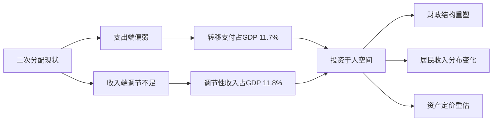
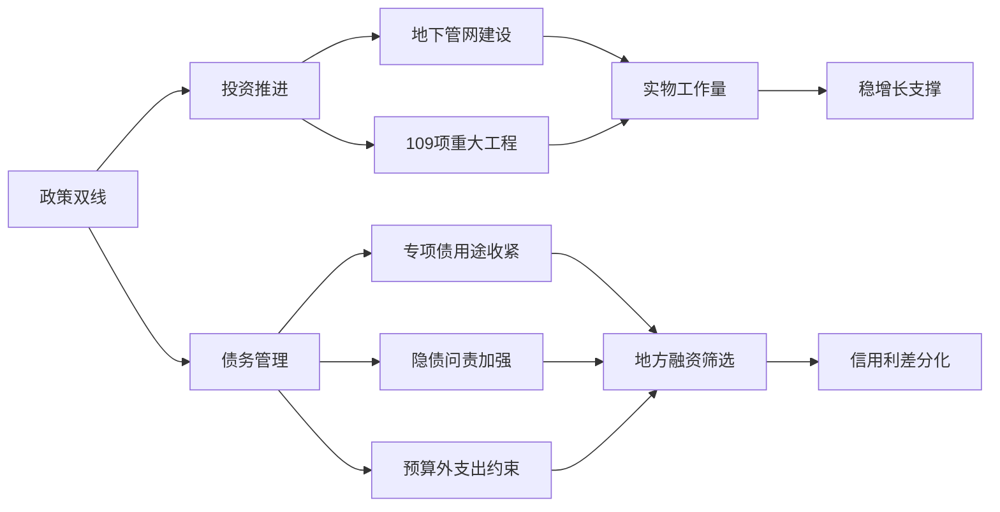

# 📰 公众号热点提炼

> 🕐 2026-09-08（周二）· 覆盖 09-07 至 09-08 · 11 个公众号 · 19 篇文章

## ⚡ 关键情报 KEY DELTA

本时段最值得关注的主线有两条：一条是**宏观与固收层面，财政与债务管理同步推进、银行保险获注资、长端利率继续下行、信用债内部则开始转向结构性机会**，资金更集中在**3–5年信用债、二永债与高等级科创债**，而关于二次分配、政府债务约束和地方国企融资重构的讨论，实质上都在指向未来资产定价框架的再调整。[来源:my_subscription_RAR000007926010]

另一条是**科技应用层面，GPT-6 Astra 对电脑与专业软件的直接操控成为高频话题**，从 Blender 建模、浏览器自动化到视频生成、语音记忆系统、具身智能与文生图架构，文章密集指向一个共识：AI 正从“回答问题”走向“直接执行任务”，而产业关注点也从单模型能力转向**工作流、部署效率、少步推理、记忆系统和协作式机器人**。[来源:my_subscription_RAR000007926347][来源:my_subscription_RAR100002086355]

---

## 财经固收类文章：结构化Q&A深度拆解

### 1. “被动补”迹象初现
**来源**：睿哲固收研究 · `09-08 07:30

#### 1. 这篇文章在说什么？
- **2026年7月工业企业产成品存货同比升至10.8%**，较前值上升**1.3个百分点**，全工业行业年内首次出现**“被动补库存”**迹象。
- 在此前**连续三个月主动补库**后，本月工业企业**营收增速止升**，库存继续上行而收入边际转弱，是“被动补”的直接触发条件。
- 分行业看，上游行业被表述为**“被动补库存”**，中游行业为**“主动去库存”**，下游行业为**“被动补库存”**，反映补库并非全面需求驱动，而是结构分化更强。
- 文中同时提示**统计口径误差风险**，强调工业企业数据大多基于抽样，可能与现实存在偏差。

#### 2. 为什么这件事重要？
- 库存周期从“主动补”切到**“被动补”**，意味着企业库存上升不再由需求改善主导，而更可能由**销售走弱、出货放缓**触发；这通常意味着后续生产、价格和盈利弹性可能弱于此前乐观预期。
- 如果中上游仍在去库、上下游却被动累库，说明需求修复的传导并不顺畅，后续市场更需要区分行业景气，而不能把库存改善简单理解为总量复苏。

#### 3. 作者的核心观点是什么？
- 作者核心判断是：**7月工业库存数据已出现“被动补”苗头**，这与此前连续数月的主动补库状态相比，是一个边际变化信号。
- 文章并未直接给出强方向性资产建议，但隐含逻辑是：如果收入增速不能再起，库存周期改善的持续性需要重新评估。

#### 4. 关键数据与信号
- **产成品存货同比：10.8%**。
- **较前值上升：1.3个百分点**。
- **连续三个月主动补库后，7月营收增速止升**。
- 关键信号词：**年内首现、被动补库存、营收增速止升**。

#### 5. 对投资决策意味着什么？
- 对宏观交易而言，后续需要重点跟踪**工业企业营收增速、PPI修复斜率与中游制造补库持续性**，验证“被动补”是短期波动还是新的周期切换。
- 若收入侧继续走弱，则顺周期资产的盈利兑现节奏可能放慢，债市对增长放缓的定价基础反而更稳固。

---

### 2. 张瑜：走向“大开大合”的二次分配——投石问“K”系列九
**来源**：一瑜中的 · `09-07 22:22

#### 1. 这篇文章在说什么？
- 文章核心比较了中国与**美国、日本、德国、韩国**在二次分配支出端和收入端的差异，指出中国当前仍呈现**“小开小合”**特征。
- 支出端方面，**2024年我国政府对居民转移支付占GDP比重为11.7%**，低于典型发达国家平均的**23%**；收入端方面，**社保收入+所得税+财产税占GDP比重为11.8%**，低于典型发达国家平均的**23.6%**。
- 从变化趋势看，**2015至2024年我国转移支付/GDP提升1.5个百分点**，快于美日德均值的**1个百分点**，显示近10年支出端追赶较快，但**2024年出现近4年首次下滑**。
- 收入端方面，**2015至2024年我国OECD可比口径宏观税负从22.4%降至19.5%**，同期OECD国家均值升至**34.1%**；其中我国**所得税/GDP从5.1%降至4.1%**、**财产税/GDP从1.6%降至1.2%**，与发达国家方向相反。
- 文章进一步提出四类税制结构差异：**个人资本利得税、弃籍税、全球最低税、财产税**，并指出**2024年我国个人资本利得税+不动产税+遗产和赠与税占GDP仅0.6%**，低于美日德韩均值**2.9%**。

#### 2. 为什么这件事重要？
- 这篇文章的重要性在于，它把“投资于人”“共同富裕”等政策表述，具体拆解为**财政支出扩张空间**与**税制改革空间**两条主线，因而直接关系到未来消费、社保、财政结构与居民部门资产负债表。
- 若二次分配继续从“小开小合”走向**“大开大合”**，一阶影响是财政支出结构重塑；二阶影响则可能是居民收入分布、税负结构与资本市场风险偏好的再定价。

#### 3. 作者的核心观点是什么？
- 作者明确判断：中国正从**“小开小合”走向“大开大合”**，但当前更大的堵点可能在**收入端“合”的不足**，即调高能力不够，掣肘了支出端“开”的力度。
- 文章并非简单倡导照搬海外制度，而是强调在国际比较下，中国在部分财富调节税收工具上确有结构差异，未来可能是中长期改革关注方向。
- 从政策逻辑上看，作者更偏向认为未来二次分配体系仍将继续扩张，只是节奏与工具选择需要结合中国国情。

#### 4. 关键数据与信号
- **政府对居民转移支付/GDP：11.7%**，发达国家均值**23%**。
- **社保收入+所得税+财产税/GDP：11.8%**，发达国家均值**23.6%**。
- **2015–2024年我国宏观税负：22.4%降至19.5%**；OECD均值升至**34.1%**。
- **所得税/GDP：5.1%降至4.1%**；**财产税/GDP：1.6%降至1.2%**。
- **个人资本利得税+不动产税+遗产和赠与税/GDP：0.6%**，对比美日德韩均值**2.9%**。
- 关键信号词：**投资于人、小开小合、大开大合、四个税制结构差异**。

#### 5. 对投资决策意味着什么？
- 中期看，需要跟踪**财政转移支付、社保支出、税制改革与全球最低税推进**等政策线索，这些变量将影响消费修复节奏、居民可支配收入预期及部分行业税负预期。
- 资产配置层面，这类研究更偏向提示**财政结构与分配制度变化**，而非短期交易信号；但若政策落地强化“投资于人”，则消费、民生服务及部分高税负敏感行业的估值体系都可能受到影响。

---

图1：二次分配研究的核心传导链条

---

### 3. 投资与债务管理双线部署——政策周观察第95期
**来源**：一瑜中的 · `09-07 22:22

#### 1. 这篇文章在说什么？
- 文章将近一周政策归纳为**“投资”与“财政/债务管理”两条主线**，时间范围覆盖**8月31日至9月6日**。
- 投资端方面，国常会听取城市地下管网建设情况汇报，发改委连续召开两场重大项目推进会议，并在**9月3日调度109项重大工程建设进展**。
- 债务端方面，《国务院关于2025年度政府债务管理情况的报告》披露，**截至2025年末全国政府债务余额102.5万亿元**，其中**国债41.2万亿元**、**地方政府法定债务54.8万亿元**、**地方政府存量隐性债务6.5万亿元**。
- 报告同时强调后续要**“控制总量、优化结构、化解风险”**，并提出**严禁将无收益项目纳入专项债支持范围**、**新增融资不得与政府信用挂钩**、**未纳入预算安排的支出一律不得实施**等更强约束。
- 其他政策还包括：**财政部向3家银行和4家保险机构合计注资2970亿元**，以及证监会、财政部等在私募募集办法和外籍个人股息红利个税政策上的新进展。

#### 2. 为什么这件事重要？
- 这篇文章的重要性在于，它把近期政策信号从“稳增长”进一步细化为**“扩投资”与“强约束”并行**：一方面推进地下管网、“六张网”、重大工程；另一方面持续收紧专项债、隐债和预算外支出边界。
- 对债市而言，这种组合意味着财政仍积极，但资金投向更强调收益匹配和风险约束；对地方融资平台和类政府信用主体而言，融资环境将继续从“总量支持”转向**结构筛选**。

#### 3. 作者的核心观点是什么？
- 作者的归纳是：当前政策并非单一宽松，而是**投资推进与债务管理双线部署**。
- 文章强调，债务管理的关键词已经非常清晰，即**兼顾当下和长远、控制总量、优化结构、化解风险**；这意味着未来地方政府融资纪律和项目筛选要求会继续增强。
- 与此同时，投资端并未弱化，反而通过**109项重大工程**与地下管网等方向强化实物工作量支撑。

#### 4. 关键数据与信号
- **全国政府债务余额：102.5万亿元**。
- **国债余额：41.2万亿元**。
- **地方政府法定债务：54.8万亿元**。
- **地方政府存量隐性债务：6.5万亿元**。
- **109项重大工程建设进展被调度**。
- **财政部注资：2970亿元**，对象为**3家银行、4家保险机构**。
- 关键信号词：**控制总量、优化结构、化解风险、无收益项目禁入、新增融资不得与政府信用挂钩**。

#### 5. 对投资决策意味着什么？
- 固收投资上，后续需重点跟踪**专项债用途约束、隐债问责、预算外支出压降**等执行情况，这些因素将影响地方国企、城投及准城投主体信用利差分化。
- 权益与产业链层面，可继续关注**地下管网、重大工程、“六张网”相关方向**，但要区分“有项目推进”与“有盈利兑现”的差别。

---

图2：投资推进与债务管理双线部署的政策传导

---

### 4. 血崩
**来源**：表舅是养基大户 · `09-07 21:35

#### 1. 这篇文章在说什么？
- 文章先讨论某上市公司对应届生解约事件的处理进展：**总经理扣薪12个月**、人力总监免职，但作者强调实际约束力度有限，因为董事长**半年末持股市值100多亿**，而被扣年薪仅**110万**，当日股价反弹**4个点**后，其持股市值“回血”约**3个亿**。
- 市场部分，作者重点提示某**国产GPU第一股**因**首次大规模解禁**而出现**20cm大跌**；解禁前流通股仅**3000多万股**，此次解禁**2500多万股**，相当于流通盘增加约**85%**。
- 作者同时认为，相比港股，A股本轮整体解禁压力**相对可控**，并提到若剔除某大市值个股，未来解禁规模大致仍在过去两年多月均水平附近。
- 文章还提到科技板块大涨受**OpenAI新模型刺激**，并指出财政部注资后银行、保险等红利板块承压，**红利与成长跷跷板**继续演绎。

#### 2. 为什么这件事重要？
- 短期看，文章最有价值的信息是对**解禁冲击**与**红利—成长跷跷板**的市场观察：高估值科技股可能受主题催化上涨，但个股层面的流通盘变化仍可能造成显著波动。
- 对红利资产而言，作者提示了一个重要的交易层风险：在注资、摊薄ROE与高股息拥挤交易并存的情况下，红利并非无波动资产，短线追涨的赔率正在下降。

#### 3. 作者的核心观点是什么？
- 作者对个股解禁的判断偏谨慎，认为短期**解禁压力是风险点**，但对A股整体解禁压力并不悲观，认为相较历史上行周期，本轮IPO本身已较克制。
- 对板块风格，作者明确提示当前是**成长占优、红利回调**的阶段，尤其当部分红利板块股息率已明显压低后，短线继续追高需要降低预期。

#### 4. 关键数据与信号
- **扣薪12个月**、**年薪110万**、**持股市值100多亿**。
- 股价反弹**4个点**，作者估算市值“回血”约**3个亿**。
- 某GPU公司流通股由**3000多万股**基础上新增解禁**2500多万股**，增幅约**85%**。
- 关键信号词：**20cm血崩、首次大规模解禁、红利跌倒、成长走强**。

#### 5. 对投资决策意味着什么？
- 对主题科技交易而言，需要把**产业催化**与**筹码结构**同时纳入框架，单纯看赛道热度可能忽视解禁和流动性冲击。
- 对红利资产而言，后续需继续跟踪**注资落地后的ROE摊薄、股息率压缩和资金风格切换**，高股息策略更适合看长期配置而非无脑短线追高。

---

### 5. 财政部为银行保险注资，长端利率下行（20260907）
**来源**：固收彬法每日观察 · `09-07 19:39

#### 1. 这篇文章在说什么？
- 当日国债现券收益率整体下行，**2年期国债活跃券收益率下行0.25bp至1.24%**，**10年期下行0.35bp至1.68%**，**30年期下行0.65bp至2.16%**。
- 资金面偏宽松，**1年期国股行存单利率持平于1.48%**。
- 文中将当日行情解释为：**逆回购恢复投放、净回笼45亿元**，叠加财政部为银行保险注资，引发市场对**宽货币预期升温**。

#### 2. 为什么这件事重要？
- 这篇文章虽然简短，但给出了当日最直接的利率市场价格信号：**长端下行幅度大于短端**，说明市场在宽松预期与资金面宽松下，更愿意增配长久期利率债。
- 财政部注资消息若被市场理解为稳金融体系与配合宽信用、宽货币的组合动作，则会继续强化中长端利率下行预期。

#### 3. 作者的核心观点是什么？
- 作者核心结论是：当日债市走强，背后驱动来自**资金宽松**与**宽货币预期升温**。
- 文章并未延伸讨论中期趋势，但短期交易口径偏向顺势看多利率债表现。

#### 4. 关键数据与信号
- **2Y国债：1.24%，下行0.25bp**。
- **10Y国债：1.68%，下行0.35bp**。
- **30Y国债：2.16%，下行0.65bp**。
- **1Y国股行存单：1.48%**。
- **逆回购净回笼：45亿元**。

#### 5. 对投资决策意味着什么？
- 若后续资金面维持宽松，则长端利率仍有表现基础；但需要继续验证财政注资与货币政策之间是否存在更持续的联动预期。
- 关注后续**公开市场操作、资金利率与长端收益率曲线陡峭度**变化，判断本轮下行是单日脉冲还是趋势延续。

---

### 6. 信用 | 科创债指数基金扩容，增量资金可期
**来源**：郁言债市 · `09-07 10:57[来源:my_subscription_RAR000007926010]

#### 1. 这篇文章在说什么？
- 文章回顾了**8月31日至9月4日**信用债市场表现：信用债收益率普遍下行，其中**二永债4–5年表现占优**，二级资本债**4–10Y收益率下行2–3bp**，银行永续债**3–5Y下行2–4bp**。[来源:my_subscription_RAR000007926010]
- 从机构行为看，**基金净买入其他类债券110亿元**，较前周增加**34亿元**，其中**3–5年净买入65亿元，占比59%**；**其他机构净买入225亿元**，环比增加**117亿元**，其中**3–5年净买入189亿元，占比84%**。[来源:my_subscription_RAR000007926010]
- 结构性机会方面，作者重点提示**9月4日10家基金管理人集中申报科创债场外指数基金**，跟踪中债-AAA科技创新债券指数等，覆盖银行间和交易所品种，范围较现有科创债ETF更广。[来源:my_subscription_RAR000007926010]
- 投资建议方面，文章提出：信用债维持**中性久期**，重点关注**AA+券商普通债4–5Y**与**高等级科创债**；并提示**AAA-二级资本债5Y收益率1.84%**，较AAA中短票5Y高**10bp**，而**AAA-二级资本债10Y收益率2.03%**，已低于同期限高评级信用债。[来源:my_subscription_RAR000007926010]

#### 2. 为什么这件事重要？
- 文章的重要性在于，它清晰揭示了当前信用债市场已从全面压缩走向**结构性行情**：一方面资金仍在买，另一方面利差已偏低，后续超额收益更依赖品种和期限选择。[来源:my_subscription_RAR000007926010]
- 科创债指数基金扩容若继续推进，会给**高等级科创债、绿色债成分券**带来新增需求预期，形成成分券与非成分券之间的估值分化。[来源:my_subscription_RAR000007926010]

#### 3. 作者的核心观点是什么？
- 作者总体观点偏中性偏结构化：短期资金面对信用仍有支撑，但由于利差已低，后续不宜期待全面大行情，而应做**结构交易**。[来源:my_subscription_RAR000007926010]
- 具体上，作者更偏好**AA+券商普通债4–5Y**与**高等级科创债**，对长久期二永债则相对谨慎，认为追涨赔率偏低。[来源:my_subscription_RAR000007926010]

#### 4. 关键数据与信号
- **基金净买入其他类债券110亿元**，环比增**34亿元**。[来源:my_subscription_RAR000007926010]
- **3–5年净买入65亿元，占59%**。[来源:my_subscription_RAR000007926010]
- **其他机构净买入225亿元**，环比增**117亿元**。[来源:my_subscription_RAR000007926010]
- **3–5年净买入189亿元，占84%**。[来源:my_subscription_RAR000007926010]
- **10家基金管理人申报科创债场外指数基金**。[来源:my_subscription_RAR000007926010]
- **AA+券商债4Y、5Y较中票利差分别为7bp、6bp**。[来源:my_subscription_RAR000007926010]
- **AAA-二级资本债5Y：1.84%**；**10Y：2.03%**。[来源:my_subscription_RAR000007926010]

#### 5. 对投资决策意味着什么？
- 信用债策略上，更适合维持**中性久期**、聚焦**3–5年中高评级信用品种**，避免在长久期二永债上继续压缩赔率。[来源:my_subscription_RAR000007926010]
- 若科创债指数产品持续推进，可优先跟踪**指数覆盖的高等级成分券**，关注由申报预期驱动的相对估值分化。[来源:my_subscription_RAR000007926010]

---

### 7. 2026地方国企宝典，新鲜出炉
**来源**：郁言债市 · `09-07 10:57[来源:my_subscription_RAR000007926133]

#### 1. 这篇文章在说什么？
- 文章从地方债务化解背景切入，指出自**2023年7月**提出“一揽子化债方案”后，**35号文、14号文、134号文、150号文**等政策陆续出台，并直接增加**“6+4”万亿元地方债资金**用于化债。[来源:my_subscription_RAR000007926133]
- 在此推动下，城投债违约风险明显下降，区域间信用利差分化显著收敛，**信用利差最高省份与最低省份差值由将近800bp压缩至100bp左右**。[来源:my_subscription_RAR000007926133]
- 截至**2025年末**，官方披露**超82%的融资平台退出名单**，隐债较**2023年末减少7.8万亿元**。[来源:my_subscription_RAR000007926133]
- 文章认为，随着化债临近尾声、评级监管与发债政策在**今年6–7月**趋严，传统城投新增债融资变难，地方国企正成为新的融资主力；**2026年1–8月信用债净融资2.18万亿元**，其中**地方国企1万亿元，占比46.1%**，同比提升**13个百分点**，**首次发债地方国企426家**，较去年同期增加**174家**。[来源:my_subscription_RAR000007926133]
- 因应这一变化，作者团队推出《地方国企宝典》，覆盖**4882家发债地方国企**。[来源:my_subscription_RAR000007926133]

#### 2. 为什么这件事重要？
- 这篇文章本质上是在提示信用市场一个中期结构变化：**“城投”融资时代正在向“地方国企”融资体系重塑过渡**。[来源:my_subscription_RAR000007926133]
- 一阶影响是信用研究对象发生变化，从平台类主体转向类城投、类金融和产业主体；二阶影响则是未来信用利差可能重新分化，研究价值重新抬升。[来源:my_subscription_RAR000007926133]

#### 3. 作者的核心观点是什么？
- 作者明确认为，随着化债推进与平台退出，**“城投可能变成过去式”**，地方国企会成为新的融资主力。[来源:my_subscription_RAR000007926133]
- 同时作者判断，未来新地方国企债利差**可能再次走向分化**，尽管分化程度未必回到化债前极端状态，但“区域分层、期限控制、主体筛选”会重新重要。[来源:my_subscription_RAR000007926133]

#### 4. 关键数据与信号
- **“6+4”万亿元地方债资金化债**。[来源:my_subscription_RAR000007926133]
- **利差差值：近800bp压缩至100bp左右**。[来源:my_subscription_RAR000007926133]
- **超82%融资平台退出名单**。[来源:my_subscription_RAR000007926133]
- **隐债较2023年末减少7.8万亿元**。[来源:my_subscription_RAR000007926133]
- **2026年1–8月信用债净融资2.18万亿元**。[来源:my_subscription_RAR000007926133]
- **地方国企净融资1万亿元，占比46.1%**，同比增**13个百分点**。[来源:my_subscription_RAR000007926133]
- **首次发债地方国企426家**，同比多**174家**。[来源:my_subscription_RAR000007926133]
- **宝典覆盖4882家发债地方国企**。[来源:my_subscription_RAR000007926133]

#### 5. 对投资决策意味着什么？
- 信用投资框架需要从“看城投行政层级”转向“看地方国企真实经营、产业定位与区域财政承接能力”。[来源:my_subscription_RAR000007926133]
- 后续可重点跟踪**平台退出节奏、地方国企新增融资占比、区域利差再分化**等指标，判断信用市场是否进入新一轮分层阶段。[来源:my_subscription_RAR000007926133]

---

### 8. 伸手，接图
**来源**：一瑜中的 · `09-08 00:00

#### 1. 这篇文章在说什么？
- 这是一篇**福利合集/报告索引**类文章，提到可获取**9篇深度报告、13万字以上内容、200多张图表**与百张精选图。
- 内容围绕“投石问K”系列九篇报告的目录与图表目录展开，主题集中在**K型分化、美国/德国经验、地产治理、二次分配**等。

#### 2. 为什么这件事重要？
- 这篇文章本身不提供新增研究结论，但其目录集中展示了作者近期宏观研究主线，有助于理解前述《二次分配》文章所在的研究框架。

#### 3. 作者的核心观点是什么？
- 文章更偏资料汇总和传播，不构成独立投资判断。

#### 4. 关键数据与信号
- **9篇深度报告**、**13万字以上**、**200多张图表**。

---

### 9. 国联民生固收徐亮团队丨电话会议邀请
**来源**：固收亮话 · `09-07 15:30

#### 1. 这篇文章在说什么？
- 文章是电话会议邀请，会议时间为**2026-09-07 20:00**，主题为**利率节奏及转债策略分析**。
- 议题包括：**注资国债有什么影响、利率节奏和策略怎么看、如何从资金角度看待转债配置价值、九月新增哪些推荐转债**。

#### 2. 为什么这件事重要？
- 会议主题与当下市场主线高度相关，尤其是**财政注资—利率交易—转债资金配置**之间的联动，反映卖方研究关注重心已转向政策脉冲下的策略节奏。

#### 3. 关键数据与信号
- **会议时间：09-07 20:00**。
- 关键信号词：**注资国债、利率节奏、转债配置价值**。

#### 4. 对投资决策意味着什么？
- 可作为后续跟踪线索：若市场继续围绕注资与利率节奏展开交易，转债估值与资金面将是重要观察点。

---

### 10. 固收实务投研框架系列会议（共12期，每周三晚上7点）
**来源**：固收亮话 · `09-07 15:30

#### 1. 这篇文章在说什么？
- 文章是固收系列会议预告，规划**12场电话会议**，覆盖**九大核心方向**。
- 当前预告为**第十期**，时间是**2026/9/9 19点**，主题是**“怎么从0构建信用债投资组合”**，涉及信用债超配/低配、组合构建、信用策略调整和收益增厚等问题。

#### 2. 为什么这件事重要？
- 虽是会议信息，但议题本身贴近当前信用市场环境：在利差压缩、结构机会为主的阶段，市场确实更关心**信用债组合构建与相对价值选择**。

#### 3. 关键数据与信号
- **12场电话会议**。
- **第十期：2026/9/9 19点**。
- 主题：**从0构建信用债投资组合**。

---

### 11. 红利跌倒
**来源**：债券今天有蛋吗 · `09-07 13:31[来源:my_subscription_RAR100002089856]

#### 1. 这篇文章在说什么？
- 文章简要记录了当天市场表现：**双创跟随美股半导体上涨**，而在前一日增资方案出台后，**银行等红利板块领跌**，市场整体行业涨跌各半。[来源:my_subscription_RAR100002089856]
- 同时提到，截至上周五收盘，A股温度计为**71.4度**，属于**中等水平**。[来源:my_subscription_RAR100002089856]

#### 2. 为什么这件事重要？
- 这篇文章与《血崩》互相印证了当日市场风格切换：**成长强、红利弱**，说明资金在主题科技与高股息之间进行再平衡。[来源:my_subscription_RAR100002089856]

#### 3. 作者的核心观点是什么？
- 文章更偏市场记录而非深度分析，但其核心观察是：增资方案后，红利板块承压，市场风格开始出现再切换。[来源:my_subscription_RAR100002089856]

#### 4. 关键数据与信号
- **A股温度计：71.4度**。[来源:my_subscription_RAR100002089856]
- 信号词：**红利领跌、双创上涨、行业涨跌各半**。[来源:my_subscription_RAR100002089856]

---

## 科技类文章：概要模式

### 12. 用GPT-6 Astra操控Blender，保姆级教程来了。
**来源**：数字生命卡兹克 · `09-08 08:17

文章系统梳理了 **GPT-6 Astra + Blender** 的三种协作方式：**Computer Use、Blender官方MCP、CLI+Python脚本**，并用天坛、摩托车、角色建模等案例说明 AI 在建筑、机械等规则几何结构上的建模效率显著提升，但在人物、生物类建模上仍需结合 Tripo AI 等专门3D生成模型。 作者还给出明显的成本与效率对比，例如单次天坛建模耗时约**4小时**，且几乎用掉 **200美元Pro会员额度的一半**，说明这类长程执行虽然可用，但成本和稳定性仍是现阶段约束。

### 13. GPT-6 Astra的唯一正确用法：把你电脑给它！
**来源**：刘小排r · `09-08 00:21

文章核心观点非常直接：**GPT-6 Astra 真正的突破不是更会聊天，而是更会“用电脑”**，可在 KiCad、Unity、Blender、Power BI、剪辑软件等专业环境中直接完成任务。 文中列举了 PCB 设计、游戏制作、复杂建模、机器人结构拆解等多个案例，实质是在强调 AI 正从“工具辅助”转向“软件代理”。

### 14. 全扩散架构、无需图文对预训练，LLaDA杀穿开源文生图
**来源**：机器之心 · `09-07 20:27

LLaDA-Image 采用**全扩散架构**，核心亮点是**超过90%的累计生成训练样本采用 image-only 监督**，把图文对主要留到后续语言对齐阶段，即“先学会画，再学会听话”。 文章称其在 **Qwen-Image-Bench** 上取得开源模型中英文双榜第一，并进一步通过 **TwinFlow** 蒸馏把推理压缩到 **2–4步**，体现当前文生图竞争已从“能不能生成”转向“训练配方、推理效率与统一编辑能力”。

### 15. 两年前我说自己是AI时代的纺织工，今天我把这活开源交出去了！
**来源**：花叔 · `09-07 20:12

文章介绍作者开源的浏览器自动化工具 **huashu-chrome**，其价值不在“打开网页”，而在**继承用户当前浏览器登录态**，让 Agent 直接进入后台、签证系统、App Store Connect 等无 API 场景执行任务。 文中给出最近**14天执行两万多条命令、成功率96%、单条平均1.5秒**等运行数据，说明 AI Agent 的瓶颈已从模型问答，逐步转向身份接入、动作校验、批处理与安全边界设计。

### 16. 不注册、不花钱，10秒出一条带声音的AI视频，这家公司要干啥？
**来源**：机器之心 · `09-07 18:00

文章评测了 Pavo 平台的极速视频模式，强调其在**不用注册、约10秒内生成5秒带声音视频**方面的低门槛体验，文中实测文生视频耗时约**9.49秒**。 同时文章指出，注册后每天可获 **200积分**，按**每生成1秒消耗2积分**计算，约可每日生成**100秒视频**，反映AI视频产品正在从“模型效果竞争”转向“试错成本与工作流效率竞争”。

### 17. 颜水成团队重磅发布VoiceMem，提出「流式双脑架构」打造下一代实时交互基础设施
**来源**：机器之心 · `09-07 18:00

VoiceMem 的核心创新是把实时语音交互中的“记忆”拆成**信息左脑**与**情感右脑**，分别处理事实检索与人格/情绪沉淀，使语音助手不仅记得“你说过什么”，还记得“你是什么样的人”。 文中给出关键性能指标：检索延迟压缩到 **VAD后134毫秒**，较传统方案降低 **65%**，并把完整检索过程隐藏在标准 **300毫秒静音等待窗口**内，说明实时交互的竞争正进入“低时延+长期记忆”的基础设施阶段。

### 18. 机器人基础模型的「协作时代」来了！芝诺机器人发布全球首个协作具身智能基础模型
**来源**：机器之心 · `09-07 11:56[来源:my_subscription_RAR000007926347]

文章介绍 **Zeno-1**，一个 **3B参数**、面向**去中心化多机器人协作**的物理智能基础模型，可在本地以 **30Hz** 频率进行闭环视觉—运动推理。[来源:my_subscription_RAR000007926347] 其方法重点在于通过闭环伙伴交互学习协作，而非依赖中心控制器，显示具身智能正在从单体能力竞赛转向多机器人协同、鲁棒性与长程任务执行能力。[来源:my_subscription_RAR000007926347]

### 19. 大模型企业「跨界」具身即登顶榜首！智象HiDream具身世界模型来了
**来源**：机器之心 · `09-07 11:56[来源:my_subscription_RAR100002086355]

HiDream-O1-Embodied 被定位为具身世界模型，首次参评 **RoboColiseum** 即在 **Robustness** 子榜以平均分 **0.692** 登顶，文章强调其强项在于指令理解、视觉多视角协同与高容错训练。[来源:my_subscription_RAR100002086355] 这意味着世界模型竞争正从视频生成延伸到真实物理交互，且数据范式也从单纯采集转向**“真实基座+生成增强”**的模型—数据飞轮。[来源:my_subscription_RAR100002086355]

---

## 🔭 关注清单 THINGS TO WATCH

1. **利率与资金面**：继续跟踪财政部注资后，公开市场操作、资金利率与**10年、30年国债收益率**是否延续下行趋势，验证“宽货币预期升温”是否能持续。
2. **信用结构机会**：关注**科创债场外指数基金申报**后成分券估值变化，以及**3–5年信用债、二永债**是否继续获得基金和其他机构增配。[来源:my_subscription_RAR000007926010]
3. **政策与地方融资重构**：重点观察**专项债用途管理、隐债问责、平台退出进度**与地方国企新增融资占比，判断信用利差是否重新进入区域和主体分化阶段。[来源:my_subscription_RAR000007926133]

_本日报基于用户订阅的公众号文章生成。财经投研类文章做结构化深度拆解，科技类文章做概要概览。_