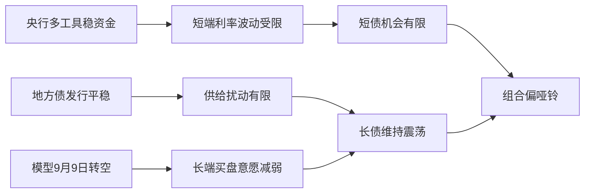
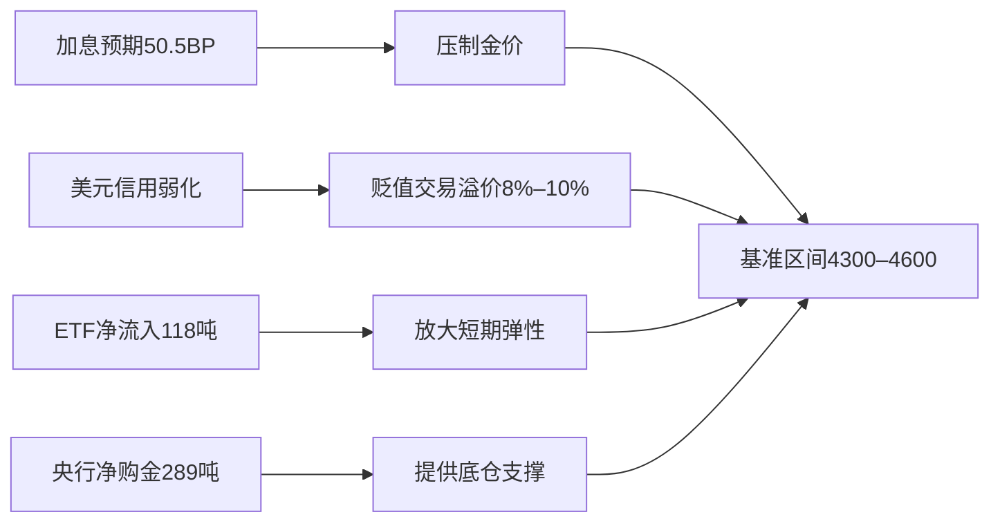

# 📰 公众号热点提炼

> 🕐 2026-09-15（周二）· 覆盖 09-14 至 09-15 · 9 个公众号 · 20 篇文章

## ⚡ 关键情报 KEY DELTA

债券侧的核心变化，是**“资金面未显著转松 + 海外加息预期抬升 + 银行MPA新增债券考核传闻发酵”**共同作用下，长端尤其超长端波动加大，但多篇文章同时指出，**8月信贷与社融偏弱、地方债发行节奏平缓、央行继续通过逆回购与买断式工具维稳流动性**，使得债市更接近“震荡而非趋势反转”。[来源:social_media_RAR000007950863][来源:social_media_RAR000007948210]

宏观侧，围绕美国市场的分歧在于：一类观点强调**美股美债相关系数已在正区间维持两年多，美国金融体系“脆弱性”上升**；另一类观点则从黄金定价切入，认为**美元信用弱化与财政约束并未因鹰派表态而消失，黄金4300–4600美元/盎司区间震荡的中枢仍有支撑**。[来源:social_media_RAR000007947798]

科技侧最值得关注的主线是：**企业级AI正从“拼模型能力”转向“拼数据主权、插件生态与训练自主权”**。一边是英伟达、Palantir等限制外部前沿模型接触敏感数据，另一边是Anthropic开放Claude Mods、PyTRIO推动Training API、腾讯T-Mem强化长期记忆，这些变化都指向AI平台竞争正由模型本身外溢到安全、控制与工作流层。[来源:social_media_RAR100002186710][来源:social_media_RAR100002185009]

## 财经投研类文章

### 1. 需要担心债市调整吗？
**来源**：固收亮话 · `09-14 12:00` · [原文链接](http://mp.weixin.qq.com/s?__biz=Mzk0MjI0ODUwNw==&mid=2247537482&idx=1&sn=d9ec11fe3a04c1714527d6b37b33e50e) [来源:social_media_RAR000007948210]

#### 1. 这篇文章在说什么？
- 对短端的判断偏谨慎：预计隔夜资金利率仍主要在 **1.35%–1.4%** 区间波动，而 **1Y存单**、**3Y国开**隐含的7天资金利率约为 **1.41%**、**1.36%**，与当前 **R007约1.4%** 已较接近，因此短债进一步下行空间有限。[来源:social_media_RAR000007948210]
- 对长端的判断偏震荡：预计 **9月10Y国债**主要波动区间为 **1.65%–1.7%**，**30Y国债**主要波动区间为 **2.1%–2.15%**，10–11月利率下行概率可能更高，且不排除9月底提前交易。[来源:social_media_RAR000007948210]
- 组合建议上，继续维持**“短+长”的哑铃型结构**，久期短期偏中性，若利率位于区间上沿，再关注交易机会。[来源:social_media_RAR000007948210]
- 个券层面，重点提及**26T6**的交易价值，认为若 **26T4-26T6利差压缩至当前约2.4BP后继续收敛**，则26T6超额价值会逐步显现。[来源:social_media_RAR000007948210]
- 模型信号方面，文中指出其**利率预测模型于9月9日由多转空**，且当前 **3个子模型看多、5个子模型看空**，综合模型看空。[来源:social_media_RAR000007948210]

#### 2. 为什么这件事重要？
- 这一定义了当前债市的核心框架：**短端缺赔率、长端有波段但无单边趋势**，意味着配置盘与交易盘都需要降低“趋势性做多”的预期，转向区间思维和结构性择券。[来源:social_media_RAR000007948210]
- 对理财与固收账户而言，若资金利率稳定在 **1.35%–1.4%** 而非继续下台阶，那么票息资产与超长债的相对性价比排序会发生变化，组合更强调久期分层而非单一拉长。[来源:social_media_RAR000007948210]

#### 3. 作者的核心观点是什么？
- **短端机会有限，长端震荡为主。**在央行多工具平滑资金、地方债发行节奏平稳的背景下，短端难走出明显趋势；长端则需等待更明确的政策、供给或基本面验证。[来源:social_media_RAR000007948210]
- **四季度优于9月。**作者更倾向于把利率下行机会放在 **10–11月**，而非立刻在9月大举押注。[来源:social_media_RAR000007948210]
- **超长债赔率仍在，但更适合调整后介入。**特别是30年国债与地方债底仓，仍有配置价值，但需等待更好的点位与更明确的供给环境。[来源:social_media_RAR000007948210]

#### 4. 关键数据与信号
- **隔夜资金利率预期：1.35%–1.4%**。[来源:social_media_RAR000007948210]
- **1Y存单/3Y国开隐含7天资金利率：1.41% / 1.36%**。[来源:social_media_RAR000007948210]
- **9月10Y国债区间：1.65%–1.7%**；**30Y国债区间：2.1%–2.15%**。[来源:social_media_RAR000007948210]
- **26T6-260016利差：46BP左右**；**26T4-26T6利差：2.4BP左右**。[来源:social_media_RAR000007948210]
- **利率预测模型9月9日由多转空**；**3个子模型看多、5个子模型看空**。[来源:social_media_RAR000007948210]

#### 5. 对投资决策意味着什么？
- 组合层面更适合**维持中性久期 + 哑铃配置**，而不是在当前位置集中押注长债大幅走牛。[来源:social_media_RAR000007948210]
- 交易层面优先关注**26T6、30Y地方债、8–9Y国开等相对价值品种**，并持续验证地方债供给、通胀与资金面的边际变化。[来源:social_media_RAR000007948210]

图1：债市策略主线——资金、供给与模型信号共同决定“震荡而非反转”[来源:social_media_RAR000007948210]

### 2. MPA新增指标，超长债回调！
**来源**：红军债市笔记 · `09-15 05:37` · [原文链接](http://mp.weixin.qq.com/s?__biz=MzkzNTYzMDYxMg==&mid=2247486975&idx=1&sn=44ddad101752b23342673d3c4606469b) 

#### 1. 这篇文章在说什么？
- 9月14日债市盘中受多重因素扰动：早盘海外因素压制情绪，**10Y国债平开1.686%**、**30Y国债上至2.1745%**；尾盘收于 **10Y 1.684%**、**30Y 2.1724%**。
- 当日央行开展 **5040亿元隔夜逆回购**，对冲 **5000亿元买断式逆回购** 和 **5亿元7天期逆回购**到期，实现**净投放35亿元**。
- 资金面表现为均衡偏紧，**DR001下行0.5BP至1.414%**，**DR007下行0.8BP至1.414%**，**1年存单上行0.5BP至1.485%**。
- 文中认为下午发酵的**MPA新增债券考核指标传闻**，是压制超长债的主要因素，但其对10年影响有限，对银行体系的实际约束范围和强度仍有不确定性。
- 同时，8月金融数据偏弱：**新增人民币贷款600亿元**，低于市场预期 **3800亿元**；**社融16619亿元**，低于预期 **19865亿元**；**M2同比7.5%**，低于预期 **7.6%**。

#### 2. 为什么这件事重要？
- MPA若将债券久期或顺周期交易行为纳入考核，影响的不只是单日情绪，而是**银行对长久期利率债的风险偏好与交易节奏**，尤其会改变超长债的边际定价力量。
- 但金融数据偏弱又对债市形成基本面支撑，这使市场呈现典型的**“政策约束预期”与“弱现实利多”对冲**格局，决定了长端更可能高波动震荡，而非单边熊市。

#### 3. 作者的核心观点是什么？
- **MPA传闻对超长债有影响，但未必构成系统性利空。**作者强调，债券考核究竟是7大项中的分支还是新增第8项、权重多高，目前都不明确。
- **大行可能大体符合久期要求，小行或不在考核范围。**文中提及久期考核均值为 **5.8年**，而去年国有大行和股份制行年报显示持仓久期低于该水平，若仅 **5000亿以上银行** 执行，则影响有限。
- **更大变数在基金。**政策本身不直接约束基金，但若银行持有基金需要压降相关指标，可能通过赎回行为向基金端传导，进而影响超长债。

#### 4. 关键数据与信号
- **10Y国债：1.686%开、1.684%收**；**30Y国债：2.1745%高点、2.1724%收**。
- **央行逆回购：5040亿元**；**净投放：35亿元**。
- **DR001/DR007：1.414% / 1.414%**。
- **新增贷款：600亿元** vs 预期 **3800亿元**；**社融：16619亿元** vs 预期 **19865亿元**；**M2同比：7.5%**。
- **久期考核均值传闻：5.8年**；潜在执行门槛传闻：**5000亿以上银行**。

#### 5. 对投资决策意味着什么？
- 短期需重点跟踪**MPA考核口径是否落地、银行是否出现真实减久期行为、基金端是否出现被动赎回**，这是超长债能否继续承压的关键验证链条。
- 若政策仅是预期管理而非强制去杠杆，则在弱金融数据环境下，**7年附近品种及部分中长端券**可能受益于久期再配置需求。

### 3. 4400美元的黄金，涨跌空间怎么看
**来源**：郁言债市 · `09-14 08:38` · [原文链接](http://mp.weixin.qq.com/s?__biz=MzU3NTYyNTIyMQ==&mid=2247615526&idx=1&sn=1113cfb954e9ddcc79703d5482aa47ef&chksm=fca7413f33f8908099b8aa9eceb5379beb12a68f4d6d2a71a3d8617133a4a152aefab1605537&scene=0&xtrack=1#rd) [来源:social_media_RAR000007947798]

#### 1. 这篇文章在说什么？
- 文章认为，8月黄金上涨由**加息预期阶段性回落**与**美元贬值交易重启**共同驱动，伦敦金现一度站上 **4600美元/盎司**，Jackson Hole会议后回落至 **4400美元/盎司附近**，9月上旬再回落到 **4350美元/盎司附近**。[来源:social_media_RAR000007947798]
- 以3–6月经验回归测算，**加息预期每变动25BP，金价反向变动约4.8%**；按9月上旬年内累计加息预期 **50.5BP** 推算，仅考虑加息预期的隐含金价约 **4000美元/盎司**，而实际金价约 **4350美元/盎司**，即存在约 **9pct** 的“贬值交易溢价”。[来源:social_media_RAR000007947798]
- 资金面上，交易型资金是本轮反弹斜率的主要来源，**8月全球黄金ETF净流入118吨**，接近1月全月 **120吨**；而全球央行 **二季度净购金约289吨**，高于 **2023–2025年约249吨** 的单季均值，中国央行 **8月增持约20吨**，连续 **22个月** 增持。[来源:social_media_RAR000007947798]
- 长期框架中，文中用“**黄金总市值/美债总额**”衡量美元信用重估。该比值 **2026年3月触及0.85**，**9月11日约0.78**；若比值升至 **1**，对应长期参考价约 **5600–5800美元/盎司**。[来源:social_media_RAR000007947798]
- 基准情形下，作者预计金价未来 **3–6个月** 在 **4300–4600美元/盎司** 震荡；偏强情形可至 **4600–4900美元/盎司**，偏弱情形回踩 **4000–4300美元/盎司**。[来源:social_media_RAR000007947798]

#### 2. 为什么这件事重要？
- 对多资产配置而言，这篇文章提供了黄金的双锚定价：一是**短期由加息预期决定方向**，二是**长期由美元信用与财政约束决定中枢**，有助于判断黄金是交易性品种还是战略性底仓。[来源:social_media_RAR000007947798]
- 其核心预期差在于：即使Jackson Hole后加息交易再升温，**“贬值交易”并未消失**，因此黄金未必简单复制“实际利率上行=金价下跌”的老逻辑。[来源:social_media_RAR000007947798]

#### 3. 作者的核心观点是什么？
- **黄金并未被高估到极端。**当前金价相对美元指数的弹性约为 **2.8倍**，仍低于 **2025年约7倍** 的经验值，说明市场对美元信用弱化的定价尚未过热。[来源:social_media_RAR000007947798]
- **中期区间震荡，长期上沿仍在抬升。**作者并未直接看单边大牛，但认为当前 **4350美元/盎司** 更接近基准区间下沿。[来源:social_media_RAR000007947798]
- **央行购金是底仓，交易型资金决定斜率。**若ETF与期货资金继续回补，价格弹性会更明显；若仅靠央行，更多体现为底部支撑。[来源:social_media_RAR000007947798]

#### 4. 关键数据与信号
- **伦敦金现高点：4600美元/盎司**；近期位置：**4350–4400美元/盎司**。[来源:social_media_RAR000007947798]
- **年内累计加息预期：50.5BP**；隐含金价约 **4000美元/盎司**。[来源:social_media_RAR000007947798]
- **贬值交易溢价：约8%–10%，当前约9pct**。[来源:social_media_RAR000007947798]
- **8月黄金ETF净流入：118吨**；**二季度全球央行净购金：289吨**；**中国央行8月增持：20吨**、连续 **22个月** 增持。[来源:social_media_RAR000007947798]
- **黄金总市值/美债总额比值：0.78（9月11日）**；升至 **1** 对应 **5600–5800美元/盎司**。[来源:social_media_RAR000007947798]

#### 5. 对投资决策意味着什么？
- 若组合将黄金定位为**美元信用弱化的对冲资产**，则当前更适合按 **4300–4600美元/盎司** 区间思维配置，而不是追逐单日波动。[来源:social_media_RAR000007947798]
- 未来几周需重点盯住**9月议息会议路径、油价、TGA/长债回购动作以及央行购金节奏**，这些变量决定金价是向 **4600美元/盎司** 修复还是回踩 **4000美元/盎司** 一线。[来源:social_media_RAR000007947798]

图2：黄金定价框架——利率锚、美元信用与资金行为共同作用[ source:20 ]

### 4. 张瑜：如何看美国的“脆弱”与“坚强”——张瑜旬度会议纪要No.147
**来源**：一瑜中的 · `09-14 23:21` · [原文链接](http://mp.weixin.qq.com/s?__biz=MzI3NTUyMDkzMw==&mid=2247609529&idx=1&sn=05ba6c201c5a0a535907365cf46f078c&chksm=eadd4d104ba2d0d40dcf858bad020bf33d724e7c846b6a8a49a13a7d6f3dc9647f12389a47b3&scene=0&xtrack=1#rd) 

#### 1. 这篇文章在说什么？
- 文章将**美股与美债相关系数**定义为衡量美国金融市场流动性健康度的关键指标，指出正常情况下股债应为负相关，这是美国大类资产配置体系的基石。
- 自 **1997–1998年至今近30年**，股债相关系数共有**四次**转正或接近转正，其中前两次最终演变为系统性流动性危机，分别对应 **2000年互联网泡沫破裂** 与 **2007–2008年次贷危机**。
- 当前是过去30年的**第四次高位**，且已在高位维持**两年多**。作者认为，本届美联储最核心的评价标准，就是能否把这一相关系数重新压回负区间。
- 文章同时强调美国的“韧性”在于其政策工具不只限于经济手段，还可联动**经济、政治、军事**多元手段共同施压和配套发力。

#### 2. 为什么这件事重要？
- 资产配置的底层逻辑，依赖股债负相关带来的风险对冲。如果股债同跌，**传统平衡型组合、量化配置体系和金融机构久期/权益对冲机制都会失灵**，脆弱性将从市场波动演变为流动性风险。
- 因此，这一观察框架并非抽象讨论，而是直接关联全球风险资产、美元债、黄金乃至人民币资产的波动传导路径。

#### 3. 作者的核心观点是什么？
- **美国当前最大的脆弱性，是股债正相关维持过久。**一旦长债继续承压，美股无法像过往那样提供缓冲，系统更易进入去杠杆状态。
- **美国的韧性在于手段多元。**不同于多数经济体只能依靠利率、流动性和财政，美国还能通过跨市场、跨国家、跨政治层面的手段协调“拆弹”。
- **衡量本轮政策成功与否，不在“术”而在“果”。**无论使用什么工具，最终检验标准都是股债相关系数能否重回负值。

#### 4. 关键数据与信号
- **近30年共4次**股债相关系数转正或接近转正。
- 前两次对应 **2000**、**2007–2008** 的系统性危机。
- 当前为**第四次高位**，且已维持**两年多**。
- **2015–2018年**大体量加息周期中，相关系数反而逐步回到负区间，被视为一次成功“拆弹”。

#### 5. 对投资决策意味着什么？
- 未来需把**美股美债相关性**视为全球资产风险偏好的核心监测指标之一；若持续正相关并伴随长债上行，则应警惕跨资产联动下跌的系统性冲击。
- 对国内资产而言，这将影响**外需、汇率、黄金与A股风险偏好**，特别是海外利率冲击向本土定价的外溢。

### 5. 投资部署持续加力——政策周观察第96期
**来源**：一瑜中的 · `09-14 23:21` · [原文链接](http://mp.weixin.qq.com/s?__biz=MzI3NTUyMDkzMw==&mid=2247609529&idx=2&sn=d359e17618204068c9881a8a4d55978b&chksm=ea7969831e704d2be5579fd3334befd6f666fc01416d98c561b03c1812f8977c82931198913f&scene=0&xtrack=1#rd) 

#### 1. 这篇文章在说什么？
- 近一周政策主线是**投资部署继续加力**，着力点集中在**要素保障**与**多元化投融资体系**，重点覆盖城市更新、算力网、“六张网”重大项目与老旧水库改造。
- 算力网方面，政策明确其为AI发展的基础支撑；《信息通信行业发展“十五五”规划》提出到 **2030年**，**信息通信行业收入4.1万亿元**、**信息基础设施累计投资3.8万亿元**、**智能算力规模9800EFLOPS**、**先进存力规模1700EB**、**每万人拥有5G（含5G-A）基站数50个**。
- 与 **2025年的1590EFLOPS** 相比，规划中的 **9800EFLOPS** 意味着智能算力规模增幅**逾5倍**。
- 反内卷方面，新能源汽车与生猪产能调控被写入“十五五”规划：到 **2030年**，新能源乘用车、商用车在各自领域新车总销量占比分别达到 **70%**、**40%**；生猪方面则强调头部企业产能集中度目标调控与分级联动管理。

#### 2. 为什么这件事重要？
- 这组政策信号说明稳增长不再只依靠传统地产链，而是更多通过**新基建、城市更新、算力/通信网络与财政金融协同**发力，意味着未来信用扩张与投资线索可能向新型基础设施倾斜。
- 对行业配置而言，这同时构成**算力链、通信设备、绿电与储能、城更链条**的政策支撑；而反内卷政策则影响新能源车、动力电池、生猪等供给侧格局。

#### 3. 作者的核心观点是什么？
- **投资部署持续加力，但方式更重“机制建设”而非简单放量。**例如多元化可持续投融资体系、政银企协作机制、要素保障等，反映政策正在为中期投资扩张搭框架。
- **算力基础设施是高优先级方向。**相关规划既给出了投资规模，也给出具体技术指标，清晰度高于一般产业政策表述。
- **反内卷政策进一步制度化。**对汽车、生猪与重要工业品的管理从口号转向目标、条件与成本核算规则。

#### 4. 关键数据与信号
- **2030年信息通信行业收入：4.1万亿元**。
- **信息基础设施累计投资：3.8万亿元**。
- **智能算力规模：9800EFLOPS**，较 **2025年1590EFLOPS** 增长逾5倍。
- **先进存力规模：1700EB**；**每万人5G基站数：50个**；**50G-PON端口数：100万个**。
- **2030年新能源乘用车/商用车销量占比：70% / 40%**。

#### 5. 对投资决策意味着什么？
- 需要把**政策性投资方向**与**供给约束政策**分开看：前者利好算力、通信与城更产业链，后者更多作用于新能源车、动力电池与农业养殖的产能纪律。
- 后续跟踪重点是**项目落地节奏、投融资工具是否实质扩容、以及“六张网”从协调机制走向实物工作量的速度**。

### 6. 担忧银行考核收紧，长端利率下行（20260914）
**来源**：固收彬法每日观察 · `09-14 19:32` · [原文链接](http://mp.weixin.qq.com/s?__biz=Mzk0NDYyODU2MQ==&mid=2247489238&idx=1&sn=6de2488ddc474cfb51d3e3605e3f725d#ocr) [来源:social_media_RAR000007950863]

#### 1. 这篇文章在说什么？
- 9月14日现券表现为**国债收益率整体下行**，其中 **2Y国债下行0.25BP至1.24%**，**10Y国债下行0.20BP至1.68%**，但 **30Y国债上行0.14BP至2.17%**，表现出典型的**长短分化**。[来源:social_media_RAR000007950863]
- 资金面整体均衡，**1年期国股行存单利率持平前日，收1.50%**。[来源:social_media_RAR000007950863]
- 公开市场方面，**净投放35亿元**；市场同时消化了**银行考核收紧担忧**、**8月社融较弱**以及**央行预告买断式投放5000亿元、等量续作**等信息。[来源:social_media_RAR000007950863]

#### 2. 为什么这件事重要？
- 这说明市场对“考核收紧”与“弱社融”作出了不同期限的定价：**中短端更吃基本面偏弱与流动性维稳，超长端则更敏感于监管与久期约束预期**。[来源:social_media_RAR000007950863]
- 因此，曲线结构变化比绝对点位更关键，后续若30Y持续弱于10Y，意味着超长债风险偏好仍未修复。[来源:social_media_RAR000007950863]

#### 3. 作者的核心观点是什么？
- 文章本身较简，但隐含判断是：**市场主线并非单纯宽松交易，而是“弱基本面利多”与“考核收紧利空”并存**。[来源:social_media_RAR000007950863]
- 从表现看，**30Y弱于10Y** 是最值得跟踪的信号。[来源:social_media_RAR000007950863]

#### 4. 关键数据与信号
- **2Y：1.24%，下行0.25BP**。[来源:social_media_RAR000007950863]
- **10Y：1.68%，下行0.20BP**。[来源:social_media_RAR000007950863]
- **30Y：2.17%，上行0.14BP**。[来源:social_media_RAR000007950863]
- **1Y国股行存单：1.50%**。[来源:social_media_RAR000007950863]
- **公开市场净投放：35亿元**。[来源:social_media_RAR000007950863]

#### 5. 对投资决策意味着什么？
- 配置上更应关注**曲线与券种分化**，而不是简单押注全曲线下行。[来源:social_media_RAR000007950863]
- 若后续考核口径明确，**30Y及以上久期资产**的交易节奏可能仍慢于10Y左右核心券。[来源:social_media_RAR000007950863]

### 7. 油价飙涨，长端利率上行（20260911）
**来源**：固收彬法每日观察 · `09-14 19:29` · [原文链接](http://mp.weixin.qq.com/s?__biz=Mzk0NDYyODU2MQ==&mid=2247489234&idx=1&sn=24e7e83e709bab22dc727b794800fc53#ocr) [来源:social_media_RAR000007950862]

#### 1. 这篇文章在说什么？
- 文中回顾9月11日债市：**2Y国债持平0.86%**，**10Y国债上行0.75BP至1.69%**，**30Y国债上行0.70BP至2.17%**，整体长端承压。[来源:social_media_RAR000007950862]
- 资金面整体均衡，**1年期国股行存单利率持平前日，收1.49%**。[来源:social_media_RAR000007950862]
- 扰动来自**原油价格上涨与美债飙升**，并叠加市场对**下周政府债净缴款压力**以及当日**未预告买断式投放**的关注。[来源:social_media_RAR000007950862]

#### 2. 为什么这件事重要？
- 该文与9月14日复盘合并看，可见长端利率近几个交易日持续受**海外通胀交易、原油、政府债供给与监管预期**轮番扰动，债市并非纯内生驱动。[来源:social_media_RAR000007950862]
- 对组合而言，这意味着超长债波动率提升，外部变量对国内曲线的映射加强。[来源:social_media_RAR000007950862]

#### 3. 作者的核心观点是什么？
- 文章偏复盘，但核心信号是：**油价与海外利率已成为近期长端上行的重要外生变量**。[来源:social_media_RAR000007950862]
- 当流动性工具投放预期出现不确定时，市场对供给与通胀更敏感。[来源:social_media_RAR000007950862]

#### 4. 关键数据与信号
- **10Y：1.69%，上行0.75BP**；**30Y：2.17%，上行0.70BP**。[来源:social_media_RAR000007950862]
- **1Y国股行存单：1.49%**。[来源:social_media_RAR000007950862]
- **公开市场净投放：40亿元**。[来源:social_media_RAR000007950862]

#### 5. 对投资决策意味着什么？
- 需把**油价、美债利率、政府债缴款节奏**纳入日频监控框架，尤其是在超长债仓位较重时。[来源:social_media_RAR000007950862]

### 8. 呸
**来源**：表舅是养基大户 · `09-14 21:33` · [原文链接](http://mp.weixin.qq.com/s?__biz=Mzg2MDc2NzQ3MQ==&mid=2247510346&idx=1&sn=e6f60b3fb453d6941419ea9501e54db8) [来源:social_media_RAR000007951067]

#### 1. 这篇文章在说什么？
- 文章判断**9月底之前市场大概率仍以震荡为主**，并称截至上周五 **A股温度跌破70度**，全球温度计也创近期新低。[来源:social_media_RAR000007951067]
- 海外AI板块受前沿大模型公司呼吁放缓研发、强化监管等表态冲击，美股开盘时**费城半导体低开5个多点**，A股光模块龙头下跌 **5–6个点**。[来源:social_media_RAR000007951067]
- 国内市场层面，作者重点提到两类信号：一是某电池龙头此前宣布 **200–400亿** 回购并注销，但首次仅回购 **2亿元**；二是某AI公司再次融资，股票配售与可转债合计接近 **50亿美刀**，高位累计回撤 **76%**。[来源:social_media_RAR000007951067]
- 未来一周的风险焦点仍是**超级央行周**，包括美联储、英国央行、日本央行决议，同时油价继续飙升，可能抬升大类资产波动率。[来源:social_media_RAR000007951067]

#### 2. 为什么这件事重要？
- 文章虽偏市场随笔，但其价值在于勾勒了当前权益风险偏好的三重压制：**全球AI估值下修、融资/解禁压力、以及超级央行周带来的宏观波动**。[来源:social_media_RAR000007951067]
- 对A股科技成长与港股AI链条而言，这意味着短期更难靠情绪独立走强，需等待风险偏好修复或流动性改善。[来源:social_media_RAR000007951067]

#### 3. 作者的核心观点是什么？
- **对后市不悲观，但短期承认震荡。**作者并不看空中期，但认为当前更像磨底与洗筹阶段。[来源:social_media_RAR000007951067]
- **AI大模型商业模式压力仍大。**从海外头部模型公司的焦虑与融资行为看，产业景气虽高，但资本开支和回报匹配仍是隐忧。[来源:social_media_RAR000007951067]
- **波动率可能继续抬升。**超级央行周与油价冲击是短期最直接的外部变量。[来源:social_media_RAR000007951067]

#### 4. 关键数据与信号
- **A股温度跌破70度**。[来源:social_media_RAR000007951067]
- **费城半导体低开5个多点**；A股光模块跌 **5–6个点**。[来源:social_media_RAR000007951067]
- 回购计划 **200–400亿**，首次回购 **2亿元**。[来源:social_media_RAR000007951067]
- 再融资规模接近 **50亿美刀**；股价高位回撤 **76%**。[来源:social_media_RAR000007951067]

#### 5. 对投资决策意味着什么？
- 短期更适合控制科技成长仓位节奏，重点观察**政策会议、油价与解禁/融资事件**对风险偏好的二次冲击。[来源:social_media_RAR000007951067]

## 科技类文章

### 1. 英伟达，开始限制Claude使用了
**来源**：机器之心 · `09-15 07:03` · [原文链接](http://mp.weixin.qq.com/s?__biz=MzA3MzI4MjgzMw==&mid=2651057018&idx=1&sn=8a26aedb297bec55f3b80cac183adfca&chksm=852769a3d0ba73b8f18c4ec4433c6effbd0a655d4f731b8b53d42c6de3356f46170d7331e469&scene=0&xtrack=1#rd) 

企业级AI采购的核心门槛正从“模型够不够强”转向“数据能否始终留在客户边界内”。文章提到，部分大型企业开始限制Anthropic模型在敏感场景中的使用，同时Anthropic推出EFS，将安全监测日志放入客户自有云中，反映企业级前沿模型竞争已进入**数据主权与零留存承诺**阶段。

### 2. Claude Mods开始上线，社区用插件「魔改」Claude Code
**来源**：机器之心 · `09-15 07:03` · [原文链接](http://mp.weixin.qq.com/s?__biz=MzA3MzI4MjgzMw==&mid=2651057018&idx=2&sn=14a3c85a952a76aae17c0d48c3475023&chksm=850d508afa52c18f9967380f3e582d03ee76a7c3d6017f39f1e2e8c0381cca7a9143d4b471cf&scene=0&xtrack=1#rd) 

Claude Code正从单一编程助手升级为可扩展平台。文章指出，Claude Mods基于Function Hooks，可拦截工具调用、修改UI，并已出现把既有功能改写为Mod的案例，意味着未来Coding Agent的竞争重心可能从模型能力进一步转向**插件生态、控制粒度与企业治理能力**。

### 3. 万字详解GPT-6 Astra，Sebastian Raschka带你读懂循环Transformer与隐藏的思维链
**来源**：机器之心 · `09-14 20:18` · [原文链接](http://mp.weixin.qq.com/s?__biz=MzA3MzI4MjgzMw==&mid=2651056994&idx=1&sn=9d91896821ffe151b7b34fc420393350&chksm=854e0150f34b203d76a200f1a1f14b4264142b5fe2909603981fa5f667df0cbc6efdb93bb762&scene=0&xtrack=1#rd) [来源:social_media_RAR100002191542]

文章系统梳理了循环Transformer/循环深度的原理，并指出Astra在部分任务上显著更强，但“隐藏思维链”未必源于循环架构本身，更可能是**模型更强后所需外显推理token更少**。同时，Astra在 **ARC-AGI-3达到99.9%**、而GPT-5.6 Sol仅 **7.8%** 的数据，也说明前沿模型的性能代际差距已在部分任务上极端拉大。[来源:social_media_RAR100002191542]

### 4. 「人类造的最后一个AI」还有多远？一张图看懂OpenAI、Anthropic等大厂的RSI进度
**来源**：机器之心 · `09-14 14:54` · [原文链接](http://mp.weixin.qq.com/s?__biz=MzA3MzI4MjgzMw==&mid=2651056992&idx=1&sn=b2a196e4adf207f9b7e4ea6064279370&chksm=8570267272ff0eb40931eb2cc8216ddef03c0e8605f73f60350b430e2444b6a58d50344cc9b7&scene=0&xtrack=1#rd) [来源:social_media_RAR100002188011]

文章用RSI五级框架描绘递归自我改进路径，并给出HCI指标：截至2026年，**前沿数学HCI为86.4、研究生级科学85.8、工具调用Agent仅39.9、软件工程52.6**，说明AI在标准化评测上已接近天花板，但在长程工具与真实工作流上仍有巨大缺口。[来源:social_media_RAR100002188011]

### 5. 当AI幻觉开始操作电脑：深大、港科大提出ECA，让Agent行动前先验证证据
**来源**：机器之心 · `09-14 14:54` · [原文链接](http://mp.weixin.qq.com/s?__biz=MzA3MzI4MjgzMw==&mid=2651056992&idx=2&sn=67d6ef34f21355f78811d70da2c74686&chksm=85a75b1a11123451709b9885e48a42b1a21ac4f2f27f10466e4ca83995df5d12f73ba121ec23&scene=0&xtrack=1#rd) [来源:social_media_RAR000007950405]

ECA把Agent执行流程拆成“模型提议动作—独立验证器提供证据—门控程序决定是否执行”。文中给出的实验显示，在构建任务中**140个不安全动作全部被拦下、60个正常任务全部完成**，在浏览器接入测试中 **85个不安全动作均未获准执行**，表明AI Agent安全正从提示词防御升级到**证据驱动的执行门控**。[来源:social_media_RAR000007950405]

### 6. GLM Flash 5.3 值得你猛蹬
**来源**：刘小排r · `09-14 14:06` · [原文链接](http://mp.weixin.qq.com/s?__biz=MzI1MTUxNzgxMA==&mid=2247503060&idx=1&sn=b4c2f93c1e56ec158011eadb80ec06d5) [来源:social_media_RAR100002186512]

文章从开发者体验角度展示GLM-5.3-Flash在网页、3D场景与多模态编程中的实用性，并披露作者近一周后台使用量达 **23.7亿Token**。核心信息是，国内编程Agent工具开始在**多模态理解、浏览器操作与远程控制**上形成更成熟工作流。[来源:social_media_RAR100002186512]

### 7. 让企业拥有自己的模型！PyTRIO定义TaaS新范式：大模型训练进入API时代
**来源**：机器之心 · `09-14 12:03` · [原文链接](http://mp.weixin.qq.com/s?__biz=MzA3MzI4MjgzMw==&mid=2651056978&idx=1&sn=3f375ee86e8f98ec325bdb7c84fdf2b9&chksm=854505e03478e7c263753822af637343268b88a9c3470e624ad46539cabb13e13a29088e8ef3&scene=0&xtrack=1#rd) [来源:social_media_RAR100002186710]

PyTRIO把训练能力封装成Training API，试图把企业“调用模型”推进到“调用训练能力”。文中列举的案例包括：某法律模型在LAB基准全通过率 **19.7%**、单任务成本 **5.92美元**；Search-R1实验中50步训练后Macro EM由 **28.57%升至45.71%**，说明训练服务化正在降低企业构建专属模型的门槛。[来源:social_media_RAR100002186710]

### 8. 告别「只会相似度检索」：腾讯最新T-Mem让AI学会「联想回忆」
**来源**：机器之心 · `09-14 12:03` · [原文链接](http://mp.weixin.qq.com/s?__biz=MzA3MzI4MjgzMw==&mid=2651056978&idx=2&sn=901b4973ad6d9c8cae04509443643876&chksm=85a993a71ee05953717c0e727292e97748c6037c347094a12528dd0b0ed7fea1086160363d7f&scene=0&xtrack=1#rd) [来源:social_media_RAR100002185009]

T-Mem的创新点是在记忆写入时预设未来触发场景，让模型不仅能做相似召回，还能做“联想回忆”。在两个记忆benchmark上，T-Mem分别取得 **80.26%** 与 **74.81%** 的准确率，并把主流系统从LoCoMo到LoCoMo-Plus常见的 **28–50个百分点** 跨域落差压缩到 **5.45个百分点**。[来源:social_media_RAR100002185009]

### 9. 正式开源！比橙皮书skill更强10倍的Huashu-Report来了！
**来源**：花叔 · `09-14 20:58` · [原文链接](http://mp.weixin.qq.com/s?__biz=Mzg2OTA1OTAxNA==&mid=2247492170&idx=1&sn=64f9df6b6a646e523817563d8e34a058#ocr) [来源:social_media_RAR000007951066]

文章介绍一个开源报告生成工作流Huashu-Report，重点不是“AI会写报告”，而是通过**数据表.json、编译检查、逐页渲染核验**抑制编数字、口径冲突与排版错误。其背后反映出，AI投研应用正从单纯内容生成转向**流程约束、可验证性和工程化交付**。[来源:social_media_RAR000007951066]

### 10. 视觉理解和生成究竟能否相互促进？从视觉表征、任务到系统重新审视UMM
**来源**：机器之心 · `09-14 09:24` · [原文链接](http://mp.weixin.qq.com/s?__biz=MzA3MzI4MjgzMw==&mid=2651056910&idx=2&sn=517f9d2160df7298c3dd8064451d644f&chksm=85f024d052b804df7489df354aec2ed5ea69cc0eb653fd258cbc0bdf5dff340b37316b4a2f85&scene=0&xtrack=1#rd) [来源:social_media_RAR100002181192]

文章讨论统一多模态模型（UMM）中“理解”与“生成”是否真正互相促进。核心结论是，两者只有在共享底层知识、且架构允许“部分专门化、部分共享”时，才可能出现双向迁移，这对未来多模态Agent、具身智能与端到端视觉生成系统的路线选择有指导意义。[来源:social_media_RAR100002181192]

## ☕ 其他更新

| 公众号 | 文章标题 | 发布时间 | 一句话概括 |
|---|---|---:|---|
| 固收亮话 | 国联民生固收徐亮团队丨电话会议邀请 | 09-14 18:00 | 电话会议预告，主题聚焦利率与地方债策略，包括债市是否需要担心调整、地方债发行偏慢及配置关注点。[来源:social_media_RAR100002188408] |
| 机器之心 | 20万元奖金！2026年第十三届百度奖学金开启申报 | 09-14 09:24 | 活动通知类内容，主要为百度奖学金申报入口与联系方式，不涉及投研或科技趋势分析。[来源:social_media_RAR000007948208] |

## 🔭 关注清单 THINGS TO WATCH

- **债市监管与银行行为验证**：重点跟踪MPA新增债券考核传闻是否有更明确口径，以及银行是否真实出现减久期、基金是否出现被动赎回，决定超长债波动是情绪性还是趋势性。[来源:social_media_RAR000007950863]
- **超级央行周与海外通胀交易**：美联储、英国央行、日本央行决议叠加油价走势，将继续影响美债利率、黄金区间上沿/下沿以及A股成长风格的风险偏好。[来源:social_media_RAR000007951067][来源:social_media_RAR000007947798]
- **企业级AI基础设施竞争升级**：关注前沿模型厂商在数据留存、私有化部署、插件生态与Training API上的新动作，这将影响AI软件、算力平台与企业采购范式。[来源:social_media_RAR100002186710][来源:social_media_RAR100002185009]

_本日报基于用户订阅的公众号文章生成。财经投研类文章做结构化深度拆解，科技类文章做概要概述。_