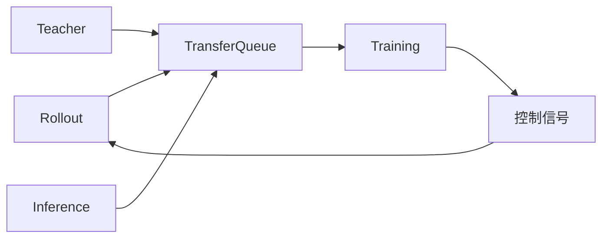

# 📰 公众号热点提炼

> 🕐 2026-09-17（周四）· 覆盖 09-16 至 09-17 · 7 个公众号 · 16 篇文章

## ⚡ 关键情报 KEY DELTA

本时段信息呈现出两条主线：一条是**国内宏观与利率市场**继续围绕“生产修复、内需偏弱、资金偏紧、美联储再度加息”展开，债市短线进入震荡偏多与外部约束并存的定价阶段；另一条是**AI 应用与 Agent 基础设施**明显加速，从 Claude 产品形态合并、手机 Agent 商用化，到本地 RSI、具身智能和 OPD 新研究，行业讨论已经从“模型能力”进一步推进到“工作流、系统架构与落地效率”。[来源:my_subscription_RAR000007959574][来源:my_subscription_RAR100002224543][来源:my_subscription_RAR000007959465][来源:my_subscription_RAR100002221298][来源:my_subscription_RAR100002220024][来源:my_subscription_RAR100002216395][来源:my_subscription_RAR000007956827][来源:my_subscription_RAR000007956826][来源:my_subscription_RAR000007956185][来源:my_subscription_RAR000007956187][来源:my_subscription_RAR000007955596]

投资上更值得跟踪的边际变化有三点：**8 月工增回升至 5.2%**而内需仍显“缩圈”，意味着宏观总量未失速但需求修复并不稳固；**10 年国债收益率在 1.68% 左右震荡、30Y 特别国债发飞**，说明长端情绪仍受供给与资金面扰动；科技侧则出现更清晰的产品化趋势，尤其是**Claude 将 Cowork 与 Chat 合并、豆包手机助手消费者版本落地、本地模型与自我改进系统被反复验证**，应用入口与 Agent 执行框架成为新的竞争焦点。[来源:my_subscription_RAR000007959574][来源:my_subscription_RAR100002224543][来源:my_subscription_RAR000007959465][来源:my_subscription_RAR100002221298][来源:my_subscription_RAR100002220024][来源:my_subscription_RAR100002216395][来源:my_subscription_RAR000007956187]

---

## 财经投研类文章

### 1. 经济的三个视角——8月经济数据点评

**来源**：一瑜中的 · `09-17 00:01`

#### 1. 这篇文章在说什么？

- **8 月工业增加值同比为 5.2%**，高于前值 **4.5%**；测算 **7–8 月月度 GDP 增速拟合值为 4.2%**，略高于 **4–5 月的 4.1%**，文中据此判断三季度 GDP 大概率好于二季度 **4.3%**，全年实现 **4.5% 以上**增速目标难度仍不大。[来源:my_subscription_RAR000007959465]
- 生产修复主要来自供给约束缓解：**煤炭增加值同比 -5.6%**，较前值 **-10.8%**改善；**原油加工量同比 -6.9%**，较 7 月 **-15.8%**明显修复，化工链增加值同比回升至 **0%**，好于前值 **-1.2%**。[来源:my_subscription_RAR000007959465]
- 内需端出现“缩圈”迹象：8 月 **70 城二手房环比下跌或持平城市达 67 个**，较 3 月的 **57 个**增加 10 个；7 月全行业中 **84.2%** 的行业投资增速为负，制造业中 **78.6%** 的细分行业投资增速为负。[来源:my_subscription_RAR000007959465]
- 消费继续偏弱：**8 月社零同比 0.4%**，低于前值 **0.6%**；**1–8 月服务零售额累计增速 4.9%**，低于 **1–4 月的 5.6%**；**1–8 月餐饮增速 2.4%**，低于 **1–4 月的 3.8%**。[来源:my_subscription_RAR000007959465]
- 新动能仍保持相对韧性：**装备制造业同比 12.1%**、信息业生产指数 **9.6%**、租赁和商务服务业生产指数 **9.0%**；**1–8 月机电出口增速 26.9%**、设备投资 **9.3%**、知识产权产品投资 **9.2%**，均快于经济增速。[来源:my_subscription_RAR000007959465]

#### 2. 为什么这件事重要？

- 这组数据给出的不是“强复苏”，而是**生产修复快于需求修复**的结构：供给端改善托住总量目标，但地产、消费、行业投资广度不足，意味着总量增长与微观体感之间仍有落差，对权益和利率资产的含义并不相同。[来源:my_subscription_RAR000007959465]
- 对债市而言，若总量目标可达成、而内需仍偏弱，则政策大概率更偏向**加快存量政策落地与小幅需求侧微调**，而非强刺激；这会削弱“宽信用急转弯”的预期，但也限制长端利率大幅下行的弹性。[来源:my_subscription_RAR000007959465]
- 对权益而言，新旧动能切换加快意味着**信息业、装备制造、机电出口、设备与知识产权投资**仍是相对景气方向，但地产链、传统消费与广义内需链条的修复仍待验证。[来源:my_subscription_RAR000007959465]

#### 3. 作者的核心观点是什么？

- 核心判断一：**生产正在修复**，全年 **4.5% 以上**增长目标仍有实现基础，8 月工业回升更多是供给约束缓解而非全面需求回暖。[来源:my_subscription_RAR000007959465]
- 核心判断二：**内需有缩圈迹象**，体现在房价上涨城市减少、投资正增长行业减少、服务消费与偏必选消费回落。[来源:my_subscription_RAR000007959465]
- 核心判断三：**新动能供需两侧保持平稳偏快增长**，经济正处于新旧动能切换加速阶段，因此政策取向可能偏克制，但会加快存量政策落地并适度微调需求侧政策。[来源:my_subscription_RAR000007959465]

#### 4. 关键数据与信号

- **工增同比 5.2%**，前值 **4.5%**。[来源:my_subscription_RAR000007959465]
- **7–8 月 GDP 拟合值 4.2%**，4–5 月为 **4.1%**。[来源:my_subscription_RAR000007959465]
- **社零同比 0.4%**，前值 **0.6%**；**出口同比 25.0%**，前值 **23.9%**；**8 月固投当月同比 -11.0%**，前值 **-12.9%**。[来源:my_subscription_RAR000007959465]
- **商品房销售面积同比 -14.8%**、销售额同比 **-12.1%**；**地产投资同比 -25.5%**；**新开工面积同比 -30.9%**。[来源:my_subscription_RAR000007959465]
- **知识产权产品投资同比 9.2%**，占全部投资 **15.2%**，比重同比提高 **2.3 个百分点**；其中计算机软件和数据库投资增长 **10.9%**，研究与开发投资增长 **7.8%**。[来源:my_subscription_RAR000007959465]

#### 5. 对投资决策意味着什么？

- 资产配置上，更应把 8 月数据理解为**“总量可稳、内需不强、结构分化”**，而不是单边风险偏好抬升信号；若后续政策仍偏克制，债市大幅熊市基础不足，但交易节奏会受外部利率与资金面影响。[来源:my_subscription_RAR000007959465]
- 后续应重点跟踪三类验证指标：**地产销售与房价城市扩散、服务消费修复斜率、设备/知识产权投资与机电出口的持续性**。[来源:my_subscription_RAR000007959465]

---

### 2. 时隔三年美联储再次加息！

**来源**：红军债市笔记 · `09-17 06:17`

#### 1. 这篇文章在说什么？

- 9 月 16 日国内债市日内先弱后稳：早盘情绪偏空，**10 年国债收益率上至 1.6815%**、**30 年上至 2.17%**；午后资金面有所缓和、股市下跌后，现券收益率回落，尾盘 **10 年收于 1.679%**、**30 年收于 2.166%**。[来源:my_subscription_RAR100002224543]
- 资金面整体均衡偏紧：**DR001 上行 2.3bp 至 1.449%**，**DR007 上行 1.26bp 至 1.437%**；大行出钱限价 **1.43%**，较上日升 **1bp**；**一年存单下 0.5bp 至 1.48%**。[来源:my_subscription_RAR100002224543]
- 央行开展 **6000 亿元隔夜逆回购**与 **1100 亿元 7 天逆回购**，因当日有 **5970 亿元隔夜逆回购到期**及 **700 亿元国库定存到期**，实现**净投放 430 亿元**。[来源:my_subscription_RAR100002224543]
- 海外方面，美联储以全票结果**加息 25bp**，将联邦基金利率目标区间上调至 **3.75%–4%**，为三年来首次加息；**10 年期美债收益率报 5.021%**，中美利差约 **-334.2bp**，较上日变化 **+3bp**；美元指数报 **100.33**，离岸人民币报 **6.7126**。[来源:my_subscription_RAR100002224543]
- 文中判断，虽然美联储加息对国内货币政策有一定压制，但国内货币政策仍以我为主，若经济数据没有明显走强，债市仍将回归国内基本面，短期延续**震荡偏多**。[来源:my_subscription_RAR100002224543]

#### 2. 为什么这件事重要？

- 对国内债市来说，海外加息的直接影响不是国内政策被动跟随，而是通过**中美利差、汇率、风险偏好和资金预期**形成外部约束，压制长端利率过快下行。[来源:my_subscription_RAR100002224543]
- 但如果国内经济仍未显著走强，债市核心定价锚仍在内需与基本面，意味着外部冲击更多表现为**波动放大**而非趋势反转。[来源:my_subscription_RAR100002224543]
- 短线交易层面，资金面、股债跷跷板、政府债缴款与隔夜逆回购续作规模，仍是利率盘面的直接触发器。[来源:my_subscription_RAR100002224543]

#### 3. 作者的核心观点是什么？

- 美联储加息落地对国内货币政策有压制，但**中国货币政策仍以我为主**，触发条件依然是国内经济强弱。[来源:my_subscription_RAR100002224543]
- 当前经济数据并未大幅走好，因此债市仍回归国内基本面，**短期维持震荡偏多**判断，回调可考虑小幅加仓。[来源:my_subscription_RAR100002224543]
- 交易建议上，文中给出区间思路：**10 年国债 1.69%以上可小幅分批加仓，1.66%附近止盈；30 年 2.18%以上小幅分批加仓，2.16%附近止盈**。[来源:my_subscription_RAR100002224543]

#### 4. 关键数据与信号

- **10 年国债尾盘 1.679%**；**30 年国债尾盘 2.166%**。[来源:my_subscription_RAR100002224543]
- **DR001 1.449%**；**DR007 1.437%**；**一年存单 1.48%**。[来源:my_subscription_RAR100002224543]
- 央行**净投放 430 亿元**。[来源:my_subscription_RAR100002224543]
- 美联储**加息 25bp**至 **3.75%–4%**。[来源:my_subscription_RAR100002224543]
- **10 年美债 5.021%**；**中美利差 -334.2bp**；美元指数 **100.33**；离岸人民币 **6.7126**。[来源:my_subscription_RAR100002224543]

#### 5. 对投资决策意味着什么？

- 若后续资金面边际改善、国内增长数据未超预期修复，则利率债仍有交易性机会，但需警惕**海外利率高位、汇率波动和供给扰动**对长端的压制。[来源:my_subscription_RAR100002224543]
- 更值得关注的不是“海外加息本身”，而是**央行续作节奏、政府债缴款规模、A 股风险偏好和中美利差变化**是否共振放大波动。[来源:my_subscription_RAR100002224543]

---

### 3. 大涨的原因

**来源**：表舅是养基大户 · `09-16 21:33`

#### 1. 这篇文章在说什么？

- 文章先从产业侧切入，提到当日有两条与字节相关的重要信息：一是按彭博亿万富豪指数，**张一鸣身家突破 1000 亿美元**；二是字节与中兴合作推出**豆包手机**，作者将其视为 AI 抢占流量入口的重要动作。[来源:my_subscription_RAR100002221298]
- 作者认为 AI 发展正重新回到“入口为王”的互联网逻辑：豆包手机通过大模型分解口令、分配流量；Workbuddy 通过接入多个大模型并控制流量分发，成为另一类入口型平台。[来源:my_subscription_RAR100002221298]
- 市场层面，双创板块当日明显上涨，作者归因于三点：**《电子信息制造业发展“十五五”规划》下发**、市场消化美联储加息利空、以及前一日成交量创年内次低后情绪处于底部区间。[来源:my_subscription_RAR100002221298]
- 作者对短期市场判断偏震荡，提到当前多数机构“不敢加，也不敢减”，节前成交量难以明显放大。[来源:my_subscription_RAR100002221298]
- 中长期上，作者仍偏积极看待 A 股优质股权资产，理由是**A 股股权风险溢价高于历史中位数，且近期回落后已来到年内高点**；同时，中国在本轮全球利率上行中“低利率、低波动”，10 年国债仍维持低波动特征。[来源:my_subscription_RAR100002221298]

#### 2. 为什么这件事重要？

- 这篇文章提供的是一个**权益风格与配置框架**：短线市场仍受海外利率、节前流动性与成交情绪压制，但中长期股权性价比并未因短期波动而恶化。[来源:my_subscription_RAR100002221298]
- 作者把 AI 投资逻辑从“模型能力”前移到“流量入口”，对于科技成长股的估值锚有启发：谁控制了用户入口，谁就可能在模型层竞争之外获取更高的分发权与定价权。[来源:my_subscription_RAR100002221298]
- 对资产配置而言，作者同时强调多资产配置、FOF 与全天候策略的相对优势，适用于牛市中段或震荡市环境下平衡收益与回撤。[来源:my_subscription_RAR100002221298]

#### 3. 作者的核心观点是什么？

- 对市场短期观点偏谨慎：节前大概率仍是**震荡**，机构增量资金意愿有限，成交量难起。[来源:my_subscription_RAR100002221298]
- 对中长期 A 股观点偏积极：**优质股权仍值得拥抱**，核心支撑是股权风险溢价处于高位、国内无风险利率低且波动小。[来源:my_subscription_RAR100002221298]
- 对科技产业判断偏向“入口竞争”：豆包手机、Workbuddy 等案例说明，AI 的关键竞争之一正在转向**流量入口和分发权**。[来源:my_subscription_RAR100002221298]

#### 4. 关键数据与信号

- **张一鸣身家突破 1000 亿美元**。[来源:my_subscription_RAR100002221298]
- 双创板块当日表现：文中提到**双创 50 涨超 3%**。[来源:my_subscription_RAR100002221298]
- 前一交易日成交量创**年内次低**。[来源:my_subscription_RAR100002221298]
- 中国 10 年国债在全球利率上行中被描述为**低利率、低波动，1 个bp玩一周**。[来源:my_subscription_RAR100002221298]

#### 5. 对投资决策意味着什么？

- 短线不宜把单日大涨线性外推成趋势反转，更合理的理解是**政策催化 + 海外利空消化 + 低位情绪修复**。[来源:my_subscription_RAR100002221298]
- 中线可继续围绕**科技成长、A 股核心资产以及多资产配置工具**做结构优化，但需要同步跟踪海外利率、港股表现和 AH 溢价对风险偏好的传导。[来源:my_subscription_RAR100002221298]

---

### 4. 30Y特别国债发飞，长端利率下行（20260916）

**来源**：固收彬法每日观察 · `09-16 19:22`

#### 1. 这篇文章在说什么？

- 当日国债现券收益率整体下行：**2 年期国债活跃券收益率 1.24%**，与前一日持平；**10 年期国债活跃券收益率下行 0.20bp 至 1.68%**；**30 年期国债活跃券收益率下行 0.20bp 至 2.14%**。[来源:my_subscription_RAR100002220024]
- 资金边际收敛，**1 年期国股行存单利率持平昨日，收于 1.49%**。[来源:my_subscription_RAR100002220024]
- 公开市场方面，文中提到**净投放 1130 亿元**，同时提示**30Y 特别国债发飞**这一重要事件。[来源:my_subscription_RAR100002220024]

#### 2. 为什么这件事重要？

- 长端利率在特别国债发飞背景下仍能下行，说明市场对长债的需求尚未完全被供给扰动压制，做多力量仍在。[来源:my_subscription_RAR100002220024]
- 但资金只是“边际收敛”，并未显著转松，意味着长端下行更多是交易层面的收益率修复，而非资金面趋势性宽松驱动。[来源:my_subscription_RAR100002220024]

#### 3. 作者的核心观点是什么？

- 文章本身偏复盘式，核心信息是：**长端利率下行、资金偏收敛、存单利率稳定、30Y 特别国债发飞**，对市场形成了供给扰动与现券偏强并存的格局。[来源:my_subscription_RAR100002220024]

#### 4. 关键数据与信号

- **2Y 国债 1.24%**。[来源:my_subscription_RAR100002220024]
- **10Y 国债 1.68%，下行 0.20bp**。[来源:my_subscription_RAR100002220024]
- **30Y 国债 2.14%，下行 0.20bp**。[来源:my_subscription_RAR100002220024]
- **1Y 国股行存单 1.49%**。[来源:my_subscription_RAR100002220024]
- **公开市场净投放 1130 亿元**；**30Y 特别国债发飞**。[来源:my_subscription_RAR100002220024]

#### 5. 对投资决策意味着什么？

- 短线长端利率的交易逻辑仍围绕**供给冲击、资金边际变化与机构配置需求**博弈，若资金未进一步明显转松，则收益率下行空间仍需谨慎评估。[来源:my_subscription_RAR100002220024]

---

## 科技类文章

### 5. 分享一个大幅节省Codex额度的邪修方法，不要浪费了你的ChatGPT Pro会员。

**来源**：数字生命卡兹克 · `09-17 08:09`

文章核心是作者分享其 AI 开发工作流：在 AIHOT 月活突破 **100 万**、监控信源接近 **2000 个**、模型 API 成本和 Codex 额度压力快速上升的背景下，作者将生产业务数据封装为**只读、最小权限、可审计的 MCP Server**，再让 **GPT-6 Pro** 通过插件访问真实业务数据做方案规划，最后把方案“添加到 Codex”交由 Codex 执行，从而节省 Codex 周额度。[来源:my_subscription_RAR100002225819]

文中给出的量化细节包括：**200 美元 Pro 会员**周度有 **200 次 GPT-6 Pro 对话额度**，作者称一次 Ultra 级分析规划可能消耗周额度的 **10%**，而改用该工作流后一次完整执行任务大约只消耗周额度的 **4%**。其本质不是新模型突破，而是**把真实世界数据接入 ChatGPT 插件体系，重新分配“规划”与“执行”两个环节的算力预算**。[来源:my_subscription_RAR100002225819]

### 6. 刚刚，Anthropic关闭Claude Cowork独立入口，与Chat合并

**来源**：机器之心 · `09-17 06:47`

Anthropic 将 **Claude Cowork** 与 **Claude Chat** 合并为统一 Claude，未来几周先向 **Pro 和 Max** 用户开放；同时推出 **Claude Docs**、**Claude Slides**，并把 **Claude Design** 更深地接入对话流程，目标是不再让用户预先判断任务该交给哪个工具，而是由 Claude 自动选择能力并继承上下文、技能和连接器。[来源:my_subscription_RAR000007959574]

这意味着产品路线从“多工具分入口”转向“统一工作台”，竞争焦点从模型能力继续前移到**工作流整合、异步任务执行与文档/演示产出的一体化体验**。[来源:my_subscription_RAR000007959574]

### 7. Meshy: 角色驱动下SPMD范式的RL训练框架

**来源**：机器之心 · `09-17 06:47`

文章介绍 OpenBMB 的 **Meshy**：将 **Inference、Training、Rollout、Teacher** 等角色建模为独立服务，使用 **TransferQueue** 作为统一数据面，不依赖 Ray，也没有中央调度器，使 RL 流程更接近预训练常用的 **SPMD** 设计。[来源:my_subscription_RAR000007959573]

核心结论是，传统 Single-Controller 在同步 RLHF 场景有效，但在异步生成、持续训练、多轮 Agent 交互下会成为调度与数据瓶颈；Meshy 通过**服务化 + 队列化传输 + 本地确定性拓扑推导**，提升异步训练、故障排查、代码简洁度与扩展性。[来源:my_subscription_RAR000007959573]

图1：Meshy 将多角色 RL 训练改造为由数据面与控制信号驱动的服务协作体系。[来源:my_subscription_RAR000007959573]

### 8. Anthropic这位“老师”是如何进步的？

**来源**：刘小排r · `09-17 00:03`

文章用“数学家与刷题学生”的比喻区分了**前沿大模型能力形成**与**蒸馏模型能力复制**，并进一步引用法院记录与媒体材料，描述 Anthropic 在 **2021–2023 年**下载数百万份盗版书后，又通过名为 **Project Panama** 的项目批量购买实体书、切割书脊、工业扫描并数字化，用于模型训练。[来源:my_subscription_RAR100002222855]

文章重点不在技术细节，而在提醒：最强模型的“教师能力”很大程度上来自**极其大规模、甚至带争议的数据获取方式**；相较之下，蒸馏反而只是把“题库知识”复制给学生模型。[来源:my_subscription_RAR100002222855]

### 9. 在折腾9个月后，手机Agent的王者，豆包手机助手它回来了。

**来源**：数字生命卡兹克 · `09-16 16:57`

文章围绕努比亚 **NaviX Ultra** 消费者版本展开：机身厚度 **7.62mm**、电池 **7100mAh**、主摄 **2 亿像素**，**12GB+512GB** 定价 **5999 元**、国补后 **5499 元**，并强调豆包手机助手从工程机走向消费级量产。[来源:my_subscription_RAR100002216395]

更关键的是 Agent 能力进化：新增带**指纹鉴权**的 AI 按键、复杂长程任务执行、**任务排队与插队**、增强记忆与**快捷指令**、理解屏幕内容直接操作、以及系统录音/相机与飞书妙记的深度接入。文章同时指出两项现实约束：**任务免费额度有限**，且 GUI 操作主要覆盖系统、中兴、字节系和部分接入第三方应用。[来源:my_subscription_RAR100002216395]

### 10. OpenAI百亿投入砸向具身，机器人竞争进入数据与算力时代

**来源**：机器之心 · `09-16 15:57`

文章介绍一份仿真测评：在 RoboDojo 中，**GPT-6 Astra + π0.5** 的混合模式取得 **62.60 平均分**、**48% 成功率**，显著高于 **GPT-6 Astra Direct** 的 **37.81 分**与 **26% 成功率**；在 RoboLab 中，Astra Direct 在选取任务上的成功率达到 **98%**。[来源:my_subscription_RAR000007956827]

作者据此提出，具身智能的突破路径是**通用大模型提供语义理解与规划，机器人策略模型提供物理交互与动作先验**。但代价仍高：文中提到混合方案在 RoboDojo 累计消耗约 **6.25 亿 Token**，Astra Direct 超过 **11.3 亿 Token**，因此具身竞争最终会落到**数据规模与算力投入**上。[来源:my_subscription_RAR000007956827]

### 11. AI会做题，却未必能自进化：字节Seed等提出三项新基准

**来源**：机器之心 · `09-16 15:57`

文章介绍 Self-Developing Agents 的三套基准：**ASPIRE、S³Gym、HarnessDev**，分别研究 Agent 如何从模糊目标中确定学习方向、如何从经验中学习、以及对执行系统的改造能否长期保留。[来源:my_subscription_RAR000007956826]

核心发现并不乐观：在 ASPIRE 中，**30 个单元里有 21 个产出了可进入筛选的检查点，但最终只有 1 个增益被保留**；在 S³Gym 中，自我判断质量与后续学习收益关联较弱；在 HarnessDev 中，可见反馈上的改进并不一定能迁移到隐藏任务，说明 AI 的“自我改进”离真正闭环仍有明显距离。[来源:my_subscription_RAR000007956826]

### 12. 复杂的Harness Evolution，甚至不如多跑几遍

**来源**：机器之心 · `09-16 12:00`

文章讨论 AI2 和华盛顿大学关于 Harness Evolution 的研究：在给定相近 inference budget 和反馈条件下，复杂的“自我修改 Prompt、工具、Memory 与控制逻辑”的方案，并未稳定胜过最简单的 **Parallel Sampling** 或 **Sequential Refinement**。[来源:my_subscription_RAR000007956185]

文章的中心结论是，很多看似“Agent 自我进化”带来的提升，可能只是**多几次尝试**所带来的 test-time scaling 效应；当换到未参与优化的新任务后，Harness 演化的迁移增益非常有限。[来源:my_subscription_RAR000007956185]

### 13. 本地该怎么做RSI？我们与StartLux CTO聊了聊

**来源**：机器之心 · `09-16 12:00`

文章围绕 StartLux 的本地模型与 RSI 路线展开。其 **StartLux-V1.0-27B-Preview** 在 MCP 专项测试中取得 **39.25 分**，排名第二，并称其相较基座 **Qwen3.6-27B** 提升 **5.34 个百分点**主要来自后训练；团队表示约 **70% 的实验执行工作交给 AI**，若只算机械执行，自动化比例已可超过 **95%**。[来源:my_subscription_RAR000007956187]

更值得关注的是其对 RSI 的分层定义：从 Self-correction、Memory/Experience、Automated Training、Auto Research，到真正的递归自我改进。团队认为本地 RSI 的关键价值不只是隐私或成本，而是让**每个人拥有独立参数状态和独立进化轨迹的 AI**。[来源:my_subscription_RAR000007956187]

图2：StartLux 描述的本地 RSI 路径，本质是让个人使用反馈持续进入受控的研究与更新闭环。[来源:my_subscription_RAR000007956187]

### 14. 换题还是第一！DM0.5横扫RoboColiseum四榜

**来源**：机器之心 · `09-16 09:00`

文章称原力灵机 **DM0.5** 在 RoboColiseum 的**四张榜单全部第一**，并回顾其此前已在 **LIBERO、RoboTwin 2.0、VLA-Arena、RoboChallenge Table30 V2、RoboDojo** 等多套评测中位列第一。[来源:my_subscription_RAR000007955599]

文中列出的关键成绩包括：**LIBERO 综合成功率 99.0%**，RoboTwin 2.0 简单与复杂场景分别 **93.6%** 和 **93.3%**，VLA-Arena 三档难度分别 **89.0%/53.6%/44.1%**，RoboChallenge Table30 V2 整体成功率 **43.0%**、综合得分 **54.42**，而在 RoboDojo 的 Memory 维度达到 **47.74 分**、**47.44% 成功率**。[来源:my_subscription_RAR000007955599]

### 15. 清华团队再探 On-Policy Distillation：数据撑死，算法饿死

**来源**：机器之心 · `09-16 09:00`

文章总结的是 OPD 第二篇研究：即便把训练集从 **17000 道题**缩减到**1 道题**，Student 在数学任务上仍能从 **59.1** 提升到 **68.5**（300 步），而全量 17k 题对应为 **69.8**；1000 步时单题为 **68.4**，全量为 **72.1**。[来源:my_subscription_RAR000007955596]

作者据此提出“**数据撑死，算法饿死**”的判断：一道题通过反复 rollout 已能覆盖大部分状态空间，真正的瓶颈反而在于 Student 吸收 Teacher 稠密监督的速度太慢，而不是数据供给不够。[来源:my_subscription_RAR000007955596]

---

## ☕ 其他更新

| 文章 | 来源 | 时间 | 核心内容 | 备注 |
|---|---|---:|---|---|
| 她都这么有钱了，怎么还像个新手？ | 刘小排r | `09-16 22:34` | 用“优等生思维”与“寻宝者思维”对比创业者面对新机会时的行为差异，强调在 AI 降低试错成本后，更应接受高失败率、追求少数高回报结果。[来源:my_subscription_RAR100002221928] | 偏创业方法论/心态随笔 |
| 大涨的原因（产业补充视角） | 表舅是养基大户 | `09-16 21:33` | 除市场复盘外，文中对**豆包手机**与 **Workbuddy** 的讨论强调 AI 竞争正在转向**流量入口与分发权**。[来源:my_subscription_RAR100002221298] | 可作为科技应用侧补充 |
| Anthropic这位“老师”是如何进步的？（数据伦理补充） | 刘小排r | `09-17 00:03` | 从书籍数字化与版权争议角度，讨论前沿模型训练背后的数据获取成本与伦理边界。[来源:my_subscription_RAR100002222855] | 偏行业观察与伦理讨论 |

---

## 🔭 关注清单 THINGS TO WATCH

1. **宏观验证**：后续重点看地产销售、房价扩散、服务消费与设备/知识产权投资能否延续，决定“生产修复”能否进一步传导到需求侧。[来源:my_subscription_RAR000007959465]
2. **利率交易窗口**：关注美联储加息后中美利差、人民币汇率、央行逆回购续作与政府债缴款是否共振，决定长端利率在 **1.68%** 一线附近是震荡还是再度走强。[来源:my_subscription_RAR100002224543][来源:my_subscription_RAR100002220024]
3. **AI 应用入口竞争**：重点跟踪 Claude 一体化工作台、豆包手机助手消费者版本以及本地 RSI/Agent 系统的真实用户使用反馈，判断 Agent 是否从“演示能力”走向“稳定生产力”。[来源:my_subscription_RAR000007959574][来源:my_subscription_RAR100002216395][来源:my_subscription_RAR000007956187]

*以上内容基于 2026-09-16 至 2026-09-17 时间窗内的订阅公众号更新整理，按文章可获取正文片段进行提炼；截断或信息有限的文章，已按可见内容据实概括。[来源:my_subscription_RAR100002225819][来源:my_subscription_RAR000007959574][来源:my_subscription_RAR000007959573][来源:my_subscription_RAR100002224543][来源:my_subscription_RAR100002222855][来源:my_subscription_RAR000007959465][来源:my_subscription_RAR100002221928][来源:my_subscription_RAR100002221298][来源:my_subscription_RAR100002220024][来源:my_subscription_RAR100002216395][来源:my_subscription_RAR000007956827][来源:my_subscription_RAR000007956826][来源:my_subscription_RAR000007956185][来源:my_subscription_RAR000007956187][来源:my_subscription_RAR000007955599][来源:my_subscription_RAR000007955596]*