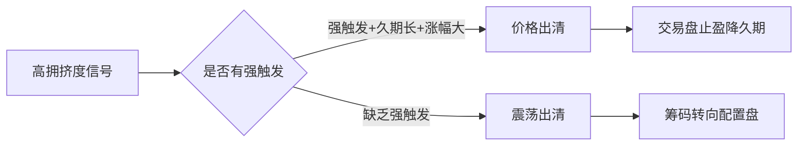

# 📰 公众号热点提炼

> 🕐 2026-09-21（周一）· 覆盖 09-20 至 09-21 · 7 个公众号 · 18 篇文章

---

## ⚡ 关键情报 KEY DELTA

本时段最值得关注的变化来自海外与国内的双向拉扯：美联储9月议息会议将联邦基金利率目标区间上调25bp至**3.75%–4.00%**，以**12:0全票通过**，为其2023年7月以来首次加息，某券商固收首席认为当前宏观环境高度类似1972–1980年的高通胀年代，美联储或复刻"伯恩斯式被动加息"，难以复刻沃尔克式主动制造衰退。国内则延续"基本面利好债市、微观结构偏拥挤"的组合：8月信贷脉冲再度回落、企业部门信贷增速回归下行，10年国债收益率下行1bp至**1.68%**、30年活跃券下至**2.13%–2.15%**，多头趋势未改[来源:my_subscription_RAR000007972564]；但债市微观交易温度计读数下行7个百分点至**65%**，拥挤度虽缓解仍处中等偏高，市场更可能以"震荡出清"而非"价格出清"消化[来源:my_subscription_RAR000007972564]。科技侧，机器之心密集报道了工具调用数据合成（ToolLoop）、世界模型因果思维链（CausalWM）、Qwen-Image-2.1开源生图登顶，以及GPT-6 Astra直接驱动机器人等进展，AI"从操作软件到操作世界"的叙事明显加速[来源:my_subscription_RAR000007971648][来源:my_subscription_RAR000007971650]。

---

### 1. 债市｜仍处多头叙事，关注"资产荒"与风偏变化

**来源**：郁言债市 · `09-20 22:23`

#### 1. 这篇文章在说什么？

某券商固收团队判断，9月14–18日债市多头情绪占据上风、利率尝试跳出低波震荡区间，**当下多头趋势尚未改变，若长端出现阶段性调整，机会大于风险**；同时提示进入9月下旬应重点关注"资产荒"逻辑与市场风险偏好的变化。

#### 2. 关键数据与证据

本周长端表现由"抢跑定价"主导：18日部分机构押注双节前夕公积金贷款利率、LPR或迎"双降"，**30年国债期货持仓量单日净增1.94万手**，30年国债活跃券单日下行1.4bp至**2.15%**。

| 品种 | 本周变动 | 最新收益率 |
| --- | --- | --- |
| 1Y国债 | 持平 | 1.23% |
| 3Y国债 | +2bp | 1.27% |
| 5Y国债 | –2bp | 1.41% |
| 7Y国债 | –3bp | 1.51% |
| 10Y国债 | –1bp | 1.68% |
| 30Y国债 | –2bp | 2.13% |
| 10Y国开 | 约–1bp | 1.76% |
| 3Y隐含AA+城投 | –1bp | 1.67% |
| 5Y隐含AA+城投 | –2bp | 1.78% |
| 10Y隐含AA+城投 | –5bp | 2.18% |
| 3Y AAA-二级资本债 | –2bp | 1.66% |
| 5Y AAA-二级资本债 | –4bp | 1.80% |
| 10Y AAA-二级资本债 | –5bp | 1.98% |
| 3M/6M/1Y存单 | 持平 | 1.44%/1.46%/1.49% |

供给与资金是两条核心叙事：9月1–24日政府债累计净发行规模**1.64万亿元**，扣除9月28–29日**3665亿元**到期后，预计9月净供给落在**1.30–1.40万亿元**区间。资金面方面，大行净融出规模由月初约4万亿元持续回落至**3.2万亿元**，R001在9月17日一度上行至**1.49%**。此外，9月20日9月LPR报价维持不变，市场结构性降息预期部分落空。

#### 3. 底层逻辑与传导机制

逻辑起点是央行政策基调的边际切换：央行署名文章强调"贷款降速提质或将成为宏观运行的新常态"，意味着"弱需求"现状对降准降息刺激的指引意义明显减弱，**债市开始降低对"总量型"宽松的期待，转而关注结构性政策对广义利率中枢下行的推动作用**。供给端逻辑则是：若四季度政府债延续"逐月平均"发行、年内供给难有凸点，则交易逻辑或由"担忧密集发行冲击"切换为"抢跑次年资产荒加剧"——逐年"2万亿化债"进程阶段性告一段落后，次年财政是否增加国债和地方债新增供给存在高度不确定性，绝大多数配置型机构可能提前配置以防供给规模减少。

#### 4. 对投资的含义

从性价比视角，**利率债曲线凸点集中在7年、10年等点位，超长利差已然具备压缩空间**；品种利差维度，**7年期政金债与地方债具备一定性价比**。考虑降息落地前10年收益率下行空间相对有限，若博弈10年内机会可考虑非国债品种；对超长端则可借调整机会逐渐布局20–30年国债、地方债。

#### 5. 分歧与风险

当前市场最大分歧仍是**2027年财政政策强度**。风险偏好可能迎来大考：7月以来万得全A由全年次高的7214点回落至9月18日的6428点，跌幅达**10.9%**，科技概念领跌、创业板指与科创综指分别跌**18.7%**、**15.2%**，未来一周中美高层会晤结果可能成为科技行情的放大器。下周关注点包括中美高层会晤（23–25日）、税期后资金面是否仍有波动、MLF续作（本月到期6000亿元）。风险提示：货币政策、流动性、财政政策均可能出现超预期调整。

---

### 2. 支出增速再度回落——8月财政数据点评

**来源**：一瑜中的 · `09-20 10:31`

#### 1. 这篇文章在说什么？

某券商首席经济学家对8月财政数据点评指出，**广义财政支出同比降幅由7月的–4.4%扩大至–6.7%**，市场聚焦年底财政发力；作者沿"新增政府债发行→项目→项目资本金→项目配套资金"的传导链条逐环节观察，结论是**截至9月中旬各环节状态改善仍有限**[来源:my_subscription_RAR000007970435]。

#### 2. 关键数据与证据

收入端：8月一般公共预算收入增速回落至**4.7%**（7月11.7%），其中税收收入增速**5.6%**（7月13.9%）、非税收入**0.3%**（7月–5.4%）；1–8月收入规模为年初预算的**71%**，进度为2021年以来同期最快[来源:my_subscription_RAR000007970435]。税收仍反映"价格上行、股市活跃、外贸增势强劲"三大支撑——企业所得税、增值税等价格相关税拉动税收增速1.4个百分点，个税等收入相关税拉动1.7个百分点，外贸相关税拉动2.2个百分点[来源:my_subscription_RAR000007970435]。

支出端：8月一般公共预算支出增速转负（**–0.1%**，7月0.5%），1–8月支出为年初预算的**60.5%**；中央本级支出同比**+4.7%**，地方**–1.1%**[来源:my_subscription_RAR000007970435]。三项代表性基建类支出（城乡社区、交通运输、农林水）合计拖累支出增速0.4个百分点（7月拖累0.3个百分点）[来源:my_subscription_RAR000007970435]。

传导链条关键环节：9月新增政府债发行**1.29万亿元**（去年9月1.19万亿，同比+922亿），1–9月累计发行8.56万亿、全年目标11.89万亿，尚有**3.33万亿元待发**[来源:my_subscription_RAR000007970435]；1–8月施工项目计划总投资增速**–5.3%**、新开工项目计划总投资增速**–22.3%**[来源:my_subscription_RAR000007970435]；9月项目建设专项债发行**2648亿元**（去年9月1781亿，同比+867亿）[来源:my_subscription_RAR000007970435]；8月企业中长期贷款增加**3232亿元**（去年8月4590亿）[来源:my_subscription_RAR000007970435]；8月委托贷款增加约**200亿元**（去年8月减少约100亿）[来源:my_subscription_RAR000007970435]。政府性基金方面，8月收入降幅收窄至**–3.8%**（7月–19.2%），其中卖地收入**–12.6%**（7月–27.1%），政府性基金支出降幅扩大至**–21.4%**（7月–16.3%）[来源:my_subscription_RAR000007970435]。

#### 3. 底层逻辑与传导机制

财政发力依赖逐级传导，任一环节堵点都会削弱最终实物工作量[来源:my_subscription_RAR000007970435]。

图1：财政发力的传导链条（据原文梳理）

链条显示：发债端9月小幅提速，但项目端指标回落、资本金端财政仍小幅拖累（准财政增量待9月委托贷款验证）、配套资金端项目建设专项债小幅提速而企业中长期贷款待观察，因此**发债偏慢直接导致8月政府性基金支出降幅扩大、进而拖累广义财政支出**[来源:my_subscription_RAR000007970435]。

#### 4. 对投资的含义

政策信号指向"合理加快财政支出进度、对支出进度持续偏慢的地区加强督导"，但短期基建类支出起色尚不明显[来源:my_subscription_RAR000007970435]。对于债市而言，财政发力节奏偏慢意味着基本面修复对债市尚不构成趋势性利空；对于权益端，四季度政府债与准财政工具的落地速度是判断"实物工作量"能否形成支撑的关键观测点[来源:my_subscription_RAR000007970435]。

#### 5. 分歧与风险

风险提示包括：后续政策超预期、预算与执行存在差异、新型政策性金融工具资金使用进度难以跟踪，可能低估或高估去年工具资金在2025年的使用规模[来源:my_subscription_RAR000007970435]。可持续性方面，地产新政后卖地收入仍可能承压，卖地收入降幅收窄的持续性待观察[来源:my_subscription_RAR000007970435]。

---

### 3. 高拥挤度如何消化？

**来源**：睿哲固收研究 · `09-20 18:21`

#### 1. 这篇文章在说什么？

某券商固收团队提出，**高拥挤度并不必然导向大跌**——除"价格出清"外，还可通过"震荡出清"（时间换空间）消化；从外部触发强度、前期趋势持续性、前期涨幅三个维度判断，当前更接近"缺乏强触发+前期趋势较短+累计下行幅度温和"的组合，**通过震荡逐步消化拥挤度的概率更高**[来源:my_subscription_RAR000007972564]。

#### 2. 关键数据与证据

市场处于低波震荡：过去20日**10Y和30Y国债中债估值收益率振幅仅有不足2BP和3BP**[来源:my_subscription_RAR000007972564]。基本面确认小周期方向：8月社会消费品零售总额同比仅增**0.4%**，1–8月房地产开发投资同比**–19.9%**，8月新增社融规模降至2017年以来同期低位、新增人民币贷款亦创历史同期新低[来源:my_subscription_RAR000007972564]。拥挤度有所缓解但仍中等偏高：久期分歧度处于过去三年**46%**分位，微观交易综合温度计自7月中旬以来首次回落至**65%**分位以下，但中长期纯债基金久期中位值仍高达**3.27年**、处于过去三年**99%**分位，基金累计净买入超长债规模也处历史高位[来源:my_subscription_RAR000007972564]。

历史样本（2020年以来13轮高拥挤）：**6轮价格出清**（2020年4月、2021年7–9月、2022年8月、2023年8月、2025年初、2025年7月），**7轮震荡出清**（2021年6月、2021年11月、2023年6月、2024年3–4月、2024年7月底至8月初、2026年4月、2026年6月）[来源:my_subscription_RAR000007972564]。价格出清阶段对应10年国债收益率分别经历约**80bp、30bp、30bp、25bp**的明显上行；震荡出清阶段最大调整幅度通常不超过**10bp**[来源:my_subscription_RAR000007972564]。今年几次拥挤信号之间累计下行幅度分别仅约**15bp、7bp、8bp**[来源:my_subscription_RAR000007972564]。

典型案例（2024年3月震荡出清）：1月初至3月7日，20–30年国债老债上基金累计净买入约**222亿**、保险净卖出约**102亿**；3月8日至6月7日，基金转为净卖出约**151亿**、保险转为净买入约**193亿**；7–10年国债同期基金净卖出约**612亿**，大行和中小行分别净买入约**330亿**和**118亿**[来源:my_subscription_RAR000007972564]。

交易复盘：本周（9月14–18日）央行逆回购合计投放**31363亿元**、回笼23095亿元，**净投放8268亿元**，周二对到期的5000亿6M买断式逆回购等量续作[来源:my_subscription_RAR000007972564]。DR001、DR007、DR014运行中枢分别上行**5bp、4bp、4bp**至1.44%、1.43%、1.44%，DR001最高运行至**1.47%**、创2026年以来点位新高[来源:my_subscription_RAR000007972564]。公募基金久期中位值上升0.05至3.27年（过去三年99%分位），久期分歧度持平于0.52（46%分位）[来源:my_subscription_RAR000007972564]。

#### 3. 底层逻辑与传导机制

两条出清路径的差异是核心：

图2：高拥挤度的两条出清路径（据原文梳理）

价格出清通常需要"高拥挤+较强反向触发"共同出现，负债端压力叠加会放大调整并自我强化（如2022年11月）[来源:my_subscription_RAR000007972564]；震荡出清则是在资本利得空间收窄后，交易盘追涨和拉久期意愿下降、换手率降温，并通过阶段性小幅调整为配置资金提供介入窗口，筹码由基金、券商等交易盘向银行、保险等配置盘转移[来源:my_subscription_RAR000007972564]。三个判断条件——**触发因素强度、前期趋势时间、前期累计涨幅**——共同决定出清方式[来源:my_subscription_RAR000007972564]。

#### 4. 对投资的含义

作者强调"静态拥挤度水平本身并非调整幅度的决定性指标"：2024年7月底至8月初拥挤度一度升至**80%**以上，此后10年国债收益率仅阶段性上行约10bp；而2025年7月初拥挤度仅接近**60%**，后续收益率却上行约**25bp**[来源:my_subscription_RAR000007972564]。震荡式出清多数持续**数周至两个月**，个别阶段延长至**四个月**（如2024年3月后约4个月）[来源:my_subscription_RAR000007972564]。

#### 5. 分歧与风险

风险提示：财政节奏、央行操作和态度、机构行为变化[来源:my_subscription_RAR000007972564]。需要提示的是，高久期与筹码集中叠加意味着市场对利空冲击的敏感度提升，虽近期部分拥挤压力释放，但**筹码结构的脆弱性尚未完全解除**[来源:my_subscription_RAR000007972564]。

---

### 4. 【广发策略】反弹时机恰到好处

**来源**：晨明的策略深度思考 · `09-20 16:03`

#### 1. 这篇文章在说什么？

某券商策略团队判断市场已迎来"恰到好处的反弹时机"：年内杀估值程度已接近过去十年平均水平，对地缘、油价、美联储加息等非业绩担忧已较大程度定价；若四季度A股盈利预测保持稳定，**四季度进一步杀估值的概率较低**，配置上建议优先关注三季报高景气的AI产业链及非AI领域细分α[来源:my_subscription_RAR000007972565]。

#### 2. 关键数据与证据

估值维度：截至本周，在26年全A利润增速预测超**15%**的背景下，26年A股估值贡献度约为**–15.6%**；过去20年估值负贡献年份中位数**–17.7%**、均值**–20.4%**，过去10年中位数**–15%**、均值**–14%**[来源:my_subscription_RAR000007972565]。AI景气维度：跟踪的870余家AI重点公司26年盈利增速**84.9%**（较中报77.9%进一步抬升），整体法PE约**57X**（较6月底超90X已显著消化），且今年AI产业链涨幅几乎完全由业绩贡献、估值贡献接近0%[来源:my_subscription_RAR000007972565]。情绪与量能：9月中旬A股整体、创业板指情绪指标回落至50%分位以下，科创板约20%分位；A股量能（滚动5日日均成交额）自7月1日的3.54万亿元一度缩量至9月16日的**1.75万亿元**，缩量幅度约**50%**，后半周量能修复并迎来反弹[来源:my_subscription_RAR000007972565]。

海外流动性：CME FedWatch显示美联储年内加息两次的概率已接近**100%**，加息3次概率也显著走高；当前核心CPI同比**2.4%**、初始利率**3.75%**，均高于90年代以来三次连续加息三次情形（94年、04年、22年）的对照，故连续加息3次概率不高[来源:my_subscription_RAR000007972565]。

AI高频量价：截至9月18日，DDR5-4800/5600 16Gb现货价格**48.92美元**（上周49.12美元）；B200租赁价约**5.59美元/小时**（周内一度升至5.71美元/小时），H100租赁价**2.65美元/小时**、较年初涨超**20%**[来源:my_subscription_RAR000007972565]。需求端，OpenAI、Anthropic的ARR分别超**443亿**和**741亿美元**，ChatGPT和Gemini月活均突破**9亿**；2026年二季度AWS收入同比增长**37%**至**422亿美元**、创近18个季度最高增速；海外Top4云厂商2027年全年Capex预计同比增长**45%**至**10640亿美元**[来源:my_subscription_RAR000007972565]。

#### 3. 底层逻辑与传导机制

四季度AI催化有望形成一条完整验证链：

图3：AI产业催化链条（据原文梳理）

事件节奏上，9月23–24日Meta Connect与9月29日OpenAI DevDay先检验应用与模型侧；10月中旬OCP Global Summit把交易中心推向硬件（光模块、高速PCB、服务器、液冷与电源、国产算力链）；Anthropic IPO招股文件或于9月底公开、上市窗口或落在10月中旬；10月底至11月美股AI链财报与订单验证决定行情能否从"情绪修复"走向"基本面行情"[来源:my_subscription_RAR000007972565]。

#### 4. 对投资的含义

财政"后置发力"是另一支撑：今年1–8月国债和地方债净融资8.86万亿元、较2025年同期减少14.6%，若完成全年目标，预计9–12月净融资5.03万亿元、较2025年同期增加**45.1%**[来源:my_subscription_RAR000007972565]。配置上建议优先关注三季报高景气的AI产业链，以及非AI领域的细分α（医药、航运、船舶、出口链个别环节等）；对红利板块"目前仍有胜率但赔率不如6·30，配置性价比有所收敛"[来源:my_subscription_RAR000007972565]。

#### 5. 分歧与风险

风险提示：地缘冲突超预期使全球通胀上行压力超预期；海外通胀及美国经济韧性使全球流动性更快进入紧缩周期；国内稳增长力度不及预期[来源:my_subscription_RAR000007972565]。需注意文中对典型科技赛道判断"均线偏离度尚未到达过热阈值"，若海外紧缩预期修正不及预期，短期情绪仍可能反复[来源:my_subscription_RAR000007972565]。

---

### 5. 【开源固收】当前美联储，或复刻70年代美联储的被动加息

**来源**：陈曦固收研究 · `09-21 07:48`

#### 1. 这篇文章在说什么？

某券商固收首席认为，美联储本次加息25bp至**3.75%–4.00%**属"被动跟随通胀"，当前宏观环境与1972–1980年高通胀年代高度相似；由于美国尚不具备主动把经济压入衰退的条件，美联储更像1972–1978年的"伯恩斯时代"，**结果大概率是高通胀与高利率持续**，并提示国内债券收益率或将上行、黄金上涨趋势或仍未结束。

#### 2. 关键数据与证据

美联储9月议息会议将联邦基金利率目标区间上调**25bp至3.75%–4.00%**，投票结果为**12:0全票通过**，这是自2023年7月以来首次加息。作者给出与70年代相似的三点核心原因：一是美元信用不同程度侵蚀（70年代布雷顿森林体系瓦解、当下全球央行持续购金）；二是战争驱动的能源供给冲击（70年代石油危机、当下美伊冲突导致油价高涨）；三是"黄油加大炮"的财政扩张路径延续。

#### 3. 底层逻辑与传导机制

作者指出真正压制通胀上行的是1979年上任的沃尔克，通过把利率加到经济真正承受不住、主动制造衰退并顶住压力不降息，才重置通胀预期（美国GDP增速在1980、1982年负增长）。但当前环境并不支持复制沃尔克式操作。对成长股，作者强调**影响成长股涨跌的核心变量是盈利预期、不是利率**：1999年加息周期成长股反而上涨，2016–2019年加息周期谷歌、亚马逊、微软跑赢基准，2000年互联网泡沫破裂的真正原因是远期盈利预期崩塌而非加息。

#### 4. 对投资的含义

作者认为市场已充分定价高通胀与高利率的长期环境，对权益的边际影响基本消化完毕；**黄金上涨趋势或仍未结束**，只要高通胀大背景不变这一趋势就不会逆转；全球高通胀环境客观上**有助于中国通胀的合理回升**，叠加国内"反内卷"、双碳等政策推动通胀温和回升，**国内债券收益率或将上行**。

#### 5. 分歧与风险

作者提示均衡状态可能被两种情形打破：一是财政失控式扩张（可能重演沃尔克式操作，主动制造衰退以控制通胀）；二是AI资本开支泡沫破裂（直接带来衰退与需求坍塌，通胀随之趋势性下行）。风险提示：政策变化超预期、经济变化超预期。

---

### 6. 交易热度季节性下行

**来源**：睿哲固收研究 · `09-21 07:30`

#### 1. 这篇文章在说什么？

某券商固收团队"微观交易温度计"读数较前期**下行7个百分点至65%**，主要因交易热度类指标降幅较大，属季节性下行；过热区间指标数量占比降至**55%**，但股债比价、货币松紧预期、市场利差等指标热度上升，**市场对降息的预期明显增强**。

#### 2. 关键数据与证据

关键分位值变动：1/10Y国债换手率、TL/T多空比、机构杠杆、全市场换手率分位值分别大幅下降**49、33、28、24个百分点**，30/10Y国债换手率分位值小幅下降6个百分点；配置盘力度、上市公司理财买入量、政策利差分位值分别下降**27、11、9个百分点**；热度上升的仅股债比价、货币松紧预期、市场利差，分位值分别上升**36、15、7个百分点**。20个微观指标中，过热区间11个（55%）、中性5个（25%）、偏冷4个（20%）。

具体指标：30/10Y国债换手率小幅下降0.1至**3.22**；1/10Y国债换手率下降0.7至**0.27**（分位值由过热降至中性）；TL/T多空比下降至**1.00**；全市场换手率下降0.5个百分点至**17.59%**；机构杠杆（隔夜成交/全部质押式回购）大幅下降2.9个百分点至**84.33%**（由中性降至偏冷，或为应对跨中秋需求）；8月长期国债成交占比较7月上升8.2个百分点至**87.12%**（过去一年分位值仍100%）。基金久期中位值上升至**3.27**（分位值96%），基金配超长力度升至**12.65%**（分位值100%），8月债基止盈压力较7月下降56.7个百分点至**32.17%**，货币松紧预期分位值大幅上升15个百分点至**89%**。

利差与比价：信用利差收窄4bp至**41bp**，农发-国开利差、IRS-3M Shibor利差均持平于4bp，三者利差均值收窄2bp至16bp（分位值升至45%，由偏冷升至中性）；政策利差走阔至**–13p**（分位值97%，仍在过热）；股债比价大幅上升17.2个百分点至**17.2%**，分位值上升36个百分点至**87%**（由中性升至过热）；8月消费品比价大幅上升45.4个百分点至**100%**。

#### 3. 底层逻辑与传导机制

指标区间划分口径为：分位值≥70%为偏热、<40%为偏冷、其余为中性。交易热度类分位均值大幅下降23个百分点，机构行为类下降4个百分点，利差类下降1个百分点，而比价类因股债比价跳升而上升9个百分点，共同构成温度计下行7个百分点的结构。

#### 4. 对投资的含义

当前拥挤度较高的指标包括长期国债成交占比、基金久期、基金超长债买入量、消费品比价；跨节需求下机构杠杆明显下降、市场降息预期上升。这意味着短期交易热度降温、但配置型力量边际走弱，需关注股债比价趋热对债市资金的分流。

#### 5. 分歧与风险

风险提示：模型适用性风险、模型估算误差；微观情绪指标模型依据历史数据与经验构建，在不同市场环境中有效性存在差异。

---

### 7. 转债 | 高价转债仍是胜负手

**来源**：郁言债市 · `09-20 22:23`

#### 1. 这篇文章在说什么？

某券商固收团队认为，9月14–18日类权益市场震荡走强、科技和高端制造转债表现出色，**高价品种开始摆脱强赎冲击的后续影响、情绪有所回升**，建议继续把握科技高价的做多机会，但需紧盯"9·24"中美高层会晤等重大节点下的避险情绪与兑现窗口。

#### 2. 关键数据与证据

市场表现：截至2026年9月18日，万得全A收盘价**6427.95**、较9月11日上涨1.70%，中证转债同期上涨1.04%；全年维度万得全A涨0.28%、中证转债跌1.89%。转债行业上，电子涨**5.08%**、家用电器涨3.70%、机械设备涨3.47%、通信涨2.95%，而非银金融跌2.00%、银行跌0.66%、煤炭跌0.60%。估值层面，截至9月18日**百元溢价率45.11%、处于2020年以来97.24%分位**，80元平价对应估值中枢60.42%（环比升0.44个百分点），130元平价对应估值中枢环比升1.56个百分点至**30.97%**；各价位转债估值中枢分位数均位于**96%–99%**区间。

高价券表现：以绝对价格130元以上且转股溢价率15%以上为样本，9月14–18日转债价格整体累计上涨**5.32%**，基本与正股的**5.48%**相匹配。价格结构上，全市场转债价格中位数**132.34元**、加权平均135.79元、算术平均158.44元；140元以上转债占比**35.16%**（分布最多），其次120–130元占比25.81%。供给与成交：9月14–18日仅1只新券发行，2026年累计发行规模**658.46亿元**，航亚科技（6.00亿元）新获批文；全市场转债日均成交额由前一周的533.40亿元下降至**518.05亿元**，日均换手率5.53%、环比下降0.41个百分点。

#### 3. 底层逻辑与传导机制

作者将近期转债市场内部结构变化定义为"今年6月的缩小版"——彼时也是科技高价占优、低价底仓品种持续承压；近期这种苗头再起，正股科技反弹的同时红利品种承压，映射到转债市场低价品种继续回落。高价券9月初曾因胜蓝等高价科技个券强赎倾向超预期变动带动整体估值回落，但9月中旬权益科技板块抗跌、双创板块强势反弹后开启较大幅度上涨。

#### 4. 对投资的含义

建议把握科技高价个券的做多及兑现窗口；次新券当下仍处科技反弹区间、价格大概率得到支撑，但需警惕一旦正股涨幅不够强烈以致次新券仍处"高价&超高溢价"价位结构，后续迟早面临估值消化压力。

#### 5. 分歧与风险

风险提示：全球经济下行超预期、美联储可能加速紧缩抑制全球需求；海外通胀担忧加剧引发全球股市恐慌；权益市场风格加速轮动可能大幅影响偏股型转债估值。

---

### 8. 股市"弱转强"后的转债表现复盘

**来源**：固收亮话 · `09-20 22:29`

#### 1. 这篇文章在说什么？

某券商固收团队复盘2017年以来"震荡或熊市过渡到股市上涨"拐点期中证转债的估值变动，发现拐点后一个月百元溢价率大概率走阔，**拐点期转债收益可拆为正股贝塔与百元估值抬升两块，后者较为稳定**；若后续市场由震荡或调整转入一个月级反弹，转债大概率仍有正收益。

#### 2. 关键数据与证据

按过去两个月涨跌幅<2%定义为震荡、跌幅>2%定义为熊市、随后一个月涨幅>5%定义为上涨的口径，样本期内共识别**27次拐点，其中震荡6次、熊市21次**。拐点后一个月，百元溢价率中位数由**17.16%**升至**19.97%**，变动均值为上升1.65个百分点、**27次中有22次走阔（占比81.5%）**；分市态看，震荡后反弹的估值抬升更显著（平均上升2.58个百分点），熊市后反弹平均上升1.38个百分点。本周中证转债指数涨跌幅为**1.04%**，电子、通信、房地产涨幅排名靠前。

#### 3. 底层逻辑与传导机制

历史经验显示，仅有正股贝塔不足以让转债跑赢同花顺全A，而百元估值抬升则较为稳定，两者共同决定拐点期收益。当前市场投资者风险偏好较7月有所修复，以中证2000为代表的小盘风格可能体现超额收益；部分转债正股市值不大，当小盘风格走强时转债容易走出相对收益。

#### 4. 对投资的含义

转债估值有所回落意味着资产更有性价比；若后续估值修复叠加小盘风格走强，转债资产有概率跑赢沪深300等宽基指数。标的建议关注：科技成长方向精测、颀中等转债；高端制造领域金帝、长高、宙邦、福22等转债；经济复苏驱动供需格局优化的和邦、赫达、赛斯等转债。

#### 5. 分歧与风险

风险提示：一是转债估值压缩风险，当前估值虽回落但仍处历史相对高位；二是个股业绩波动风险，经济慢复苏背景下业绩存在不确定性。

---

### 9. 国金证券固收｜债市温度计

**来源**：睿哲固收研究 · `09-21 07:30`

#### 1. 这篇文章在说什么？

本周（9月13–19日）基本面监测体系中**47个高频指标更新，利好与利空指标个数分别为23个与24个**，总体上中性偏均衡；利率十大同步指标释放的信号**以"利好"为主、占比7/10**。

#### 2. 关键数据与信号

十大同步指标具体读数：①企业中长贷余额增速**6.0%**（前值6.2%，利好）；②建材综合指数**114.1**（前值111.1，利空）；③BCI企业招工前瞻指数**51.0%**（前值51.5%，利好）；④失业金领取条件互联网搜索指数同比（6MMA）**–25.9%**（前值–34.3%，利好）；⑤PMI新出口订单趋势值**–17.6%**（前值–20.0%，利空）；⑥PMI供需平衡度趋势值**16.0%**（前值16.1%，利好）；⑦耐用消费品价格**0.94**（前值0.93，利空）；⑧票据融资**17.7万亿**（前值17.6万亿，利好）；⑨美元指数**100.0**（前值98.9，利好）；⑩铜金比**14.9**（前值15.1，利好）。较上周变化：企业中长贷余额增速、美元指数、铜金比发出"利好"信号。基本面"利好"主要体现在粗钢产量、多数行业开工率、土地成交量价、消费与出行等方面，"利空"主要体现在耗煤、商品房成交量价、工业品需求、出口、工业品价格等方面。

#### 3. 对投资的含义与风险

同步指标中利好占比7/10且企业融资、美元、铜金比转向利好，方向偏支撑债市；但基本面指标多空接近均衡，意味着债市难以获得单一方向的强驱动。风险提示：统计口径误差，数据统计大多为抽样，可能与现实情况有出入。

---

### 10. 国金证券固收｜利率择时模型：总信号看利率震荡

**来源**：睿哲固收研究 · `09-20 18:21`

#### 1. 这篇文章在说什么？

模型最新信号显示：**波动信号由2026年9月16日开始看利率上行，趋势信号由2026年1月19日开始看利率下行，模型总体看利率震荡**[来源:my_subscription_RAR100002279148]。

#### 2. 关键数据与信号

模型历史信号回顾（2026年）：年初至1月18日总信号延续去年12月末的看震荡信号；1月19日趋势指标转为看多；波动信号在年内多次切换（2月3日转空、2月9日恢复看多、2月25日转空，3月3日转多、3月18日转空，4月8日看多，5月25日转空、5月28日恢复看多，6月5日转空、6月22–23日短暂看多、24日恢复看空，7月10日转多、8月31日转空、9月7日重回看多，9月16日看空）[来源:my_subscription_RAR100002279148]。趋势项属"长周期"分析、适用于配置策略，波动项属"短周期"分析、带有前瞻性、适用于交易策略；趋势变化具有一定"后验性"[来源:my_subscription_RAR100002279148]。

#### 3. 对投资的含义与风险

当前趋势看多、波动看空，总信号为震荡，对应配置与交易含义出现分歧，宜以震荡思路应对[来源:my_subscription_RAR100002279148]。风险提示：模型适用性风险（技术指标在不同市场环境中有效性存在差异）、模型估算误差（基金久期依据内部模型估算，可能存在偏差）[来源:my_subscription_RAR100002279148]。

---

## 🤖 科技前沿（概要）

**1. EMNLP 2026 | 通过分解生成与动态自反馈，构建工具调用合成数据**
**来源**：机器之心 · `09-20 21:30`
提出 ToolLoop，将工具调用数据合成拆分为目标函数采样、用户问题反向生成、工具调用正向生成三阶段并引入动态自反馈；构建**11,024条样本**微调 Qwen3-4B-Instruct-2507，BFCL单轮总体准确率**86.40%**（对比 APIGen-4B 83.11%、ToolMind-4B 83.53%），ACEBench总体准确率**72.1%**；消融显示无反馈/仅最终筛选/完整方法得分分别为**79.97%/82.56%/86.40%**。

**2. 拿下开源生图第一，千问Qwen-Image-2.1把生图卷出新高度**
**来源**：机器之心 · `09-20 21:30`
阿里千问开源图片生成模型 Qwen-Image-2.1，**视觉生成部分仅7B参数**（20层Single-Stream DiT、原生支持2K），实现文生图与图像编辑一体化、原生支持透明图生成、最高接收**10张参考图**；公开评测总分**60.28**，超过 Nano Banana 2.0（59.82）与 GPT Image 1.5（59.65），取得开源模型第一。

**3. MHS 会让智能体从「操作软件」升级为「操作世界」吗？**
**来源**：机器之心 · `09-20 15:09`
Anthropic 于**2026年8月27日**与霍华德·休斯医学研究所（HHMI）Janelia 研究园区合作推出模型硬件标准（MHS）早期预览版，被称为"物理世界的 MCP"，旨在让 AI Agent 安全发现、理解并直接操作物理设备；其直指阻碍工业与实验室自动化的"**集成税**"问题，据称可将原本数周至数月的硬件集成过程缩短至**几小时甚至数分钟**；但也面临"重复造轮子"（对比 ROS、SiLA、OPC UA 等既有标准）及欧盟机械法规监管等争议[来源:my_subscription_RAR000007972464]。

**4. 荣登ECCV！全球首个可仿真的人–场景交互重建框架：大晓 HSImul3R 让人类视频变成机器人技能**
**来源**：机器之心 · `09-20 15:09`
大晓机器人联合南洋理工大学 S-Lab、上海人工智能实验室发布人–场景交互重建框架 HSImul3R，被 ECCV 2026 接收；在 Easy/Medium/Hard 三档任务中交互稳定率分别达**53.68%、30.56%、13.92%**（显著高于 HSfM 的10.52%、4.50%、2.66%），人–场景三维穿模率从**69.51%降至22.90%**，并将优化后动作迁移至 Unitree G1 人形机器人[来源:my_subscription_RAR000007972466]。

**5. 机器人领域的OpenAI，竟然是OpenAI自己？**
**来源**：机器之心 · `09-20 12:27`
一台售价约**150美元**的 SO-101 机械臂在 GPT-6 Astra 控制下画出金门大桥；RoboCurve 将 Astra 接至双 I2RT YAM 机械臂，测试"抓红色积木入碗"**20次成功19次、成功率95%**（同测试 Fable 5.1 仅成功8次），但换成圆形拼图精确嵌入任务后成功率骤降至**10%**（20次仅2次）；另有实验尝试以50Hz控制四足机器人，**250次推理仅换来约5秒行走**[来源:my_subscription_RAR000007971650]。

**6. 把「因果思维链」焊进世界模型，它凭什么登顶？**
**来源**：机器之心 · `09-20 12:27`
Aether AI 发布首版因果世界模型 CausalWM（**16B参数**），引入 Causal Chain-of-Thought 因果思维链，沿"Observation → Physical Motion → Geometry → Future Observation"逐步推演；在机器人世界模型基准 TriWorldBench 以 **66.04 的 TWB-Score 登顶**，训练数据约**3万小时**具身视频，并在 PAI-Bench 等多项指标领先[来源:my_subscription_RAR000007971648]。

**7. 给视频模型建一座「全能训练场」：300项任务、可验证奖励，VBVR-Pro系统探索视觉推理**
**来源**：机器之心 · `09-20 10:57`
NTU、CMU、Berkeley 等联合推出 VBVR-Pro，定义**300个视觉推理任务、构建125万条训练数据**，并为其中100项任务配备可验证打分器；打分器与人类判断一致性超**60%**（高于 GPT-5.5 的0.54、Gemini-3.1-Pro 的0.52，人类自身上限约0.77）；以 VBVR-Pro-Wan2.2-TI2V-5B 为 baseline，原始分数0.470、SFT后0.503、RLVR后提升至**0.548**[来源:my_subscription_RAR000007970624]。

**8. 刷屏了！前OpenAI研究员做的Jev，大家为啥抢着用？**
**来源**：机器之心 · `09-20 10:57`
TypeSafe AI 于**9月15日**发布"System One Models"Jev，提供 Noul、Choice、Score 三类判断形式、返回结构化判断与概率；LangChain 9月20日发布 Jev-as-a-Judge 实验，Jev 平均每次调用耗时约**0.44秒**、成本约**0.00035美元**；在广告分析实验中，Jev 约**40秒**完成37个品牌724条实时广告的8724次判断、Token成本约**9美分**，TypeSafe 宣称部分任务最高达**193.6倍速度提升和444.6倍成本优势**[来源:my_subscription_RAR000007970433]。

---

## 🔭 关注清单 THINGS TO WATCH

1. **跨季跨节资金面与政府债缴款**：9月21–24日政府债计划净缴款约**5443亿元**（较前一周的6336亿元回落），MLF本月到期**6000亿元**，央行已重启14天逆回购投放1000亿元；关注DR001能否持续突破**1.45%**[来源:my_subscription_RAR000007972564]。
2. **9月23–25日中美高层会晤**：可能成为科技行情的"放大器"，若风偏迟迟难以修复则债市多头情绪或进一步强化；同时关注科技高价转债估值能否延续修复、以及"9·24"节点下固收+资金的避险意愿。
3. **美联储加息路径与国内通胀传导**：CME FedWatch显示年内加息两次概率接近**100%**，需跟踪核心CPI与连续加息三次概率变化；海外高通胀客观上或有助于中国通胀合理回升，进而对国内债券收益率形成上行压力[来源:my_subscription_RAR000007972565]。

_本日报基于用户订阅的公众号文章生成。财经投研类文章做结构化深度拆解，科技类文章做概要提炼。_