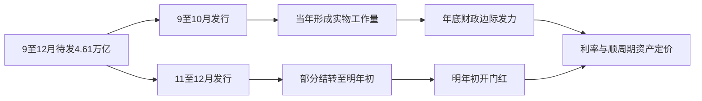
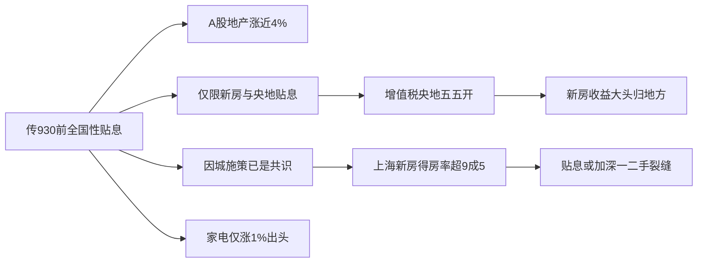
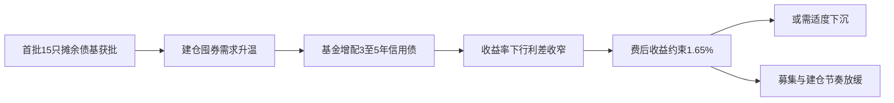

# 📰 公众号热点提炼

> 🕐 2026-09-22（周二）· 覆盖 09-21 至 09-22 · 9 个公众号 · 19 篇文章

---

## ⚡ 关键情报 KEY DELTA

本时段债市多头情绪延续，**10年国债**尾盘收于**1.6775%**、**30年**收于**2.1456%**，30年盘中一度下探**2.1445%**但未实现真正突破；央行净投放**1650亿元**且未开展14天跨季回购，**DR001**却下至**1.362%**附近，资金面宽松程度与上周"未破1.40"截然不同[来源:my_subscription_RAR100002317701][来源:my_subscription_RAR100002296099]。增量信息集中在三处：一是传闻**930前**出台全国性地产贴息政策（央地两级合计几十个bps、仅针对新房），带动**A股地产收涨近4%**、为25年以来第二大单日涨幅，但家电板块14点后涨幅收窄仅收涨**1%出头**，市场对政策逻辑存疑[来源:my_subscription_RAR100002302622]；二是**中美会谈**在摩根大通总部大厦举行，**AI首次成为议题**，贸易战休战延长截止日为**11月10日**，整体对权益偏利多[来源:my_subscription_RAR100002302622]；三是**财政**9至12月仍有**4.61万亿**新增政府债待发，**10月底**是发力落在年底还是明年初的"分水岭"，对应年底发力、甩尾发力、均匀发力三种情景[来源:my_subscription_RAR000007977760]。科技侧则出现模型与生态的密集发布：**Grok 4.7**以标准版不涨价换取长任务能力跃升，上海AI Lab与上交大的**8.9B**隐空间模型仅用**51.3%**的Token预算即追平OLMo-3-7B的最终预训练Loss，OpenAI则成立独立数学顾问组，以应对AI成果产出速度超出学术评议承接能力的治理难题[来源:my_subscription_RAR000007977857][来源:my_subscription_RAR000007974661][来源:my_subscription_RAR000007977858]。

---

## 📊 财经固收类文章深度拆解

### 1. 张瑜：年底财政发力的三种情景

**来源**：一瑜中的 · `09-21 23:45`

#### 1. 这篇文章在说什么？

- 文章以**新增政府债发行**作为观察财政发力的前瞻指标，因为财政、信贷、实物工作量等指标较繁杂且偏滞后，等到方向统一时市场预期往往已调整到位，对投资已无意义[来源:my_subscription_RAR000007977760]。
- 今年财政发债与支出均偏"稳"：**8月广义财政支出同比降幅扩大至-6.7%**（7月为-4.4%），**1-8月广义财政（一、二本账）支出同比-3.5%**，收入增速与支出增速之差达**5.5个百分点**[来源:my_subscription_RAR000007977760]。
- **1-8月新增政府债累计发行7.28万亿**，全年目标**11.89万亿**，9至12月待发**4.61万亿**（同比增量约**1.24万亿**）；去年同期累计发行8.56万亿、全年实际11.93万亿、待发3.38万亿，后4月新增政府债月均需同比多发**3000亿以上**[来源:my_subscription_RAR000007977760]。
- 报告以**10月底**为"分水岭"：若**11-12月**发行，相当部分实物工作量将落到下年（资金拨付需时间、北方冬季施工受限）；若**9-10月**发行，大概率能在当年形成一定实物工作量[来源:my_subscription_RAR000007977760]。

财政发力的传导链条与情景分野如下：

图1：新增政府债发行节奏与财政发力落地时点的传导路径

#### 2. 为什么这件事重要？

- 财政"稳"的另一面是支出端体感偏弱：受发债偏稳影响，**1-8月广义财政支出同比-3.5%**；叠加新增地方债中**可投资部分**（剔除化债、清欠和土储的专项债）二季度以来萎缩，进一步放大了财政偏"稳"的实物量体感[来源:my_subscription_RAR000007977760]。
- 政策历史上确有"留力"先例：**2021年**7月政治局要求"合理把握预算内投资和地方政府债券发行进度"；**2023年**10月下旬增发1万亿国债并安排当年使用5000亿、结转2024年5000亿；**2025年**10月下旬在地方债务结存限额中安排5000亿（其中2000亿用于经济大省项目建设），对应11月新增专项债放量，实际或大部分结转至2026年初使用，12月政治局重提"跨周期"[来源:my_subscription_RAR000007977760]。
- 这意味着**10月底至11月的发行分布**不仅决定年内基建与信贷的实物工作量，也直接影响债市对明年超长债供给与资金面的预期定价[来源:my_subscription_RAR000007977760]。

#### 3. 作者的核心观点是什么？

- 核心结论是：按**9至10月、11至12月新增政府债同比增量能否超过去年同期**，可对应今年底、明年初财政能否边际发力，分为三种情景[来源:my_subscription_RAR000007977760]。

| 情景 | 9至10月新增政府债发行 | 11至12月新增政府债发行 | 对应的实物工作量落点 |
|---|---|---|---|
| **年底发力** | **2.2万亿以上**（同比增量大于**0.47万亿**） | **2.41万亿以下**（同比增量低于去年同期的0.76万亿） | 今年底增量明显，明年初不明显 |
| **甩尾发力** | **1.24万亿以下**（同比增量低于去年同期的-0.48万亿） | **3.37万亿以上**（同比增量大于**1.72万亿**） | 今年底不明显，明年初明显 |
| **均匀发力** | **1.24–2.2万亿** | **2.41–3.37万亿** | 今年底、明年初均有一定增量 |

- 阈值推导逻辑清晰：今年底发力阈值 = 去年9至10月发行**1.72万亿** + 同比增量**-0.48万亿** = **1.24万亿**；明年初发力阈值 = 去年11至12月发行**1.65万亿** + 同比增量**0.76万亿** = **2.41万亿**[来源:my_subscription_RAR000007977760]。
- 作者特别提示：9至10月发行超过**1.24万亿**只是降幅不再扩大，**超过去年同期的1.72万亿**才对应今年底实物工作量在绝对意义上有增量，这一区分是判断"是否真正发力"的关键[来源:my_subscription_RAR000007977760]。

#### 4. 关键数据与信号

- **截至9月18日，9月新增政府债发行计划（前三周为实际值）为1.36万亿**，去年9月为**1.19万亿**，同比增加约**1712亿**，显示9月发行节奏已有前置迹象[来源:my_subscription_RAR000007977760]。
- 历史验证数据：**2021、2023、2025年11-12月**新增政府债同比分别增长**3411亿、8631亿、7623亿**，明显高于**2022、2024年**同期的**-7052亿、-8387亿**；而这三年**9-10月**的同比增量分别为**2087亿、7041亿、-4830亿**，即"留力"年份的发力确实更多落在次年初[来源:my_subscription_RAR000007977760]。
- 交叉验证指标：**2022、2024、2026年**测算财政"使用结转结余"同比增长约**1.65万亿、9600亿、7000亿**（2023、2025年则同比减少约7400亿、1.11万亿）[来源:my_subscription_RAR000007977760]。

#### 5. 对投资决策意味着什么？

- 若9至10月发行落在**2.2万亿以上**（同比增量超0.47万亿），年底实物工作量将出现绝对增量，对债市偏空、对顺周期与基建链条的盈利预期偏多；若发行后移至**11-12月**（超3.37万亿），则更可能形成明年初"开门红"的资金与工作量增量，年内利率下行的窗口反而更宽[来源:my_subscription_RAR000007977760]。
- **10月底是政策节奏的核心观察窗口**，与政治局会议、四季度增量政策信号高度绑定；在此之前，单月发行数据（如9月已公布的1.36万亿）是最及时的跟踪变量[来源:my_subscription_RAR000007977760]。
- 反向风险在于：新增政府债发行不及预期、增量政策超预期、使用结转结余测算存在误差、项目情况与预算执行不及预期，这些都会使情景判断失效[来源:my_subscription_RAR000007977760]。

---

### 2. 债市能突破吗？

**来源**：固收亮话 · `09-21 12:00`

#### 1. 这篇文章在说什么？

- 这是一份债市策略周报，结论是过去一周债券利率重回下行、长债下行稍多一些，短端震荡、收益率曲线略微变平，**国债10-1Y期限利差下行1BP至45BP左右**[来源:my_subscription_RAR100002286111]。
- 支撑因素有三：资金利率在央行呵护下冲高回落、并启动14天逆回购平抑季节性影响；美联储加息落地但国内政策与利率体现"以我为主"；尚未看到刺激政策明显进一步发力迹象[来源:my_subscription_RAR100002286111]。
- 短端机会依然不大：**1Y存单和3Y国开隐含7天资金利率分别在1.42%和1.35%左右**，而当前**R007基本在1.4%至1.45%**波动，套息空间有限[来源:my_subscription_RAR100002286111]。

#### 2. 为什么这件事重要？

- 近期**30年等超长债利率下行、国债期货出现突破上涨迹象**，债市正处于"能否突破"的关键技术位与逻辑位；作者判断**四季度初期突破下行的概率较大**，9月更可能是震荡月[来源:my_subscription_RAR100002286111]。
- 机构持仓成本提供了安全边际参照：按过去一个月交易数据滚动测算，**基金持有10年国债成本在1.68%左右，保险也在1.68%左右**，当前各机构短期持仓基本盈亏平衡，意味着利率向上大幅偏离成本的阻力较大[来源:my_subscription_RAR100002286111]。
- 利率预测模型已由分歧转向偏多：本周**4个子模型看多、4个看空，综合模型转多**；期限轮动模型中**30年国债赔率大于1**[来源:my_subscription_RAR100002286111]。

#### 3. 作者的核心观点是什么？

- **9月债市以震荡为主**：**10Y国债主要波动区间1.65%至1.7%**，**30Y国债在2.1%至2.15%左右**；**10-11月利率下行概率偏高**，且不排除**9月底抢跑**[来源:my_subscription_RAR100002286111]。
- 组合构建上建议维持**短+超长的哑铃型结构**，整体久期短期偏中性；观点更积极者可适度增加超长债维持偏高久期，在震荡下行环境中久期敞口不是劣势，但可同步提高组合票息[来源:my_subscription_RAR100002286111]。
- **TL合约因价格相对现券偏低，上涨空间略大于现券**，技术形态更强；货币政策当前对债市影响偏中性，资金利率预计多数时间维持宽松，但短时间降息概率不高，监管对当前利率水平的关注度可能也不高[来源:my_subscription_RAR100002286111]。
- 对30-10Y利差：当前处于**45-46BP**的较高水平反映超长债赔率，但9月受政府债发行、增量政策与通胀预期扰动，利差预计随震荡变化不大；考虑四季度地方债发行平缓及市场对明年超长债供给下降的担忧，**30-10Y利差有望下行到40BP以下**[来源:my_subscription_RAR100002286111]。

#### 4. 关键数据与信号

- **择券思路（10Y及以内）**：国债关注**9Y**；国开关注**7Y、9Y**；农发关注**7Y、10Y**；口行关注**10Y**；二级资本债关注**5Y、7-8Y**；中票关注**6Y、8-9Y**[来源:my_subscription_RAR100002286111]。

| 品种/个券 | 关键利差数据 | 作者判断 |
|---|---|---|
| 10年国开 | 260205-260210利差约**0.8BP**；10年国开-国债利差约**8BP** | 260210短期超额价值不强，利差压缩可关注260205 |
| 250215-250220 | 税后利差约**2BP** | 未完全反映增值税利差，可继续关注250215 |
| 10年国债 | 260010-260016利差约**0BP** | 个券差异不大，活跃券260010、260016 |
| 30年国债 | 26T6-260016利差**45-46BP**；26T4-26T6走扩至**2.7BP**；26T2-26T4、25T6-26T2均约**0.5BP**；25T6-25T2约**5.5-6BP** | 关注26T6价值，26T4-26T6或走扩至4-5BP |
| 50年国债 | 50Y-30Y老券利差回升至**4-5BP**；26T3-25T3约**9BP** | 50Y赔率相对30Y不高，26T3性价比较好 |

- **大类资产估值对比**（截至2026.9.18）：沪深300市盈率倒数减10年国债利率为**5.79**，处于过去五年**53%分位**；沪深300股息率/10年国债利率为**1.58**，处于过去五年**84%分位**，相对股市来说债市估值不贵，且信用债估值高于利率债[来源:my_subscription_RAR100002286111]。
- 浮息债方面，性价比较好且久期不高的是**26农发清发09**，其对**DR007**的预期为**1.35%**[来源:my_subscription_RAR100002286111]。

#### 5. 对投资决策意味着什么？

- 交易层面：**关注26T6和26T3**；组合底仓可小幅关注**30Y地方债**，但若**地方债-国债利差压缩至10BP以内**则应逐步减配；10年以内赔率较好的个券包括**8-9Y国开250205-250215**、**5-6Y政金220205、220210、25农发清发07、220310**，其中农发与口行性价比稍强[来源:my_subscription_RAR100002286111]。
- 期货层面：期货IRR水平提高但仍在合理范围，做空套保性价比不高；若判断短期下跌可关注**T2612**套保价值，若博上涨机会可关注**TL2612**；建议在**9月底至四季度初重点关注曲线变平策略**[来源:my_subscription_RAR100002286111]。
- 风险提示明确包括：政府债发行节奏加快、经济增长预期显著变化、货币政策不确定性、个券流动性差异、利率波动导致最优个券偏好变化、测算与实际不一致等六类[来源:my_subscription_RAR100002286111]。

---

### 3. 地产的小作文又来了

**来源**：表舅是养基大户 · `09-21 21:34`

#### 1. 这篇文章在说什么？

- 文章复盘的当日三大热点是**地产小作文、中美会谈、海外利率**，另加**宁王**的股息率话题[来源:my_subscription_RAR100002302622]。
- 地产方面，**中午开始地产板块走高，最终A股地产涨近4%**，这是**25年以来第二大单日涨幅，仅次于去年4月9日**[来源:my_subscription_RAR100002302622]。
- 消息面传闻是：**930前要出全国性的地产政策，央地两级直接贴息，合计几十个bps，仅针对新房**，作者称其"恰逢924行情两周年之际，这小作文挺会择时"[来源:my_subscription_RAR100002302622]。

#### 2. 为什么这件事重要？

- 若属实，这将是一刀切式的需求端补贴政策，直接影响新房销售、地方财政收支与银行息差，属于对地产链乃至利率定价的重磅变量，因此市场当日给予地产板块近4%的涨幅[来源:my_subscription_RAR100002302622]。
- 但其逻辑链条存在明显缺口，且市场内部已出现"用脚投票"的分歧：与新盘最相关的**家电板块14点之后开始涨幅收窄，最后仅收涨1%出头**，港股地产同样表现克制，说明资金对政策真实性并不完全认可[来源:my_subscription_RAR100002302622]。
- 叠加同期**中美会谈**与**海外长端利率**高企，权益市场的风险偏好改善更多来自外部因素而非国内地产政策的确定性[来源:my_subscription_RAR100002302622]。

图2：地产贴息传闻的市场反应与逻辑验证链条

#### 3. 作者的核心观点是什么？

- 作者的判断非常直接：**"从内容看，这纯粹是：脑白金喝多了。"** 逻辑槽点主要集中在三方面[来源:my_subscription_RAR100002302622]。
- **其一，中央出资动机不足**：新房产生的收益大头几乎都归地方，为何中央要出钱？消费补贴、消费贷贴息之所以能滚动起来，核心在于消费扩张产生的核心税种是**增值税，而增值税是央地五五开**，收支两端才能滚动[来源:my_subscription_RAR100002302622]。
- **其二，一刀切不现实**：地产**因城施策早就是共识**。以上海为例，好的新房仍然卖得出去——上海存量老房子得房率在**8成左右**，而现在有些新房实际得房率甚至在**9成5以上**，若对新房继续大额贴息，一二级市场的裂缝会进一步加深，这其实是地方反而不愿看到的[来源:my_subscription_RAR100002302622]。
- **其三，市场交易结构已给出否定信号**：家电涨幅收窄、港股地产表现平淡，说明交易层面对该小作文并不买账[来源:my_subscription_RAR100002302622]。

#### 4. 关键数据与信号

- **中美会谈**四个可关注要点：会谈地点选在**摩根大通总部大厦**，小摩CEO**杰米·戴蒙**在中美双方都有较强影响力，安排在商业机构本身体现谈判走向"市场化"；**AI首次成为新议题**，美方可能提到建立**AI重大事故通报机制**；根据前一次谈判结果，贸易战休战延长的截止日是**11月10日**，本次核心是聊如何延长；具体议题聚焦**稀土出口、关税削减清单**[来源:my_subscription_RAR100002302622]。
- **美国中期选举预测**：共和党将稳输众议院（约**10% 对 90%**），参议院落后比例扩大至**40% 对 60%**[来源:my_subscription_RAR100002302622]。
- **海外利率**：日本央行跟随美联储节奏宣布加息但整体偏鸽派，有**2位委员反对加息**，日元偏软并已跌破**157**；法国10年国债收益率上周五大幅上行**12bps至4.56**，创**08年金融危机以来新高**；美国10年国债徘徊在**5%附近**[来源:my_subscription_RAR100002302622]。
- **宁王**：当日迎来**5连跌**，为**25年9月以来收盘价首次跌破300块**；自上周五启动回购以来呈小额"定投式"回购，当晚公告**又回购了11亿**；收盘股息率已到**2.8%**，申万一级行业中股息率超过宁王的只剩**8个**（银行、食品饮料、家电、石油石化、纺织、煤炭、交运、钢铁），**非银金融的股息率还没宁王高**[来源:my_subscription_RAR100002302622]。
- 其他背景数据：**上证指数周五收盘3911.87**[来源:my_subscription_RAR100002302622]。

#### 5. 对投资决策意味着什么？

- 对地产小作文，作者的建议是**"大家面对小作文，还是要保持清醒的头脑"**，即在政策落地前不宜线性外推至地产链基本面的实质改善[来源:my_subscription_RAR100002302622]。
- 对中美会谈，作者判断**"出幺蛾子的概率比较低——对权益市场来说，整体偏利多"**，核心依据是美方在峰会前明显降低了关税和出口限制方面的强硬表态，且中期选举预测对其不利，可打的牌不够[来源:my_subscription_RAR100002302622]。
- 宁王从"大盘成长"转向"红利特征"（股息率2.8%、连续回购）值得关注其对红利板块的比价效应与资金再配置含义[来源:my_subscription_RAR100002302622]。

---

### 4. 摊余债基驱动，信用债涨势或延续

**来源**：郁言债市 · `09-21 12:04`

#### 1. 这篇文章在说什么？

- 报告复盘**9月14日至18日**信用债行情：债市多头情绪占上风，信用债收益率普遍下行、信用利差大多收窄，**中低评级5Y、高评级10Y品种表现较强**[来源:my_subscription_RAR000007974103]。
- 触发因素是**首批15只63个月封闭式摊余债基于9月14日取得注册批复**，其中**6只于9月21日发行**，**第二批13只产品也已申报**，围绕后续建仓的"囤券"开始推进[来源:my_subscription_RAR000007974103]。
- 具体行情：**中短票2-5Y收益率下行1-4bp**（AA+和AA 5Y下行3-4bp，利差收窄2-3bp）；**城投债AA和AA(2) 3-5Y下行2-5bp**（利差收窄1-3bp），**AAA和AA+ 10Y下行3-5bp**（利差收窄2-4bp）[来源:my_subscription_RAR000007974103]。

#### 2. 为什么这件事重要？

- 摊余债基的建仓需求直接改变了信用债的边际买盘结构：**9月14日至18日，基金净买入信用债408亿元，较前周增加138亿元**，其中**3-5年净买入由65亿元增至140亿元，占比由24%升至34%**[来源:my_subscription_RAR000007974103]。
- 但摊余债基存在明确的收益约束：**信用风格的费后收益率可能至少达到1.65%，才能吸引理财等投资人申购，对应费前（加杠杆后持仓收益率）约1.85%以上**；在当前低收益率背景下，单纯配置高评级信用债较难满足目标，或需适度下沉，兼顾安全性与票息性价比[来源:my_subscription_RAR000007974103]。
- 这意味着5年左右信用债的下行空间受制于"发行人/产品收益约束"这一内生机制，而非单纯资金面[来源:my_subscription_RAR000007974103]。

#### 3. 作者的核心观点是什么？

- **信用利差已处偏低水平，继续追涨的赔率有限；但机构配置需求仍在，叠加摊余债基扩容预期，对5年左右中高评级信用债仍有支撑，只是下行斜率或逐步放缓**[来源:my_subscription_RAR000007974103]。
- 操作建议：**对5年左右存量仓位不着急止盈**；**对新增资金，随着收益率下行宜同步降低5年左右配置比例**，保留收益率回调后的加仓空间[来源:my_subscription_RAR000007974103]。
- **二永债中长端相比信用债的性价比下降**：截至9月18日，**AAA-二级资本债5Y收益率为1.8%**，相比AAA中票的品种利差为**9bp**但滚动一年分位数仅**17%**；**10Y收益率已降至1.98%**，比同期限AAA中票低**3bp**，品种利差分位数仅**4%**，追涨长久期的赔率偏低；若后续基金买盘回落或资金面趋紧，**优先压降估值偏贵的交易仓位**[来源:my_subscription_RAR000007974103]。
- 合同约束值得注意：投资信用债通常要求**主体或债项评级AAA级债券的比例不低于全部信用债资产的50%**，**AA+级债券比例不超过50%**，部分产品可投AA级但要求**AA级债券比例不超过20%**[来源:my_subscription_RAR000007974103]。

图3：摊余债基建仓需求与5年信用债定价的反馈回路

#### 4. 关键数据与信号

- **信用债净买入结构**：基金**408亿元**（前周+138亿元）；其他机构**192亿元**（环比减少104亿元）；理财**79亿元**（环比增加5亿元，**3年以内占比91%**）；保险**仅净买入41亿元**（环比减少23亿元），其中**净卖出7-10年7亿元**，是**6月中旬以来首次周度净卖出**[来源:my_subscription_RAR000007974103]。
- **二永债净买入结构**：基金净买入其他类债券**387亿元**（较前周增加314亿元），其中**1-3年净买入200亿元、占比52%**，3-5年净买入127亿元但**占比由76%降至33%**；其他机构**199亿元**（3-5年占72%）；理财**97亿元**（环比+27亿元）；**保险由净买入30亿元转为净卖出60亿元**[来源:my_subscription_RAR000007974103]。

| 机构 | 信用债净买入 | 环比变化 | 期限偏好 |
|---|---|---|---|
| 基金 | **408亿元** | +138亿元 | 3-5年净买入由65亿增至**140亿元**，占比24%升至**34%** |
| 其他机构 | **192亿元** | -104亿元 | 3-5年为主 |
| 理财 | **79亿元** | +5亿元 | 3年以内占比**91%** |
| 保险 | **41亿元** | -23亿元 | 净卖出7-10年**7亿元**，6月中旬以来首次周度净卖出 |

- **可选标的一览**：公募非永续、主体评级AA+及以上、行权剩余期限**4.5-5.25年**、票息**1.8%-1.9%**的品种中，城投债（隐含评级AA+、AA、AA(2)）合计规模**1348亿元**，产业债（隐含评级AA+及以上）余额**531亿元**[来源:my_subscription_RAR000007974103]。
- **券商品种**：样本内（公募、行权剩余期限4.5-5.25年）普通债余额合计**1251亿元**、非永续次级债**235亿元**，主体评级以AAA为主、个别为AA+；**浙商证券次级1.87%、东方财富证券次级1.92%**在收益率与存量规模上性价比较好；普通券商债中**东方财富证券收益率1.84%、余额57亿元**，兼顾票息与配置容量[来源:my_subscription_RAR000007974103]。

#### 5. 对投资决策意味着什么？

- 策略上建议**优选主体评级AA+及以上、剩余期限4.5-5.25年、票息1.8%-1.9%左右的公募非永续品种**，兼顾安全性与票息性价比[来源:my_subscription_RAR000007974103]。
- 关键反向风险是**募集规模低于预期**：如果5年左右信用债收益率继续下行，可能削弱机构认购意愿，导致摊余债基实际募集规模低于此前预期，进而降低配债需求，形成"收益率越低、需求越弱"的负反馈[来源:my_subscription_RAR000007974103]。
- 需持续跟踪**第二批13只产品的申报与发行进度**，以及基金对其他类债券（主要为二永）的买盘持续性，二永债收益率下行后的交易拥挤度值得警惕[来源:my_subscription_RAR000007974103]。风险提示为货币政策超预期调整、流动性超预期变化、信用风险超预期[来源:my_subscription_RAR000007974103]。

---

### 5. REITs I 再迎一波供给潮

**来源**：郁言债市 · `09-21 12:04`

#### 1. 这篇文章在说什么？

- 本周（2026年9月14日至9月18日）**中证REITs全收益指数收于943.55点，较上周上涨0.69%，终止了两周连跌**，但成交情绪不高，**日均换手率较上周下降0.01pct至0.31%，处于历史2%分位数**[来源:my_subscription_RAR000007974104]。
- 一级市场再现供给潮：**3只商业不动产、2只基础设施REITs启动询价，一周新受理5只**，其中**紫金华住安住、新城吾悦、凯德商业3只选择在9月23日-24日启动询价**，募集缴款期安排在10月19日以后[来源:my_subscription_RAR000007974104]。
- 已上市交易的**89只REITs总市值为2316亿元，其中流通市值1296亿元**；日均成交额**3.65亿元（环比+4.45%）**、日均成交量**1.06亿份（环比-3.57%）**[来源:my_subscription_RAR000007974104]。

#### 2. 为什么这件事重要？

- 供给扩张与二级估值处于历史高赔率区间的组合，是当前REITs市场的核心矛盾：截至9月18日，**产权REITs利差较上周收窄2bp至304bp，处于历史98%分位数**，仍处高赔率区间，**数据中心利差本周收窄15bp**[来源:my_subscription_RAR000007974104]。
- 商业不动产上市表现持续不佳，形成明显的"发行—破发"压力：**市场已有5只商业不动产REITs上市，其中北京国资公司、首农商业、上海地产商业3只仍处破发状态，上市至今分别下跌17.06%、1.53%、12.74%**，仅奥莱业态的**砂之船商业、唯品会商业**实现上涨；**保利发展商业、陆家嘴商业、锦江商业**已募集完毕超1个月仍未确定上市日期[来源:my_subscription_RAR000007974104]。
- 与之形成鲜明反差的是基础设施REITs的火爆认购：**晋中公投瑞阳供热、中国建筑租赁住房网下/公众投资者认购倍数分别达175/880倍、87/390倍**，**杭州安居、菜鸟仓储物流网下认购倍数分别为355、35倍**，远高于第二批商业不动产REITs（4只发行倍数仅**1至3倍**）[来源:my_subscription_RAR000007974104]。

#### 3. 作者的核心观点是什么？

- 政策与资金面构成缓冲：2026年9月18日**上海资产管理协会主办REITs发展研讨会**，证监会债券监管司监管七处处长**王鹏飞**指出，当前REITs市场稳步发展，**中长期资金相关政策持续推进**[来源:my_subscription_RAR000007974104]。
- 考虑到当前市场参与机构和资金来源较2024年初更加多元，叠加指数基金建仓及新产品继续注册申报的可能性和中长期资金政策仍在推进，**交易流动性压力或小于2024年利差高点时期，整体利差大幅走扩的可能性较小**[来源:my_subscription_RAR000007974104]。
- 配置上仍**关注基本面良好的租赁住房、数据中心、消费设施和市政环保等板块**；交易上可**博弈短期跌幅很大、基本面尚可的园区、仓储、高速个券**[来源:my_subscription_RAR000007974104]。

#### 4. 关键数据与信号

| 板块 | 产权REITs利差 | 历史分位数 | 本周表现 |
|---|---|---|---|
| 产业园区 | **421bp** | 99% | 分化，广开产园-2.62% |
| 仓储物流 | **382bp** | 98% | 涨幅超0.70%（易商+4.51%、宝湾+3.62%） |
| 消费设施/商业不动产 | **282bp** | 96% | 商业不动产板块跌幅最大（**-0.53%**） |
| 数据中心 | **248bp**（本周收窄15bp） | 88% | 领涨，万国数据中心**+4.77%** |
| 租赁住房 | **150bp** | 77% | 涨幅超0.70% |

- 各板块利差"离2024年初高点相差约41bp"，说明整体仍处高位区间；**全市场89只个券中，51只上涨、38只下跌**[来源:my_subscription_RAR000007974104]。
- **供给规模测算**：包括已上市项目在内，**商业不动产项目达30只，合计拟募集约969亿元**，扣除已上市或募集完毕项目后，**剩余供给规模仍有674亿元**（其中处于受理阶段4只、交易所已反馈审核意见10只、已答复3只、已获批待发行5只、已发行待上市3只、已上市5只）；**基础设施项目剩余供给规模仍有481亿元**（9月以来启动询价项目多达6只，拟募集76亿元）[来源:my_subscription_RAR000007974104]。
- **指数调整与建仓进度**：全收益指数于**2026年9月14日**更新成份券名单，**湖北科投光谷、金茂消费、山东高速、宁波交投**可能因日均成交额低于**500万元**被剔除，**新纳入易商仓储、隧道股份高速**（本周分别上涨4.51%、0.38%）；首批指数基金中，**华夏基金、易方达基金、中金基金建仓已近九成（约89%），南方基金仓位约67%**[来源:my_subscription_RAR000007974104]。
- 新询价项目定价细节：**紫金华住安住、新城吾悦、凯德商业**询价区间折溢价率均为**±10%**，原始权益人认购份额分别为**20%、34%、20%**，按询价区间上限发行的分派率分别为**5.13%、5.24%、4.30%**；相比之下**锦江商业溢价10%发行的分派率仅为3.93%，可能面临上市压力**[来源:my_subscription_RAR000007974104]。

#### 5. 对投资决策意味着什么？

- 板块层面建议关注**招商蛇口、城投宽庭、华润有巢、北京保障房、润泽科技数据中心**；消费板块关注**凯德消费、物美消费、百联消费、唯品会奥莱和唯品会商业**；高速公路可关注车流持续增长的路产，如**中国交建、越秀高速**（1-8月车流量、通行费同比继续增长）[来源:my_subscription_RAR000007974104]。
- 短期最直接的验证窗口是**9月23日-24日的3只商业不动产询价及后续上市表现**，其结果将决定"供给潮+破发"是否进一步压制二级估值[来源:my_subscription_RAR000007974104]。
- 风险提示包括：公募REITs相关政策超预期调整、基础设施项目经营风险、资料来源及数据统计风险[来源:my_subscription_RAR000007974104]。

---

### 6. 多头情绪延续！

**来源**：红军债市笔记 · `09-22 06:53`

#### 1. 这篇文章在说什么？

- 这是一份**2026年9月21日**的债市日度复盘：早盘市场情绪偏多，现券震荡下行，**10年下至1.6735%、30年下至2.146%**；下午资金面偏松、股市上涨，**30年下至2.1445%**；小作文传房贷利率补贴后**10年上至1.675%、30年上至2.1495%**；尾盘10年与30年涨跌不一，**10年收于1.6775%、30年收于2.1456%**[来源:my_subscription_RAR100002317701]。
- 资金面出现反直觉的宽松：早盘央行投放**1650亿**且并未开展14天跨季回购，投放量不多，但**DR001下至1.36附近**，与上周"资金面没有下破1.40"截然不同[来源:my_subscription_RAR100002317701]。
- 股市受中美贸易谈判利好上涨，但债市未受股市影响，继续偏多走势[来源:my_subscription_RAR100002317701]。

#### 2. 为什么这件事重要？

- **30年国债盘中破了年内最低点2.146%、小幅下至2.1445%，但"破的非常纠结不流畅，没有实现真正的突破"**，这决定了当前是"突破行情"还是"区间上沿博弈"的关键判断[来源:my_subscription_RAR100002317701]。
- 基本面侧出现边际变化：**2026年9月新兴产业EPMI回升4.5个百分点至52.3**，结束连续3个月调整后再现中高位；但作者判断本月回升是**正常季节拉动**，近几个月波动幅度与去年相似，只是**中枢位置抬高**[来源:my_subscription_RAR100002317701]。
- 传导链条上，EPMI显示产需比扩大至**2.4**，与前期判断"旺季后，产能过剩策略将恢复"一致，意味着价格与盈利修复的持续性仍需观察[来源:my_subscription_RAR100002317701]。

#### 3. 作者的核心观点是什么？

- 操作建议明确：**在没有真正突破之前不追多，回调小幅加仓**；**30年2.12%是强支撑，10年1.66%是强支撑**[来源:my_subscription_RAR100002317701]。
- 短期交易建议：**10年国债1.68%以上小幅分批加仓、1.65%附近止盈**；**30年26T4国债2.17%以上小幅分批加仓、2.14%附近止盈**，设好止损、快进快出[来源:my_subscription_RAR100002317701]。
- 区间判断：预计本周**10年国债260010大概率在1.65%-1.70%区间震荡**，**30年26特4在2.13%-2.20%区间震荡**；并建议**卖出特4，买入25特2或者26特6以回避特4换券风险**[来源:my_subscription_RAR100002317701]。
- 明日（9月22日）判断为：隔夜美股上涨、美债下跌，中美利差326bp、美指下跌、离岸人民币对美元至6.6951破6.7大关，消息面平静、数据空窗期，**预期债市收益率震荡偏多，2610震荡区间1.665%-1.685%**[来源:my_subscription_RAR100002317701]。

#### 4. 关键数据与信号

- **资金与短端价格**：**DR001加权上行0.3bp至1.362%**，**DR007下行0.4bp至1.395%**；**一年存单下0.5bp至1.485%**；**shibor 1个月期下行0.06BP报1.4234%，3M持平于1.43%**；匿名隔在1.37%左右、几佰亿的量；**大行出钱限价1.37%比上日降7bp**；票据**6M上行0bp至0.50%**[来源:my_subscription_RAR100002317701]。
- **EPMI分项**：生产量、产品订货分别回升**7.4和6.6**，现有订货回升**4.2**，**产需比扩大至2.4**；出口订货回升**4.6**（连续三个月淡季上行），进口仅回升**0.8**，顺差韧性凸显[来源:my_subscription_RAR100002317701]。
- **央行操作与供给**：当日开展**1650亿元7天期逆回购**，当日无逆回购到期，**净投放1650亿元**；明日7天逆回购0亿到期，预期投放**3500亿**、14天逆回购投放**1500亿**；本日政府债缴款合计**2565亿**，一级发行国债**0亿**、地方债**888亿**[来源:my_subscription_RAR100002317701]。
- **海外与商品**：10年期美债收益率**跌4.71个基点报4.945%**，中美利差**-326.75bp**（比上日-5bp）；美元指数**涨0.21%报100.42**；离岸人民币对美元夜盘**涨23个基点报6.6928**；布伦特原油**跌4.28%报91.97美元/桶**；国内商品期市夜盘多数上涨，原油主力合约**下跌2.26%报714.3元/桶**；富时中国A50指数期货夜盘**收涨0.29%**[来源:my_subscription_RAR100002317701]。
- **数据一致性提示**：原文在"明日行情"段落中同时出现"美指下跌"与上文的"美元指数涨0.21%报100.42"、以及"布油跌至98"与上文的"跌4.28%报91.97美元/桶"，两处存在前后口径不一致，使用时需以原始发布内容及各自主流数据源复核[来源:my_subscription_RAR100002317701]。

#### 5. 对投资决策意味着什么？

- 策略含义是**区间偏多、突破前不追多**：10年围绕1.66%-1.68%、30年围绕2.12%-2.15%的支撑与压力进行波段操作，30年真正的突破尚未确认[来源:my_subscription_RAR100002317701]。
- 需跟踪的两条线索：一是**跨季资金投放**（预期7天3500亿+14天1500亿）能否延续"莫名宽松"的状态；二是**股市风险偏好与地产政策传闻**对债市的脉冲扰动[来源:my_subscription_RAR100002317701]。
- 中美利差**-326.75bp**与10年美债**4.945%**构成外部约束，若美债利率维持高位，国内长端下行空间的打开将更依赖内需与货币政策的独立节奏[来源:my_subscription_RAR100002317701]。

---

### 7. 市场担忧地产政策，长端利率上行（20260921）

**来源**：固收彬法每日观察 · `09-21 19:22`

#### 1. 这篇文章在说什么？

- 当日国债现券收益率表现分化：**2年期国债活跃券收益率持平昨日收1.03%**；**10年期上行0.15bp至1.68%**；**30年期下行0.30bp至2.15%**[来源:my_subscription_RAR100002296099]。
- 资金整体均衡，**1年期国股行存单利率上行0.61bp至1.49%**；**逆回购净投放1650亿元**[来源:my_subscription_RAR100002296099]。
- 报告将当日核心事件归因为**"市场担忧地产政策"**[来源:my_subscription_RAR100002296099]。

#### 2. 为什么这件事重要？

- 该口径与同一日其他来源形成交叉印证：红军债市笔记报尾盘**10年收1.6775%、30年收2.1456%**，固收亮话给出**基金与保险持有10年国债的成本均在1.68%左右**[来源:my_subscription_RAR100002296099][来源:my_subscription_RAR100002317701][来源:my_subscription_RAR100002286111]。
- 说明当日10年国债日内波动极窄、30年在2.15%附近反复，长端的扰动主要来自**地产政策传闻**而非资金面或基本面数据[来源:my_subscription_RAR100002296099]。
- 作为券商公众号的日度复盘，其价值在于提供**官方口径的活跃券收盘点位**，可作为验证其他来源数据的锚点[来源:my_subscription_RAR100002296099]。

#### 3. 作者的核心观点是什么？

- 报告未给出方向性判断，属客观复盘，核心信息是**收益率分化、资金整体均衡、市场担忧地产政策**三句话[来源:my_subscription_RAR100002296099]。
- 风险提示为国内基本面走势、央行货币政策取向、海外风险三类[来源:my_subscription_RAR100002296099]。

#### 4. 关键数据与信号

| 指标 | 数值 | 口径说明 |
|---|---|---|
| 2年期国债活跃券 | **1.03%**（持平昨日） | 9月21日收盘[来源:my_subscription_RAR100002296099] |
| 10年期国债活跃券 | **1.68%**（上行0.15bp） | 9月21日收盘[来源:my_subscription_RAR100002296099] |
| 10年期国债（另一来源） | **1.6775%** | 9月21日尾盘[来源:my_subscription_RAR100002317701] |
| 30年期国债活跃券 | **2.15%**（下行0.30bp） | 9月21日收盘[来源:my_subscription_RAR100002296099] |
| 30年期国债（另一来源） | **2.1456%** | 9月21日尾盘[来源:my_subscription_RAR100002317701] |
| 1年期国股行存单 | **1.49%**（上行0.61bp） | 9月21日[来源:my_subscription_RAR100002296099] |
| 1年期存单（另一来源） | **1.485%**（下行0.5bp） | 9月21日[来源:my_subscription_RAR100002317701] |
| 逆回购净投放 | **1650亿元** | 9月21日[来源:my_subscription_RAR100002296099] |

> 说明：上表中同一指标存在两个数值，源于不同来源对"收盘价/尾盘价"的统计时点与个券选择存在差异，使用时需分别标注口径，不可直接合并或平均[来源:my_subscription_RAR100002296099][来源:my_subscription_RAR100002317701]。

#### 5. 对投资决策意味着什么？

- 短端**1.03%**与**1.49%**的存单利率组合表明资金面仍处均衡状态，短端缺乏系统性下行驱动[来源:my_subscription_RAR100002296099]。
- 长端的波动集中在地产政策预期上，**在地产政策传闻被证伪或证实之前，长端更可能维持窄幅震荡**，与固收亮话"9月10Y在1.65%-1.7%震荡"的判断一致[来源:my_subscription_RAR100002296099][来源:my_subscription_RAR100002286111]。

---

## 🤖 科技类文章概要

### 1. 刚刚，SpaceXAI最强Grok 4.7发布！价格杀疯，跑分令人失望

**来源**：机器之心 · `09-22 06:50`

文章主要讨论SpaceXAI发布新一代旗舰模型Grok 4.7，核心观点是这代升级不追求全面碾压，而是用**远低于部分旗舰模型的API成本**换取接近顶尖的性能，并把竞争重心从单轮问答推进到"完成整项工作"。关键数据包括：**CursorBench 4.0得分46.3%**（Grok 4.6为40.4%，提升**5.9个百分点**）、**DeepSWE v1.1高推理强度71.0%**、**Terminal-Bench 4.0从20.3%升至38.0%**、**AA Briefcase v1.1为1657分**（前代1546）、**GDPval Elo由1605升至1695**、**EEBench由53.0%升至64.0%**、**HealthBench Professional由48.5%升至56.7%**、生物安全**LatchBio基准62.4%**、网络安全测试仅放行**3.3%**的高风险双重用途提示；标准版起价为**每百万输入Token 2美元、每百万输出Token 6美元**，与Grok 4.6一致[来源:my_subscription_RAR000007977857]。文章同时指出网友评价负面，认为其跑分表现令人失望[来源:my_subscription_RAR000007977857]。

### 2. 刚刚，OpenAI成立独立数学顾问团！100+「已攻克」开放问题待审

**来源**：机器之心 · `09-22 06:50`

文章主要讨论OpenAI宣布与名为**AGMAI（数学与人工智能顾问组）**的独立组织合作、由**普林斯顿高等研究院托管**，核心观点是当AI生成数学成果的速度超过同行评议与学术传播的承受速度时，数学界面临的是"发布与验证"的新瓶颈，而非单纯的能力问题。关键信息包括：OpenAI称从**8月28日**开始训练新内部模型，该模型已解决横跨数学多个领域的**100多道长期开放问题**；**9月8日**公开纳维-斯托克斯问题论文与Lean形式化证明；**9月11日**多位菲尔兹奖得主参与发布公开信《人工智能在数学领域的严重错位》；顾问组首批成员共**9人**，成员**不接受AI公司报酬**、建议公开发布，但**没有任何AI公司的决策权、没有成果发布的否决权**[来源:my_subscription_RAR000007977858]。

### 3. 我的一人公司品牌部又又又升级：这次我雇了个演员和一个导演（LibTV 1.5）

**来源**：花叔 · `09-21 23:02`

文章主要讨论作者使用**LibTV 1.5**为其"一人公司品牌部"搭建固定AI代言人与虚拟影棚的实际工作流，核心观点是AI视频正从"从零抽卡"走向有资产沉淀的工程化流程（角色卡、可修改的3D场景可复用）。关键数据包括：生成角色"小满"耗时两三分钟、扣**14积分**，含头像/全身图/九宫格表情/九视角转面板的一套共**58积分**；四支广告与两组对照共出图，一天合计出**84张图、10条视频（合计107秒）外加载5秒片头，消耗6180积分**；**高级版连续包月469元给11700积分**，一条15秒带音轨视频约**746积分（三十块左右）**，一张图**五毛多**；3D虚拟影棚功能测试中不扣积分，最后生成12秒真人视频扣**552积分**；片头一步**30积分**、文字动效手写笔画**150积分**[来源:my_subscription_RAR100002316521]。

### 4. ICLR 2027投稿冲到6万，比过去十几年加起来都多......

**来源**：机器之心 · `09-21 18:00`

文章主要讨论ICLR 2027摘要提交量突破**6万+**、已超过ICLR自2013年至2026年历年投稿总和（约**5.6万篇**），核心观点是AI写作工具正把顶会投稿推向"审稿能力极限"，处理能力而非研究能力成为新的稀缺资源。关键数据包括：首届ICLR收到**67篇**投稿，ICLR 2026涨至**19525篇**；ICLR 2026中**779篇被desk reject、5042篇撤稿**，最终进入决策阶段**13763篇**，**18054名reviewer**提交**76139份review**；今年限流政策要求每位作者最多出现在**20篇**投稿中，出现在**3篇及以上**的作者需承担至少**6篇**评审工作，约**20%**的投稿没有reciprocal reviewer；ICLR还与Google合作开放**Paper Assistant Tool（PAT）**[来源:my_subscription_RAR000007976472]。

### 5. ACM Multimedia 2026 Oral｜从「转述痕迹」到「看见证据」：ForgeryVCR用视觉中心推理重塑图像取证范式

**来源**：机器之心 · `09-21 18:00`

文章主要讨论腾讯优图实验室与深圳大学研究者提出的**ForgeryVCR**取证智能体框架（已被**ACM Multimedia 2026**录用并入选Oral），核心观点是图像取证应从"依赖文本描述转述痕迹"转向"基于显式视觉证据推理"，把低层取证感知显式物化为中间图像再交由多模态大模型判断。关键数据：在9个公开基准的加权平均上，相对此前最优方法，图像级检测**F1 0.7985（提升4.91%）/ ACC 0.8237（提升10.00%）**，区域级**B-IoU 0.3386（提升23.58%）/ 像素级P-IoU 0.3380（提升15.24%）**；推理模态消融中**不含文本描述的纯视觉CoT效果最好**，加入文本推理反而下降；在语义幻觉子集上，纯视觉CoT相较带文本CoT版本图像级**F1提升10.4%、ACC提升20.2%**，像素级**F1提升13.7%、IoU提升14.1%**；工具箱保留**ELA、FFT、NPP与Zoom-In**四项[来源:my_subscription_RAR000007976474]。

### 6. Jev是分类器吗？今天向所有人开放，送1.2亿token

**来源**：机器之心 · `09-21 15:24`

文章主要讨论TypeSafe AI的**Jev**模型正式向所有人开放（无需候补名单、初始**5美元额度约1.2亿token**），核心观点是把Jev简单视为分类器会低估它——它可在运行时接收自然语言标签并结合上下文评分，更适合做Agent的"决策层"。关键信息包括：Jev被称为**"System One model"**，输出形式为**Choice / Noul / Score**三类；有网友用它配合GPT-6 Astra在《Minecraft》中**8分43秒**打赢末影龙，总成本不到1美元（其中**Jev花0.01美元、Astra花0.96美元**）并已开源代码；争议集中在概率可靠性上，有网友称同样的提示词多次运行会给出不同概率、选项顺序会大幅改变输出概率，且在贷款违约、企业破产和医疗诊断等八个真实数据集上**概率校准明显落后于CatBoost**；官方也在Jev 1.13的能力说明中提醒其在算术、计数、日期、字面匹配、无关信息干扰、对抗性输入和矛盾条件等任务上表现不稳定[来源:my_subscription_RAR000007974663]。

### 7. 预训练Token消耗直接腰斩！上海AI Lab&上交大提出全新预训练任务，开源首个8.9B隐空间大模型NCP-ArchPreview

**来源**：机器之心 · `09-21 15:24`

文章主要讨论上海人工智能实验室与上海交通大学人工智能学院LUMIA Lab提出的**NCP-ArchPreview**，核心观点是在大规模预训练中引入"下一个概念预测（Next Concept Prediction, NCP）"可显著提升收敛效率，打破纯Next-Token Prediction的单一范式。关键数据包括：模型规模**8.94B参数**，基于**5.73T Dolma-3**开源语料全周期预训练，仅用**51.3%的Token预算**就追平**OLMo-3-7B**跑完全程的最终预训练Loss，**等效收敛速度提升1.95倍**，最终收敛Loss比基线低**0.091**，Stage-2退火阶段收敛速度为基线的**1.51倍**，计算帕累托效率带来**1.74倍**系统性提升；下游表现上，30个基准综合宏观平均分超越OLMo-3-7B达**+2.45分**，**GSM8K提升5.99分（39.27升至45.26）**、GSM-Symbolic提升3.95分、Minerva提升3.11分、**HumanEval提升4.28分（27.10升至31.38）**、MultiPL-E MBPP提升5.29分；架构上采用每**k=4**个Token聚合概念、切分为**S=32**段、每段**N=128**的子码本乘积量化；微调层面仅调**17M**参数的VQ码本与概念预测头，数学平均分从**30.56跃升至34.83（+4.27）**，超越同参数量LoRA的**+3.15**，而通用能力保留度上**VQ微调逆势上涨+0.39**（全量微调-0.97、LoRA-0.42），训练吞吐达**15632 tokens/s/GPU**（为全量微调的2.02倍、LoRA的1.50倍），显存占用比LoRA再降**34%**；将概念表征注入1.1B草稿模型仅增加约**4万参数**，平均接受长度相对提升**4.17%**，HumanEval上暴增**+7.59%**[来源:my_subscription_RAR000007974661]。

### 8. 清华初创&UIUC学者用7B模型在预测市场上自我蒸馏，跑赢GPT-5.6和Opus 5

**来源**：机器之心 · `09-21 12:35`

文章主要讨论伊利诺伊大学厄巴纳-香槟分校（UIUC）与清华初创团队Astraculum在**Social World Model（ICML 2026）**框架下开展的一项部署期持续学习实验，核心观点是LLM的认知更新可以从"训练时"延伸到"部署时"，通过在预测市场（Polymarket、Kalshi）上滚动自蒸馏，使模型把真实反馈写回参数。关键数据与要素包括：在长达**390天**的真实数据上按月切分窗口做滚动训练与持续回测，"部署→获得真实反馈→训练→更新模型→继续部署"；该7B模型在同等测试环境下击败**GPT-5.6、DeepSeek V4 Pro、Claude Opus 5**，是全场唯一比价格基线预测得更准的模型，且十二个月里没有一个月大幅失守；方法上采用类**SDFT**自蒸馏（老师使用事后推演作为特权信息逐Token打分，学生仅看当前新闻与价格独立预测），并以**TrajOps**引擎提供Collect、Inference、Train三个接口[来源:my_subscription_RAR000007974196]。

### 9. 这次，Token要直接发给学生，每人30万元

**来源**：机器之心 · `09-21 12:35`

文章主要讨论腾讯启动**第二届青云奖学金**，核心观点是Token正在成为AI时代科研的"基础投入"，资源约束直接决定年轻研究者的试错空间。关键信息包括：每位获奖者的激励包含**价值30万元的Token额度**与**20万元现金**（现金不限用途）；名额从去年的**15位增至20位**，面向人群从大陆及港澳台扩大至全球（具有中国国籍、计算机科学/人工智能及其交叉领域、毕业时间在**2028年1月及以后**的硕博同学）；时间线为**9至10月报名（10月25日报名截止）、11至12月评审、次年1月颁奖**；按主流模型公开API价格折算，若全部花在顶级前沿模型上可买到几十亿规模混合Token，用DeepSeek V4.1 Flash一档可达千亿级；参照Stanford《AI Index 2026》对AstaBench的统计（2400多道科研任务、57个Agent），成绩最高的Agent单题成本约**3.4美元**、多数低于**1美元**，据此折算30万元Token约对应**1.3万至4.5万道**科研benchmark问题；受访博士生按理想使用强度估算，这笔Token够过上**1至3年**"Token自由"的日子[来源:my_subscription_RAR000007974197]。

### 10. 开发者实锤：OpenAI的广告正在跨站收集你行为信息

**来源**：机器之心 · `09-21 11:09`

文章主要讨论安全研究者对OpenAI广告平台（内部代号"bazaar"）追踪链路的逆向调查，核心观点是OpenAI已在ChatGPT中植入名为**__obi**的cookie，可在用户访问安装了OpenAI广告像素的第三方网站时把浏览行为关联回ChatGPT账号。关键细节包括：cookie设置**SameSite=None; Secure**、有效期一年；追踪分三步完成（生成16字节随机标识符并获取RS256签名JWT、有效期60秒；跨站换取__obi cookie；第三方网站加载广告像素时自动携带）；广告像素SDK通过**in、fm、ht、js**四类渠道采集数据，**SDK自动抓取产生685个事件**，远超广告主主动提供的**255个**，且会提取邮箱和电话（SHA-256哈希后传输），而国家、地区、城市和邮编**明文发送**（邮编在28个网站上产生100次采集事件）；研究覆盖**936个广告主像素和1029个主机名**、**23929条观察记录**；解码的932个同步token中**736个为已登录用户、196个为匿名用户**，匿名标识符至少持续**27天**不变；文中还提及OpenAI于**5月1日**更新隐私政策、**5月13日**加州用户提起集体诉讼，ChatGPT广告于**2月9日**面向美国免费用户和Go级用户上线（每千次展示约**60美元**、最低投放门槛**20万美元**），**5月**扩展至欧洲31个国家[来源:my_subscription_RAR000007973887]。

### 11. 实测Livo｜我混进AI「西部世界」1小时，被NPC当场拆穿

**来源**：机器之心 · `09-21 11:09`

文章主要讨论快看上线的AI互动叙事产品**Livo**的实测体验，核心观点是其最特别之处在于"连续性"——地图、对话、人物情绪与世界事件彼此关联，用户退出聊天后故事也不会暂停。产品信息包括：创作者先搭建世界观、主要人物和关键剧情，由多个Agent维持角色情绪、记忆、关系与日常行动，目前已推出**四个精品故事世界**（校园、都市、谍战、奇幻）；技术架构上分为**Soul Agent**（角色判断与行动）、**World Agent**（日程、事件、环境与关系调度）、**Deep Feeling**（从感知到表达的情绪链路）、**执笔者Agent**（在创作者划定范围内补充情境），并以**六层人格档案**保存稳定人格、以实时情感状态记录情境反应；剧情结构上，创作者负责决定世界规则、核心冲突与关键转折，人工撰写的**"红色情境"**承担重要场面、AI生成的**"黑色情境"**负责连接节点并补充个性化支线，三类"命运"（注定的、潜在的、已发生的）构成产品化的分工呈现[来源:my_subscription_RAR000007973889]。

### 12. 汉化组，可能是世界上最不怕AI冲击的一群人。

**来源**：数字生命卡兹克 · `09-21 09:52`

文章主要讨论AI对字幕组与漫画汉化组的实际影响，核心观点是这批人受到的冲击远小于外界预期，因为他们的驱动力是爱好与同好交流而非收入或效率。关键细节包括：字幕组案例中，一个25人规模的组由程序员同好把听写、打轴和初翻交给AI后，原本**20分钟视频需手工打轴3到5小时**的工作量，AI一般**20分钟到1小时**即可跑完，懂日语的成员转去做校对；个人汉化者自建"单人AI烤肉一体机"，一场**两小时直播**能在凌晨发出中文字幕版；漫画汉化则因质量要求（气泡排版、字体、被遮挡背景修复）未采用AI，资深嵌字个人电脑上装了**575种字体**[来源:my_subscription_RAR100002284266]。

---

## ☕ 其他更新

本时段无。

---

## 🔭 关注清单 THINGS TO WATCH

1. **9月22日至24日的资金与供给窗口**：明日7天逆回购**0亿到期**、预期投放**3500亿**，14天逆回购投放**1500亿**，政府债缴款**2565亿元**、地方债发行**888亿**；同时**9月23日-24日**凯德商业等3只商业不动产REITs启动询价（分派率4.30%至5.24%），是检验跨季资金面与REITs供给压力的双重窗口[来源:my_subscription_RAR100002317701][来源:my_subscription_RAR000007974104]。
2. **9至10月新增政府债的发行节奏与10月底政策窗口**：截至9月18日9月发行计划**1.36万亿**、同比增约**1712亿**，10月底是判断年底发力（9至10月超2.2万亿）还是甩尾发力（11至12月超3.37万亿）的分水岭[来源:my_subscription_RAR000007977760]。
3. **中美会谈后续与11月10日休战截止日**：本次核心是延长休战，具体议题聚焦**稀土出口与关税削减清单**，AI重大事故通报机制首次进入议题，会谈结果对权益风险偏好的影响大于对债市的直接冲击[来源:my_subscription_RAR100002302622]。

---

_本日报基于用户订阅的公众号文章生成。财经投研类文章做结构化深度拆解，其他类文章做轻量概览。_